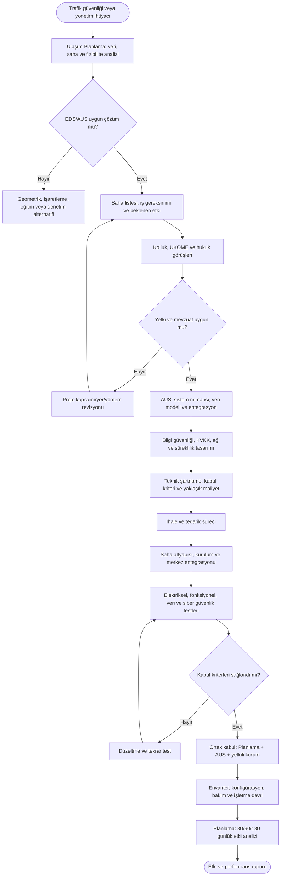
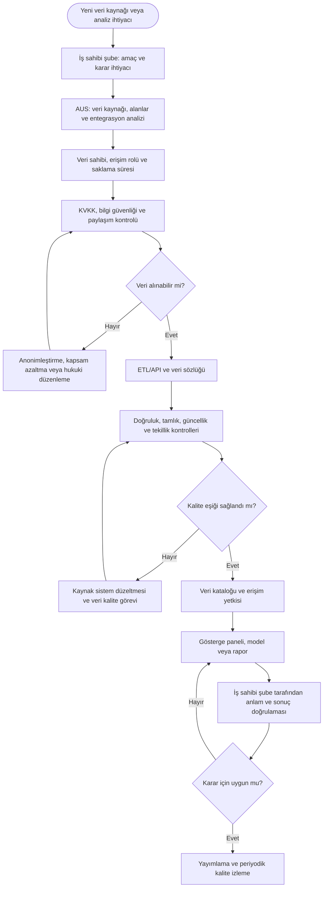
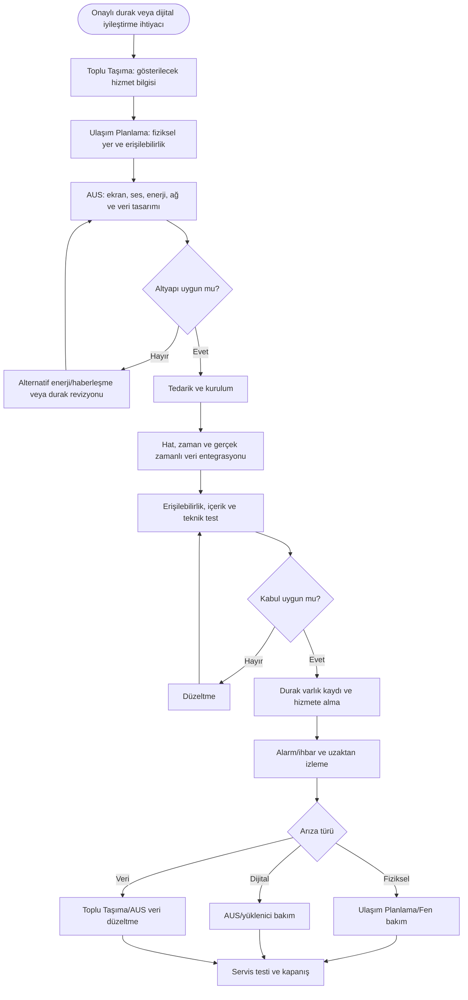
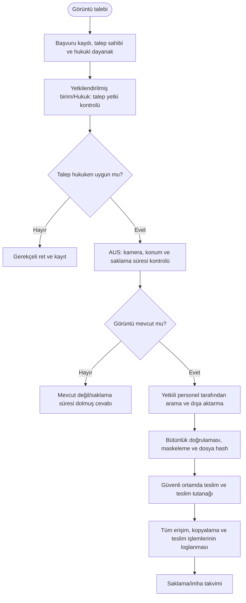
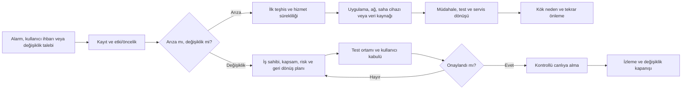

# Akıllı Ulaşım Sistemleri Süreç Haritaları

Bu bölüm EDS/AUS sistemleri, ulaşım veri platformu, akıllı durak ve kamera/veri yönetimi süreçlerini gösterir. Akıllı Ulaşım Sistemleri teknoloji, veri, entegrasyon ve sistem sürekliliğinin sahibidir; trafik ihtiyacı, yer seçimi ve trafik mühendisliği Ulaşım Planlama tarafından yürütülür.

---

## AU-01 — EDS/AUS ihtiyacı, tasarımı, kurulumu ve kabulü

**İş ihtiyacı sahibi:** Ulaşım Planlama  
**Teknoloji ve sistem sahibi:** Akıllı Ulaşım Sistemleri Şube Müdürlüğü  
**Karar paydaşları:** UKOME, kolluk, Hukuk Müşavirliği, Bilgi İşlem ve ilgili kurumlar  
**Girdiler:** Kaza/ihlal ve trafik verisi, saha etüdü, mevzuat kriterleri, kurum görüşleri, mevcut mimari, bütçe.  
**Çıktılar:** Onaylı saha/iş gereksinimi, teknik mimari, kurulmuş ve kabul edilmiş sistem, veri akışı ve etki raporu.

**Temel kontroller:** Yetki ve veri işleme dayanağı, loglama, zaman senkronizasyonu, siber güvenlik testi, veri saklama süresi, yedekleme, kabul sırasında uçtan uca veri doğrulaması.

**Önerilen KPI:** Sistem kullanılabilirliği, veri kaybı oranı, arıza çözüm süresi, hedeflenen kaza/ihlal değişimi, yanlış tespit/yanlış alarm oranı.

---

## AU-02 — Ulaşım veri platformu ve karar destek

**Süreç sahibi:** Akıllı Ulaşım Sistemleri Şube Müdürlüğü  
**Veri sahipleri:** İlgili şubeler  
**Girdiler:** Kamera, sensör, sinyal, araç, hat, ruhsat, otogar, şikâyet, kaza ve saha varlık verileri.  
**Çıktılar:** Veri kataloğu, kalite skoru, ortak gösterge paneli, API, analiz raporu ve yetkili veri paylaşımı.

**Yönetişim ilkesi:** AUS verinin teknik platform sahibidir; verinin anlamı, iş kuralı ve doğruluğundan kaynak şube sorumludur.

**Önerilen KPI:** Veri kaynağı kullanılabilirliği, güncellik gecikmesi, kalite skoru, yetkisiz erişim olayı, manuel rapor üretim süresi.

---

## AU-03 — Akıllı durak ve yolcu bilgilendirme sistemi

**Hizmet sahibi:** Toplu Taşıma  
**Fiziksel durak sahibi:** Ulaşım Planlama  
**Dijital sistem sahibi:** Akıllı Ulaşım Sistemleri  
**Girdiler:** Onaylı durak, hat/zaman verisi, enerji/haberleşme, erişilebilirlik, yolcu bilgi gereksinimleri.  
**Çıktılar:** Gerçek zamanlı yolcu bilgisi, çalışan ekran/sesli sistem, bakım kaydı ve hizmet KPI.

---

## AU-04 — Kamera görüntüsü talebi, erişim ve teslim

**Teknik veri saklama sahibi:** Akıllı Ulaşım Sistemleri  
**Hukuki karar sahibi:** Yetkilendirilmiş birim/Hukuk Müşavirliği  
**Girdiler:** Yetkili kurum veya kişi talebi, olay, tarih-saat, konum ve hukuki dayanak.  
**Çıktılar:** Yetki kontrolü, arama kaydı, güvenli teslim veya gerekçeli ret, erişim ve silme logu.

**Kritik kontroller:** Rol bazlı erişim, çift onay, tüm işlemlerde log, güvenli teslim kanalı, talep kapsamı dışında görüntü verilmemesi, saklama-imha politikası.

---

## AU-05 — AUS arıza ve değişiklik yönetimi

