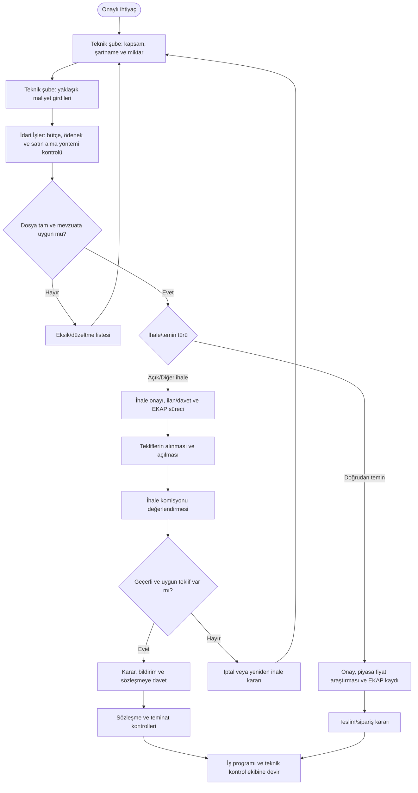
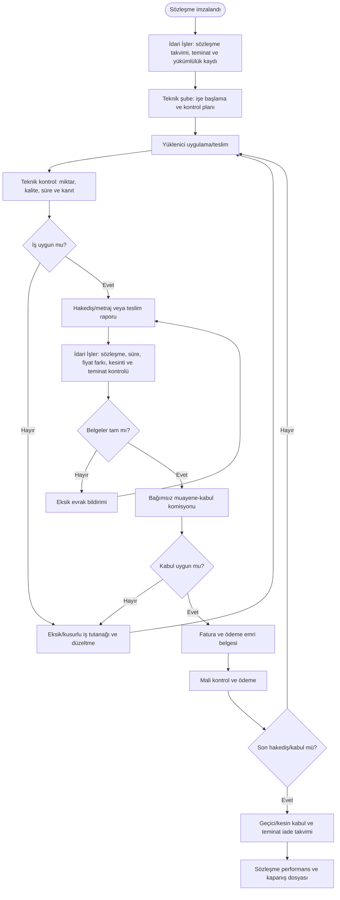
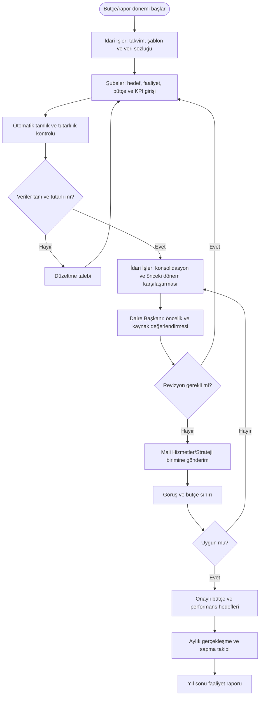
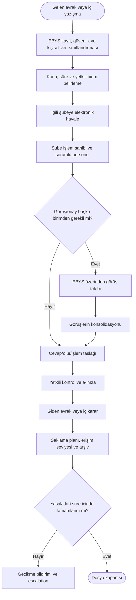
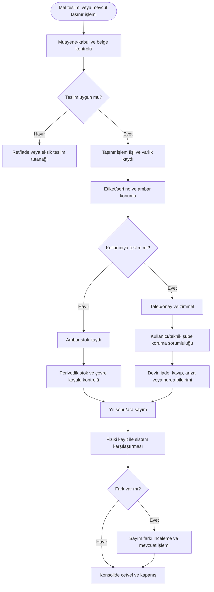
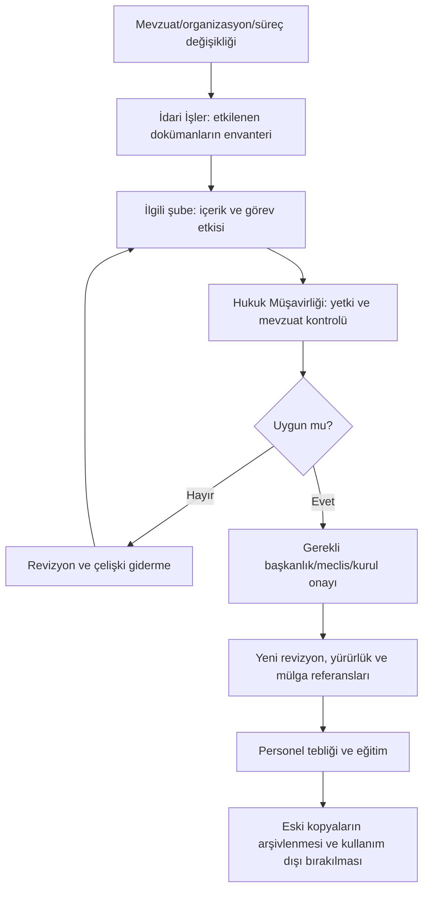

# İdari İşler Süreç Haritaları

Bu bölüm evrak, ihale, sözleşme, hakediş, ödeme, bütçe, performans, faaliyet raporu ve taşınır süreçlerini gösterir. Teknik gereksinim ve teknik kabul ilgili teknik şubenin; idari dosya, süre, teminat, ödeme evrakı ve merkezi kayıt İdari İşlerin sorumluluğundadır.

---

## ID-01 — İhale ve satın alma dosyası

**Süreç sahibi:** İdari İşler Şefliği  
**Teknik içerik sahibi:** İhtiyaç sahibi şube  
**Hesap verebilir:** Harcama yetkilisi  
**Girdiler:** Onaylı ihtiyaç, bütçe/ödenek, teknik şartname, miktar, yaklaşık maliyet, iş programı ve uygun ihale yöntemi.  
**Çıktılar:** Onay belgesi, ihale/temin dosyası, EKAP kayıtları, değerlendirme ve sözleşme.

**Görev ayrılığı:** Şartnameyi hazırlayan, teklifi değerlendiren, işi kontrol eden, kabul eden ve ödemeyi gerçekleştiren roller mevzuata uygun biçimde ayrılmalıdır.

**Önerilen KPI:** Dosya hazırlama süresi, eksik dosya oranı, ihale iptal oranı, rekabet/teklif sayısı, planlanan–gerçekleşen satın alma süresi.

---

## ID-02 — Sözleşme, hakediş, muayene-kabul ve ödeme

**Süreç sahibi:** İdari İşler — idari ve mali dosya  
**Teknik kontrol sahibi:** İlgili teknik şube  
**Girdiler:** Sözleşme, iş programı, teslim/saha kayıtları, metraj, faturalar, teminat ve kontrol raporları.  
**Çıktılar:** Hakediş, muayene-kabul, kesinti/ceza, ödeme emri evrakı, geçici/kesin kabul ve sözleşme kapanışı.

**Kontroller:** Sözleşme kilometre taşları, teminat bitiş uyarısı, gecikme/ceza kontrolü, hakediş–metraj eşleşmesi, kabul komisyonu bağımsızlığı.

---

## ID-03 — Bütçe, performans programı ve faaliyet raporu

**Süreç sahibi:** İdari İşler Şefliği  
**Veri sahibi:** Her şube  
**Girdiler:** Stratejik plan, hedefler, faaliyetler, bütçe ihtiyaçları, gerçekleşmeler, KPI ve mali veriler.  
**Çıktılar:** Gider/gelir bütçe teklifi, performans programı, faaliyet raporu ve aylık yönetici göstergeleri.

**Önerilen KPI:** Zamanında veri giriş oranı, bütçe sapması, hedef gerçekleşme oranı, manuel düzeltme sayısı, rapor üretim süresi.

---

## ID-04 — Evrak, EBYS, izin ve arşiv

**Süreç sahibi:** İdari İşler Şefliği  
**Girdiler:** Gelen/giden evrak, olur, görev/izin/rapor, dosya planı ve kurum yazışmaları.  
**Çıktılar:** Doğru birime yönlendirilmiş evrak, işlem izi, cevap, izin kaydı ve arşiv.

**Temel kontrol:** Şubeler paralel evrak kayıt defteri oluşturmamalı; EBYS tek resmî kayıt noktası olmalıdır.

---

## ID-05 — Taşınır, ambar, zimmet ve sayım

**Süreç sahibi:** İdari İşler / Taşınır Kayıt Yetkilisi  
**Girdiler:** Muayene-kabul edilmiş mal, TİF, talep, zimmet, devir ve sayım listesi.  
**Çıktılar:** Giriş-çıkış kaydı, zimmet, ambar bakiyesi, sayım tutanağı, hurda/kayıp işlemi ve konsolide cetvel.

**Görev paylaşımı:** Kayıt, ambar ve zimmet İdari İşlerde; teknik şube taşınırın kullanıcı ve koruma sorumlusudur.

---

## ID-06 — Yönetmelik, yönerge ve görev tanımı değişikliği

