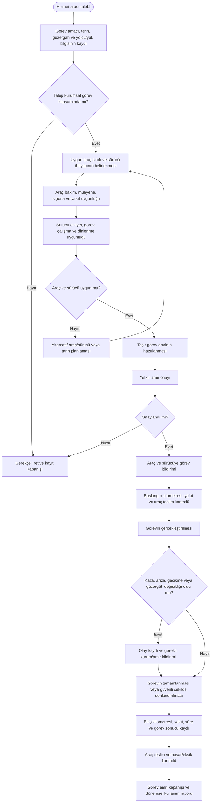

# İdari İşler — Kaynak İncelemesi Sonucu Ek Süreçler

Bu dosya, kaynak belgelerde yer aldığı halde mevcut `ID-01–ID-06` haritalarında bağımsız süreç olarak gösterilmeyen işi içerir.

---

## ID-07 — Taşıt görev emri ve hizmet aracı görevlendirme süreci

**Süreç sahibi:** İdari ve Mali İşler / İdari Destek Birimi  
**Araç ve sürücü operasyonu:** İlgili araç havuzu veya görevlendirilen şube  
**Kaynak dayanağı:** Taşıt Görev Emri Formu ve Şoför Görev Tanımı.  
**Girdiler:** Görev talebi, görev amacı, güzergâh, tarih-saat, personel/yük bilgisi, araç ve sürücü uygunluğu, yakıt ve bakım durumu.  
**Çıktılar:** Onaylı taşıt görev emri, araç/sürücü tahsisi, kilometre-yakıt ve görev gerçekleşme kaydı, uygunsuzluk veya iptal kaydı.

**Temel kontroller**

- Araç yalnız onaylı kurumsal görev için kullanılmalıdır.
- Görev emri olmadan araç çıkışı yapılamamalı; acil görevlendirmeler sonradan kayıt altına alınmalıdır.
- Sürücü ehliyet sınıfı, çalışma-dinlenme süresi ve görev uygunluğu kontrol edilmelidir.
- Başlangıç/bitiş kilometresi, yakıt ve olay kayıtları araç bazında izlenmelidir.
- Kaza veya hasar halinde sigorta, kolluk, İSG ve idari bildirim süreçleri tetiklenmelidir.

**Önerilen KPI:** Talep karşılama oranı, araç tahsis süresi, boş kilometre oranı, kilometre-yakıt sapması, plansız arıza ve olay bildirim süresi.
