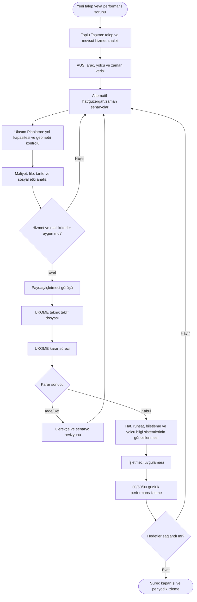
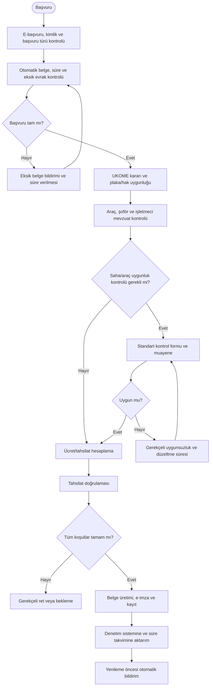
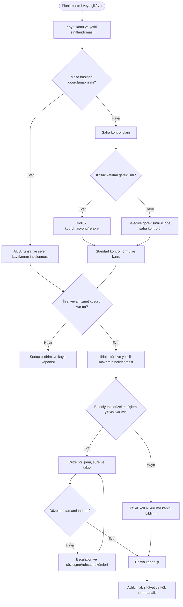
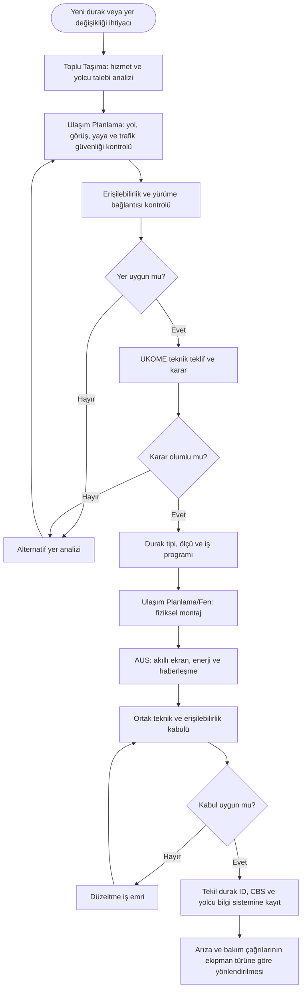
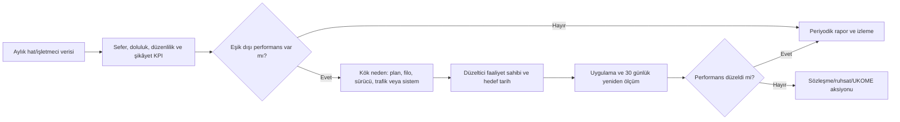

# Toplu Ulaşım Süreç Haritaları

Bu bölüm Toplu Taşıma Şube Müdürlüğünün hizmet planlama, ruhsat/vize/izin, izleme-kontrol ve durak süreçlerini gösterir. Yol kapasitesi ve trafik geometrisi Ulaşım Planlama; UKOME kurul ve karar süreci Ulaşım Koordinasyon; dijital platform ve veri entegrasyonu Akıllı Ulaşım Sistemleri sorumluluğundadır.

---

## TU-01 — Hat, güzergâh, zaman, sefer ve tarife planlama

**Süreç sahibi:** Toplu Taşıma Planlama Birimi  
**Girdiler:** Yolcu talebi, doluluk, filo ve maliyet verileri, mevcut hatlar, şikâyetler, imar/yol ağı, duraklar ve trafik koşulları.  
**Çıktılar:** Teknik rapor, hat–güzergâh–zaman–tarife önerisi, UKOME kararı, işletmeci talimatı ve izleme raporu.

**Önerilen KPI:** Sefer düzenliliği, doluluk, yolcu başına maliyet, aktarma süresi, şikâyet oranı, zamanında sefer yüzdesi.

---

## TU-02 — Ruhsat, vize, izin ve yetki belgesi

**Süreç sahibi:** Ruhsat ve Vize İşlemleri Birimi  
**Girdiler:** E-başvuru, araç/şoför/şirket belgeleri, UKOME kararı, muayene/uygunluk, ücret ve borç bilgileri.  
**Çıktılar:** Ruhsat/vize/izin/yetki belgesi, gerekçeli ret, süre ve yenileme kaydı.

**Kontroller:** Başvuru türüne göre mevzuat kontrol listesi, belge geçerlilik tarihi, çift kayıt önleme, ücret tarifesi sürümü, yetkisiz belge düzenleme engeli.

**Önerilen KPI:** Ortalama belge sonuçlandırma süresi, eksik başvuru oranı, tekrar işlem oranı, süresi geçen belge oranı.

---

## TU-03 — İzleme, kontrol, şikâyet ve karar uygulama

**Süreç sahibi:** Toplu Taşıma İzleme ve Kontrol Birimi  
**Girdiler:** Denetim planı, UKOME kararları, araç/hat verileri, vatandaş şikâyeti, kolluk veya kurum bildirimi.  
**Çıktılar:** Kontrol/tespit raporu, düzeltici işlem, yetkili makama bildirim, trend ve hizmet kalite raporu.

**Temel kontrol:** Denetim süreci belediye personeline mevzuatta bulunmayan kolluk yetkisi tanımlamamalıdır; yaptırım ve tutanak yetkisi işlem türüne göre açıkça doğrulanmalıdır.

---

## TU-04 — Durak yeri ve durak yaşam döngüsü

**Hizmet ihtiyacı sahibi:** Toplu Taşıma  
**Trafik ve fiziksel varlık sahibi:** Ulaşım Planlama  
**Dijital ekipman sahibi:** Akıllı Ulaşım Sistemleri  
**Girdiler:** Hat planı, yolcu talebi, yürüme mesafesi, erişilebilirlik, yol geometrisi, güvenlik ve mevcut durak envanteri.  
**Çıktılar:** Durak yeri kararı, erişilebilir fiziksel durak, akıllı yolcu bilgi sistemi, tekil varlık kaydı ve bakım SLA’sı.

**Önerilen KPI:** Yolcu kapsama alanı, erişilebilir durak oranı, durak arıza çözüm süresi, gerçek zamanlı bilgi kullanılabilirliği.

---

## TU-05 — Hat veya işletmeci performans gözden geçirmesi

