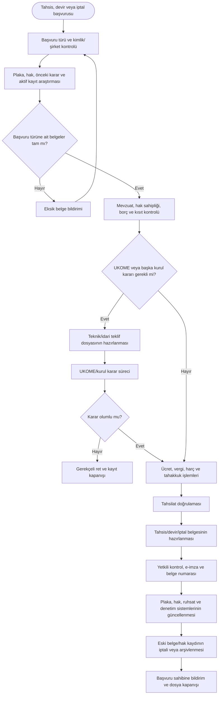
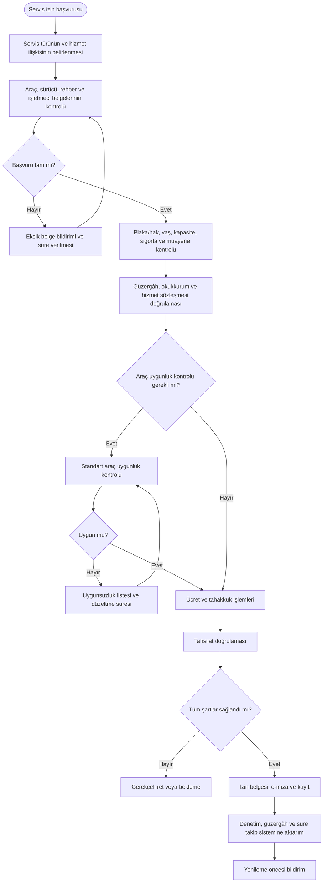
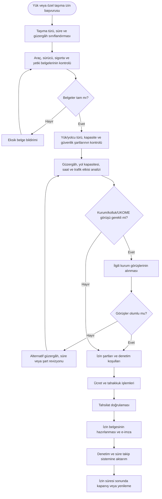
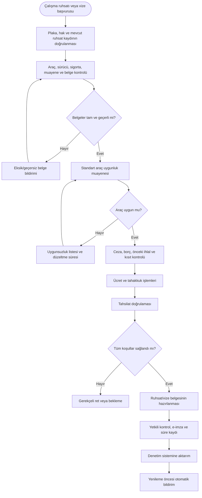

# Toplu Ulaşım — Kaynak İncelemesi Sonucu Ek Süreçler

Bu dosya, kaynak formlar ve görev belgelerinde ayrı belge ve karar mantığı bulunan ancak mevcut `TU-01–TU-05` haritalarında bağımsız süreç olarak gösterilmeyen işleri içerir.

---

## TU-06 — Ticari plaka tahsis, devir ve iptal süreci

**Süreç sahibi:** Ulaşım Ruhsat ve Ticari Araç İşlemleri Birimi  
**Karar paydaşları:** UKOME, Mali Hizmetler, Hukuk Müşavirliği ve ilgili kamu kurumları  
**Kaynak dayanağı:** Ticari Plaka Tahsis Belgesi Başvuru Formu, Ticari Plaka Devir Belgesi Başvuru Formu ve Yetki Belgesi İptali Başvuru Formu.  
**Girdiler:** Başvuru, kimlik/şirket belgeleri, plaka ve hak bilgisi, UKOME kararı, borç ve ücret bilgileri, devir veya iptal gerekçesi.  
**Çıktılar:** Tahsis/devir/iptal kararı, güncel plaka ve hak kaydı, tahakkuk, belge, gerekçeli ret ve arşiv kaydı.

**Temel kontroller:** Çift tahsis ve mükerrer hak engeli, haciz/şerh/kısıt kontrolü, kurul kararı-belge eşleşmesi, ücret tarifesi sürümü, eski belgenin kullanım dışı bırakılması.

**Önerilen KPI:** Ortalama sonuçlandırma süresi, eksik başvuru oranı, mükerrer kayıt sayısı, karar-belge uyumsuzluğu, iptal sonrası açık kayıt oranı.

---

## TU-07 — Servis aracı izin belgesi süreci

**Süreç sahibi:** Ulaşım Ruhsat ve Ticari Araç İşlemleri Birimi  
**Hizmet türleri:** S plaka okul servisi, S plaka personel servisi, özel plaka okul/personel servisi ve müşteri servisi.  
**Kaynak dayanağı:** S Plaka Okul Servis Aracı, S Plaka Personel Servis Aracı, Özel Plaka Okul Servis Aracı, Özel Kuruluş Personel Servis Aracı ve Müşteri Servis Aracı izin başvuru formları.  
**Girdiler:** Araç, sürücü, rehber personel, işletmeci/kurum, güzergâh ve hizmet sözleşmesi belgeleri; muayene, sigorta ve ücret bilgileri.  
**Çıktılar:** Servis izin belgesi, güzergâh/hizmet kaydı, gerekçeli ret, yenileme takvimi ve denetim kaydı.

**Temel kontroller:** Başvuru türüne özel kontrol listesi, araç ve sürücü belge geçerliliği, kapasite ve yaş şartı, okul servislerinde rehber personel kontrolü, güzergâh ve kurum sözleşmesi tutarlılığı.

**Önerilen KPI:** Belge sonuçlandırma süresi, ilk kontrolde uygun araç oranı, eksik başvuru oranı, süresi geçen izin oranı, tekrar uygunsuzluk oranı.

---

## TU-08 — Yük nakli ve özel taşıma izin süreci

**Süreç sahibi:** Ulaşım Ruhsat ve Ticari Araç İşlemleri Birimi  
**Kapsam:** Yük nakli, mevsimlik tarım işçisi taşımacılığı ve özel/geçici taşıma izinleri.  
**Kaynak dayanağı:** Yük Nakli İzin Belgesi Başvuru Formu ve Mevsimlik Tarım İşçisi Taşımacılığı İzin Belgesi Başvuru Formu.  
**Girdiler:** Başvuru, araç ve sürücü belgeleri, taşıma konusu, güzergâh, süre, kapasite, sigorta, güvenlik ve kurum görüşleri.  
**Çıktılar:** Süreli izin belgesi, güzergâh ve koşullar, gerekçeli ret, denetim ve kapanış kaydı.

**Temel kontroller:** Taşıma türüne uygun araç, kapasite ve güvenlik şartı; süreli izin; güzergâh ve saat kısıtı; kolluk ve kurum görüşü; denetim sistemine aktarım.

**Önerilen KPI:** Sonuçlandırma süresi, revize güzergâh oranı, izin şartı ihlali, süresi geçen açık izin, denetim kaydı tamlığı.

---

## TU-09 — Ticari araç uygunluk, çalışma ruhsatı ve vize yenileme süreci

**Süreç sahibi:** Ulaşım Ruhsat ve Ticari Araç İşlemleri Birimi  
**Kaynak dayanağı:** Ticari Plakalı Araç Uygunluk Kontrol Formu ve Ticari Araçların M/T Plaka Çalışma Ruhsatı Başvuru Formu.  
**Girdiler:** Ruhsat/vize başvurusu, araç ve sürücü belgeleri, plaka/hak kaydı, muayene ve sigorta, ücret ve borç bilgileri.  
**Çıktılar:** Uygunluk kontrol sonucu, çalışma ruhsatı/vize, uygunsuzluk bildirimi, yenileme ve denetim kaydı.

**Temel kontroller:** Mükerrer ruhsat engeli, araç uygunluk kontrolünün standart forma bağlanması, belge ve ücret tarifesi sürümü, yetkisiz belge düzenleme engeli, vize süresi takibi.

**Önerilen KPI:** Ortalama ruhsat/vize süresi, ilk muayenede uygunluk oranı, tekrar muayene sayısı, süresi geçen ruhsat oranı, belge hata oranı.
