# Ulaşım Dairesi İş–Süreç Analizi — Rev-A

**Rapor tarihi:** 2026-07-17  
**Kaynak repo:** [https://github.com/emre1006/Ula-m_Dairesi_-_Analizi](https://github.com/emre1006/Ula-m_Dairesi_-_Analizi)  
**Durum:** İnceleme taslağı; GitHub reposunda hiçbir değişiklik yapılmamıştır.

## 1. Kapsam ve yöntem

Bu çalışma repodaki resmî görev tanımı, yönerge, yönetmelik, form, iş akışı ve personel çalışma notlarının envanterini esas alır. Kaynakların büyük bölümü binary Word/PDF/Excel olduğundan görev tanımı envanteri repo dosya adlarından kataloglanmış; görev özetleri ve süreç sahipliği Denizli Büyükşehir Belediyesinin güncel yayımlanmış yönetmelik/yönergeleriyle çapraz kontrol edilmiştir.

Hedef süreçler; tek hesap verebilir süreç sahibi, RACI, görev ayrılığı, UKOME sekretarya modeli, veri yönetişimi ve mevzuat uyumu ilkeleriyle tasarlanmıştır. İstanbul, Ankara ve Kocaeli büyükşehirlerinin resmî yapılanma ve uygulamaları kıyas ölçütü olarak kullanılmıştır.

> Bu rapor hukuki mütalaa değildir. Yönetmelik/yönerge değişikliği, yetki devri veya yaptırım prosedürü öncesinde Hukuk Müşavirliği görüşü ve gerekli idari/meclis onayı alınmalıdır.

## 2. Yönetici özeti

- **38 görev/rol tanımı** kataloglandı.
- **44 ana iş süreci** girdi, çıktı, mevcut ve önerilen sahip, RACI, mevzuat ve öncelik bazında modellendi.
- **12 mükerrer/sınırı belirsiz alan** bulundu; **7 tanesi kritik**.
- **18 süreç kritik öncelikli** olarak işaretlendi.
- Kritik konular: EDS/TKM sahipliği, ihale–sözleşme–hakediş görev tekrarı, taşınır/ambar mükerrerliği, Toplu Taşıma–Ulaşım Planlama sınırı, durak yaşam döngüsü, kamera/veri yönetişimi ve 2026 Otogar değişikliğinin eski belgelere yansıtılması.
- Ana ilke: **Bir süreç—bir hesap verebilir sahip; diğer birimler RACI ile katkı verir.**

## 3. Görev tanımları envanteri

| Kod | Görev/rol | Departman | Seviye | Ana iş amacı | Repo kaynağı |
| --- | --- | --- | --- | --- | --- |
| GT-000 | Ulaşım Dairesi Başkanı | Daire Başkanlığı | Yönetici | Daire genelinde görevlerin mevzuata uygun, zamanında ve koordineli yürütülmesi; strateji, kaynak ve birimler arası yönetişim. | D37.YN.001_4 ULAŞIM DAİRESİ BAŞKANLIĞI YÖNETMELİK.docx / kamu görev sayfası |
| GT-038 | Akıllı Ulaşım Sistemleri Şube Müdürü | Akıllı Ulaşım Sistemleri | Şube Müdürü | AUS, EDS/TKM platformları, akıllı durak-otopark, veri analitiği, sürdürülebilir ve paylaşımlı ulaşım teknolojilerini yönetmek. | Akıllı Ulaşım Sistemleri/D37.GT.038_2 ...docx |
| GT-047 | Akıllı Ulaşım Sistemleri Şube Müdürlüğü Personeli | Akıllı Ulaşım Sistemleri | Personel | AUS projelerinde araştırma, veri, teknik şartname, entegrasyon, izleme ve raporlama çalışmalarını yürütmek. | Akıllı Ulaşım Sistemleri/D37.GT.047_2 ...docx |
| GT-011 | Otogar Şube Müdürü | Otogar | Şube Müdürü | Otogar giriş-çıkış, tahakkuk-tahsilat, peron tahsisi, trafik düzeni ve işletme raporlamasını yönetmek. | Otogar/D37.GT.011_8 ...docx |
| GT-041 | Gişe ve Tahsilat İşlemleri Birim Sorumlusu | Otogar | Birim Sorumlusu | Araç giriş-çıkış kayıtları, ücret tahakkuku, tahsilat, kasa ve gelir raporlamasını yönetmek. | Otogar/D37.GT.041_4 ...docx |
| GT-042 | Gişe ve Tahsilat İşlemleri Personeli | Otogar | Personel | Gişe, araç kaydı, tahakkuk, tahsilat, belge ve vardiya işlemlerini gerçekleştirmek. | Otogar/D37.GT.042_3 ...docx |
| GT-043 | Teknik İşler Birim Sorumlusu | Otogar | Birim Sorumlusu | Otogar teknik tesis, bakım-onarım, altyapı, otomasyon ve arıza süreçlerini koordine etmek. | Otogar/D37.GT.043_2 ...docx |
| GT-044 | Teknik İşler Birim Personeli | Otogar | Personel | Teknik bakım, arıza müdahalesi, saha kontrolü ve teknik kayıtları yürütmek. | Otogar/D37.GT.044_1 ...docx |
| GT-045 | Otogar İşletme Birim Sorumlusu | Otogar | Birim Sorumlusu | Peron, indirme-bindirme, bekleme alanları ve günlük işletme düzenini koordine etmek. | Otogar/D37.GT.045_3 ...docx |
| GT-046 | Otogar İşletme Birim Personeli | Otogar | Personel | Saha işletmesi, peron düzeni, firma/yolcu işlemleri ve işletme kayıtlarını yürütmek. | Otogar/D37.GT.046_3 ...docx |
| GT-002 | Toplu Taşıma Şube Müdürü | Toplu Taşıma | Şube Müdürü | Toplu taşıma planlama, ruhsat-vize, karar uygulama, kontrol ve UKOME tekliflerini yönetmek. | Toplu Ulaşım/D37.GT.002_7 ...docx |
| GT-005 | Ruhsat ve Vize İşlemleri Birim Sorumlusu | Toplu Taşıma | Birim Sorumlusu | M/S/T plaka, belediye otobüsü, yük nakli, yetki ve izin belgeleri süreçlerini yönetmek. | Toplu Ulaşım/D37.GT.005_7 ...docx |
| GT-006 | Ruhsat ve Vize İşlemleri Birim Personeli | Toplu Taşıma | Personel | Başvuru, belge kontrolü, kayıt, ruhsat-vize düzenleme ve arşivleme işlemlerini yapmak. | Toplu Ulaşım/D37.GT.006_7 ...docx |
| GT-007 | Toplu Taşıma İzleme ve Kontrol Birim Sorumlusu | Toplu Taşıma | Birim Sorumlusu | Hat, araç, tarife, güzergâh ve mevzuat uyumunun izleme-kontrol faaliyetlerini yönetmek. | Toplu Ulaşım/D37.GT.007_7 ...docx |
| GT-008 | Toplu Taşıma İzleme ve Kontrol Birimi Personeli | Toplu Taşıma | Personel | Saha/masa başı kontrol, talep-şikâyet inceleme, rapor ve karar uygulama çalışmalarını yürütmek. | Toplu Ulaşım/D37.GT.008_7 ...docx |
| GT-039 | Toplu Taşıma Planlama Birim Sorumlusu | Toplu Taşıma | Birim Sorumlusu | Hat, güzergâh, zaman, durak, tarife ve hizmet kapasitesi planlama çalışmalarını yönetmek. | Toplu Ulaşım/D37.GT.039_3 ...docx |
| GT-040 | Toplu Taşıma Planlama Birimi Personeli | Toplu Taşıma | Personel | Talep/veri analizi, hat-güzergâh-zaman planı, UKOME teknik raporu ve performans izlemesi yapmak. | Toplu Ulaşım/D37.GT.040_3 ...docx |
| GT-049 | Şoför | Toplu Taşıma | Personel | Görevlendirilen belediye aracını güvenli, mevzuata ve taşıt görev emrine uygun kullanmak. | Toplu Ulaşım/D37.GT.049_2 ...docx |
| GT-034 | Trafik Eğitim Şube Müdürü | Trafik Eğitim | Şube Müdürü | Trafik eğitim parkı, eğitim programı, farkındalık ve yayın faaliyetlerini yönetmek. | Trafik Eğitim/D37.GT.034_5 ...docx |
| GT-035 | Trafik Eğitim Şube Müdürlüğü Personeli | Trafik Eğitim | Personel | Eğitim planlama, katılımcı organizasyonu, park uygulaması, materyal ve faaliyet raporlarını yürütmek. | Trafik Eğitim/D37.GT.035_5 ...docx |
| GT-013 | Ulaşım Planlama Şube Müdürü | Ulaşım Planlama | Şube Müdürü | Ulaşım ana planı, trafik planlama, yol tasarımı, trafik yönetimi, işaretleme ve sinyalizasyonu yönetmek. | Trafik Planlama/D37.GT.013_8 ...docx |
| GT-014 | Trafik Planlama Birimi Sorumlusu | Ulaşım Planlama | Birim Sorumlusu | Planlama, trafik yönetim ve yol tasarım servislerini; teknik etüt ve UKOME tekliflerini koordine etmek. | Trafik Planlama/D37.GT.014_8 ...docx |
| GT-016 | Planlama Servisi Sorumlusu | Ulaşım Planlama | Servis Sorumlusu | Ulaşım etütleri, ana plan, yol kullanım/hız, erişim, harita ve trafik planlarını yönetmek. | Trafik Planlama/D37.GT.016_8 ...docx |
| GT-019 | Planlama Servisi Personeli | Ulaşım Planlama | Personel | Sayım-etüt, saha inceleme, harita, plan, rapor, erişim ve UKOME teklif dosyalarını hazırlamak. | Trafik Planlama/D37.GT.019_8 ...docx |
| GT-020 | Yol Tasarım Servisi Personeli | Ulaşım Planlama | Personel | Yol, kavşak, köprü, alt/üst geçit ve geometrik düzenleme projelerini hazırlamak/kontrol etmek. | Trafik Planlama/D37.GT.020_8 ...docx |
| GT-023 | Uygulama ve Yapım Birimi Sorumlusu | Ulaşım Planlama | Birim Sorumlusu | Sinyalizasyon, yatay-düşey işaretleme ve saha uygulama/yapım işlerini koordine etmek. | Trafik Planlama/D37.GT.023_9 ...doc |
| GT-024 | Düşey İşaretleme Servisi Sorumlusu | Ulaşım Planlama | Servis Sorumlusu | Trafik levhası ihtiyaç, imalat/temin, montaj, bakım ve envanterini yönetmek. | Trafik Planlama/D37.GT.024_7 ...docx |
| GT-025 | Sinyalizasyon Servisi Sorumlusu | Ulaşım Planlama | Servis Sorumlusu | Sinyalize kavşak projelendirme, kurulum, süre planı, işletme, bakım ve arıza süreçlerini yönetmek. | Trafik Planlama/D37.GT.025_8 ...docx |
| GT-026 | Düşey İşaretleme Servisi Personeli | Ulaşım Planlama | Personel | Levha saha kontrolü, montaj, bakım, söküm ve kayıt işlemlerini yapmak. | Trafik Planlama/D37.GT.026_6 ...docx |
| GT-027 | Sinyalizasyon Servisi Personeli | Ulaşım Planlama | Personel | Sinyal ekipmanı kurulumu, programlama, saha kontrolü, bakım ve arıza müdahalesi yapmak. | Trafik Planlama/D37.GT.027_7 ...docx |
| GT-030 | Yatay İşaretleme Servis Sorumlusu | Ulaşım Planlama | Servis Sorumlusu | Yol çizgisi, yaya geçidi ve yatay işaretleme programını, malzeme ve kalite kontrolünü yönetmek. | Trafik Planlama/D37.GT.030_6 ...docx |
| GT-031 | Yatay İşaretleme Servis Personeli | Ulaşım Planlama | Personel | Yatay işaretleme saha uygulaması, kontrol, ölçüm ve raporlama işlerini yapmak. | Trafik Planlama/D37.GT.031_6 ...docx |
| GT-036 | Trafik Yönetim Servisi Sorumlusu | Ulaşım Planlama | Servis Sorumlusu | Trafik akış izleme, yönlendirme, olay yönetimi ve sinyal süre optimizasyonunu yönetmek. | Trafik Planlama/D37.GT.036_4 ...docx |
| GT-037 | Trafik Yönetim Servisi Personeli | Ulaşım Planlama | Personel | Trafik kontrol merkezi operasyonu, olay kaydı, yoğunluk izleme ve saha koordinasyonu yapmak. | Trafik Planlama/D37.GT.037_4 ...docx |
| GT-032 | Ulaşım Koordinasyon Şube Müdürü | Ulaşım Koordinasyon / UKOME | Şube Müdürü | UKOME gündem, alt komisyon, karar, imza, dağıtım ve uygulama takibini yönetmek. | UKOME/D37.GT.032_8 ...docx |
| GT-033 | Ulaşım Koordinasyon Şube Müdürlüğü Personeli | Ulaşım Koordinasyon / UKOME | Personel | Başvuru/dosya ön kontrolü, gündem, tutanak, karar yazımı, imza ve dağıtım işlemlerini yürütmek. | UKOME/D37.GT.033_8 ...docx |
| GT-009 | İdari İşler Şefliği Sorumlusu | İdari İşler | Şeflik Sorumlusu | Evrak-arşiv, bütçe-performans, ihale koordinasyonu, sözleşme, ödeme ve taşınır süreçlerini yönetmek. | İdari İşler/D37.GT.009_9 ...docx |
| GT-010 | İdari İşler Şefliği Personeli | İdari İşler | Personel | EBYS, izin, arşiv, ihale/ödeme dosyası, bütçe raporu, taşınır kayıt ve destek işlemlerini yapmak. | İdari İşler/D37.GT.010_9 ...docx |

### Envanter notu

“Ana iş amacı” sütunu, dosya başlığı ile güncel yönetmelik/yönerge görevlerinin birleştirilmiş süreç özetidir; `D37.GT` belgesindeki her cümlenin birebir aktarımı değildir. Nihai İK revizyonunda her görev tanımı belgesinin madde bazlı fark analizi yapılmalıdır.

## 4. Hedef departman sorumlulukları

| Departman | Önerilen çekirdek sorumluluk |
| --- | --- |
| Ulaşım Dairesi Başkanlığı | Strateji, öncelik, kaynak, nihai hesap verebilirlik; şubeler arası uyuşmazlık çözümü. |
| Ulaşım Planlama | Ulaşım ana planı, trafik mühendisliği, yol/kavşak, erişim, sinyalizasyon, işaretleme ve Trafik Yönetim Merkezi operasyonu. |
| Ulaşım Koordinasyon / UKOME | Dosya kalite kapısı, gündem, alt komisyon, tutanak, karar, imza/dağıtım ve uygulama takibi; teknik iş sahibi değildir. |
| Toplu Taşıma | Hat-güzergâh-zaman-tarife, ruhsat/vize/izin, hizmet planı, araç/işletmeci izleme ve şikâyet. |
| Akıllı Ulaşım Sistemleri | AUS/EDS/TKM platform mimarisi, veri platformu, entegrasyon, akıllı durak/otopark, siber güvenlik ve analitik. |
| Otogar | Araç giriş-çıkış, gelir, peron ve günlük terminal işletimi; 2026 değişikliği sonrası tesis ortak hizmetleri yeniden tanımlanmalıdır. |
| Trafik Eğitim | Trafik eğitim parkı işletimi, eğitim, farkındalık, materyal ve etki ölçümü. |
| İdari İşler | EBYS/arşiv, bütçe-performans-faaliyet, ihale/sözleşme idari dosyası, ödeme evrakı, taşınır/ambar ve doküman kontrolü. |

## 5. Süreç envanteri ve atama matrisi

| ID | Süreç | Girdiler | Çıktılar | Mevcut/örtüşen sahipler | Önerilen sahip | R | A | C | I | Mevzuat | Mükerrerlik | Temel öneri | Öncelik |
| --- | --- | --- | --- | --- | --- | --- | --- | --- | --- | --- | --- | --- | --- |
| P01 | Ulaşım Ana Planı hazırlama/revizyon | Stratejik Plan, nazım imar planı, nüfus-arazi kullanımı, yolculuk anketleri, sayımlar, toplu taşıma ve trafik verisi | Onaylı Ulaşım Ana Planı, model, yatırım/uygulama programı, izleme göstergeleri | Ulaşım Planlama; Ulaşım Koordinasyon | Ulaşım Planlama | Ulaşım Planlama | Ulaşım Dairesi Başkanı | AUS, Toplu Taşıma, İmar, Fen, UKOME | Mali Hizmetler, ilgili kurumlar | 5216, 5393, 2918, yerel yönetmelik | Orta | Koordinasyon birimi yalnız kurul/kurum koordinasyonunu ve UKOME sunumunu yürütmeli; planın teknik sahibi Planlama olmalı. | Yüksek |
| P02 | Ulaşım etüdü, veri toplama ve modelleme | Sayım talebi, sensör/veri kaynakları, kaza/ihlal kayıtları, saha gözlemleri | Doğrulanmış veri seti, etüt raporu, kalibre model, karar destek çıktısı | Ulaşım Planlama; AUS | Ulaşım Planlama | Ulaşım Planlama | Ulaşım Dairesi Başkanı | AUS, Toplu Taşıma, Üniversiteler | İlgili şubeler | 5216, 5393, 2918, KVKK ilkeleri | Yüksek | Veri platformu AUS; metodoloji, model ve planlama yorumu Planlama. Tek ulaşım veri kataloğu kurulmalı. | Yüksek |
| P03 | Yol, kavşak ve geometrik düzenleme projesi | Talep/şikâyet, kaza verisi, halihazır harita, imar planı, trafik sayımı, arazi verisi | Onaylı avan/uygulama projesi, yaklaşık maliyet girdisi, UKOME teklifi, uygulama paketi | Ulaşım Planlama; Fen İşleri; UKOME | Ulaşım Planlama / Yol Tasarım | Ulaşım Planlama / Yol Tasarım | Ulaşım Planlama Şube Müdürü | Fen İşleri, İmar, AUS, UKOME | Başvuru sahibi, saha uygulama birimleri | 5216, 5393, 2918, 3194, Karayolları Trafik Yönetmeliği | Orta | Trafik/geometrik projenin sahibi Planlama; yol gövdesi yapımı Fen İşleri; işaretleme ve sinyal uygulaması Planlama Uygulama-Yapım. | Yüksek |
| P04 | Halihazır harita, ölçüm ve saha envanteri | İş emri, koordinat sistemi, mevcut harita, saha sınırı | Kontrollü halihazır harita, ölçüm raporu, CBS katmanı | Ulaşım Planlama; Harita/İmar | Ulaşım Planlama | Ulaşım Planlama | Ulaşım Planlama Şube Müdürü | İmar-Harita, AUS | Proje servisleri | 3194, 5216, teknik şartnameler | Düşük | Tekrarlı ölçüm alımlarını önlemek için kurumsal CBS katalog ve sürüm numarası kullanılmalı. | Orta |
| P05 | Geçiş yolu / yol kenarı tesis erişim uygunluğu | Başvuru, tapu/imar bilgisi, vaziyet planı, yol sınıfı, trafik etüdü | Teknik uygunluk raporu, gerekli proje revizyonu, UKOME/kurul kararı veya ret | Ulaşım Planlama; Ulaşım Koordinasyon | Ulaşım Planlama | Ulaşım Planlama | Ulaşım Planlama Şube Müdürü | UKOME, İmar, Karayolları, ilçe belediyesi | Başvuru sahibi | 2918, Karayolları Trafik Yönetmeliği md.16, 3194, 5216 | Yüksek | Teknik inceleme Planlama; gündem/karar sekretaryası Koordinasyon. Tek e-başvuru ve standart kontrol listesi. | Yüksek |
| P06 | Geçici yol kapatma veya yol daraltma izni | Dilekçe, çalışma projesi, süre, iş programı, trafik yönetim planı, kurum izinleri | Onaylı geçici trafik düzenleme planı, karar/izin, saha tedbir listesi ve duyuru | Ulaşım Planlama; UKOME; Fen/AYKOME | Ulaşım Planlama | Ulaşım Planlama | Ulaşım Planlama Şube Müdürü | UKOME, AYKOME, Zabıta, Emniyet, Basın | Başvuru sahibi ve yol kullanıcıları | 2918, Karayolları Trafik Yönetmeliği, 5216, Koordinasyon Merkezleri Yönetmeliği | Yüksek | Teknik güvenlik kontrolü Planlama; karar gerekiyorsa UKOME; uygulama ve kapatma koordinasyonu ilgili yapım/AYKOME birimi. | Yüksek |
| P07 | Şerit, yön, hız limiti ve sirkülasyon düzenlemesi | Trafik sayımı, hız/kaza verisi, saha geometrisi, vatandaş/kurum talebi | Teknik rapor, trafik düzenleme projesi, UKOME kararı, uygulama emri | Ulaşım Planlama; UKOME | Ulaşım Planlama | Ulaşım Planlama | Ulaşım Planlama Şube Müdürü | Emniyet, UKOME, AUS, Toplu Taşıma | Yol kullanıcıları | 2918, Karayolları Trafik Yönetmeliği, 5216 | Orta | Teknik dosya Planlama’da; UKOME karar sürecini Koordinasyon yürütmeli. | Yüksek |
| P08 | UKOME gündem ve karar yönetimi | Eksiksiz teknik teklif dosyası, önceki kararlar, kurum görüşleri, başkan talimatı | Gündem, alt komisyon raporu, toplantı tutanağı, imzalı karar, dağıtım listesi | Ulaşım Koordinasyon; tüm teknik şubeler | Ulaşım Koordinasyon / UKOME | Ulaşım Koordinasyon / UKOME | UKOME Başkanı / yetkili kurul | Teknik teklif sahibi şube, hukuk, kurum üyeleri | Karar uygulayıcıları ve başvuru sahibi | 5216, Büyükşehir Belediyeleri Koordinasyon Merkezleri Yönetmeliği, yerel UKOME düzenlemeleri | Düşük | Koordinasyon teknik sürecin sahibi değil; dosya kalite kapısı ve kurul sekretaryası olmalı. | Kritik |
| P09 | UKOME kararlarının uygulama ve kapanış takibi | İmzalı UKOME kararı, sorumlu birimler, süre ve koşullar | Uygulama teyidi, saha kontrolü, kapanış kaydı, gecikme/escalation raporu | Ulaşım Koordinasyon; karar sahibi şubeler | Kararın teknik sahibi şube | Kararın teknik sahibi şube | Ulaşım Koordinasyon Şube Müdürü | Zabıta, Emniyet, ilgili kurumlar | UKOME ve yönetim | Koordinasyon Merkezleri Yönetmeliği, yerel kararlar | Orta | Karar takip modülü kurulmalı; Koordinasyon takip eder, teknik şube uygulayıp kanıt yükler. | Yüksek |
| P10 | Yeni sinyalize kavşak kurulması | Kaza/yoğunluk verisi, sayım, geometrik proje, enerji/iletişim ihtiyacı, UKOME kararı | Onaylı sinyal projesi, kurulu ve test edilmiş kavşak, kabul ve envanter kaydı | Ulaşım Planlama; AUS | Ulaşım Planlama / Sinyalizasyon | Ulaşım Planlama / Sinyalizasyon | Ulaşım Planlama Şube Müdürü | AUS, Fen, elektrik dağıtım, UKOME | Trafik Yönetim Merkezi | 2918, Karayolları Trafik Yönetmeliği, işaretleme/sinyal standartları, 4734/4735 | Orta | Saha sinyalizasyonu Planlama’da; IP ağ, merkezi entegrasyon ve siber güvenlik AUS/Bilgi İşlem ile. | Yüksek |
| P11 | Sinyalizasyon arıza, bakım ve süre optimizasyonu | Arıza alarmı/ihbar, trafik verisi, bakım planı, yedek parça | Giderilmiş arıza, güncel sinyal planı, bakım kaydı, SLA/KPI raporu | Ulaşım Planlama; AUS | Ulaşım Planlama / Sinyalizasyon | Ulaşım Planlama / Sinyalizasyon | Sinyalizasyon Servisi Sorumlusu | Trafik Yönetim, AUS, yüklenici | Yönetim ve yol kullanıcıları | 2918, 6331, sözleşme/teknik şartname | Orta | Tek çağrı kaydı ve varlık bazlı bakım sistemi; merkezi yazılım/platform sorunu AUS’a otomatik yönlendirilmeli. | Yüksek |
| P12 | Yatay işaretleme planlama ve uygulama | Yol envanteri, UKOME kararı/proje, aşınma kontrolü, iş programı | Uygulanmış yol çizgisi/yaya geçidi, kalite ölçümü, metraj ve envanter güncellemesi | Ulaşım Planlama | Ulaşım Planlama / Yatay İşaretleme | Ulaşım Planlama / Yatay İşaretleme | Uygulama ve Yapım Birimi Sorumlusu | UKOME, Fen, yüklenici | Trafik Yönetim | 2918, Karayolu Trafik İşaretleme Standartları, 4734/4735, 6331 | Düşük | Yıllık risk ve yol sınıfı bazlı program, mobil saha kabulü ve malzeme performans KPI’sı kullanılmalı. | Orta |
| P13 | Düşey işaretleme planlama ve uygulama | Saha talebi, trafik projesi/UKOME kararı, levha envanteri | Montaj/bakım/söküm kaydı, güncel levha CBS katmanı, kabul raporu | Ulaşım Planlama | Ulaşım Planlama / Düşey İşaretleme | Ulaşım Planlama / Düşey İşaretleme | Uygulama ve Yapım Birimi Sorumlusu | UKOME, Fen, yüklenici | Trafik Yönetim | 2918, Karayolu Trafik İşaretleme Standartları, 4734/4735 | Düşük | Levha envanteri QR/GIS ile tutulmalı; proje olmadan saha uygulamasına izin verilmemeli. | Orta |
| P14 | Trafik Yönetim Merkezi günlük operasyonu | Canlı kamera/sensör/sinyal verisi, olay ihbarı, planlı çalışma bilgisi | Olay kaydı, dinamik yönlendirme, sinyal müdahalesi, kurum koordinasyonu, vardiya raporu | Ulaşım Planlama; AUS | Ulaşım Planlama / Trafik Yönetim | Ulaşım Planlama / Trafik Yönetim | Trafik Yönetim Servisi Sorumlusu | AUS, Emniyet, İtfaiye, AYKOME, Basın | Yol kullanıcıları ve yönetim | 2918, 5216, KVKK ve bilgi güvenliği kuralları | Yüksek | 24/7 operasyon Planlama’da; platform, veri, entegrasyon ve teknik süreklilik AUS’ta olmalı. | Kritik |
| P15 | EDS ihtiyacı, fizibilite ve saha kararı | İhlal/kaza verisi, trafik etüdü, saha geometrisi, kolluk görüşü, mevzuat kriterleri | Fizibilite raporu, önceliklendirilmiş saha listesi, UKOME/komisyon kararı | Ulaşım Planlama; AUS; UKOME | Ulaşım Planlama | Ulaşım Planlama | Ulaşım Planlama Şube Müdürü | AUS, Emniyet, UKOME, Hukuk | AUS uygulama ekibi | 2918 ve alt mevzuat, 5216, yerel yönetmelik | Yüksek | Trafik ihtiyacı ve yer seçimi Planlama; teknoloji çözüm tasarımı AUS. Karar noktaları mevzuatta açıklaştırılmalı. | Kritik |
| P16 | EDS/AUS sistemi tasarım, kurulum ve entegrasyonu | Onaylı ihtiyaç/saha listesi, teknik gereksinimler, mevcut mimari, bütçe | Kurulu sistem, entegrasyon, siber güvenlik testleri, kabul, veri sözlüğü ve işletme planı | Ulaşım Planlama; AUS; Bilgi İşlem | Akıllı Ulaşım Sistemleri | Akıllı Ulaşım Sistemleri | AUS Şube Müdürü | Planlama, Bilgi İşlem, Emniyet, yüklenici, İdari İşler | Trafik Yönetim ve yönetim | 2918, 5216, 4734/4735, KVKK, bilgi güvenliği | Yüksek | AUS teknik ürün sahibi; Planlama iş sahibi. Ortak mimari kurul ve kabul kriterleri oluşturulmalı. | Kritik |
| P17 | Ulaşım veri platformu, analiz ve karar destek | Kamera/sensör/araç/ruhsat/şikâyet/kaza verileri, veri paylaşım protokolleri | Tekil veri kataloğu, gösterge paneli, analiz raporları, API ve veri kalite skorları | AUS; Planlama; Toplu Taşıma | Akıllı Ulaşım Sistemleri | Akıllı Ulaşım Sistemleri | AUS Şube Müdürü | Bilgi İşlem, Planlama, Toplu Taşıma, KVKK/Hukuk | Tüm ulaşım birimleri | 5216, KVKK, bilgi güvenliği, yerel görev yönetmeliği | Yüksek | Veri sahipliği matrisi, saklama süresi, erişim rolü ve kalite SLA’sı tanımlanmalı. | Kritik |
| P18 | Akıllı durak ve yolcu bilgilendirme sistemi | Durak envanteri, hat/zaman verisi, yolcu ihtiyacı, erişilebilirlik kriterleri | Kurulu sistem, gerçek zamanlı bilgi, erişilebilir arayüz, bakım ve performans raporu | AUS; Toplu Taşıma; Planlama | Akıllı Ulaşım Sistemleri | Akıllı Ulaşım Sistemleri | AUS Şube Müdürü | Toplu Taşıma, Planlama, Bilgi İşlem, yüklenici | Yolcular | 5216, 5378, 4734/4735, bilgi güvenliği | Yüksek | Hizmet gereksinimi Toplu Taşıma; fiziksel durak Planlama; dijital sistem AUS. | Yüksek |
| P19 | Yaya, bisiklet, paylaşımlı ve sürdürülebilir ulaşım programı | UAP, erişilebilirlik verisi, emisyon/iklim hedefi, anket/sayım, arazi kullanımı | Politika, öncelikli ağ/proje listesi, eylem planı, KPI ve uygulama projeleri | AUS; Ulaşım Planlama | Ulaşım Planlama | Ulaşım Planlama | Ulaşım Dairesi Başkanı | AUS, İmar, Fen, İklim, Toplu Taşıma, STK | Meclis/UKOME ve kamuoyu | 5216, 5393, 5378, 3194, iklim/çevre mevzuatı | Orta | Planın teknik sahibi Planlama; teknoloji ve davranış/yenilik paketleri AUS; tek SUMP/UAP portföyü. | Yüksek |
| P20 | Toplu taşıma hat, güzergâh, zaman ve tarife planlama | Yolculuk talebi, araç/filo verisi, maliyet, doluluk, şikâyet, imar ve yol ağı | Teknik rapor, hat/güzergâh/zaman/tarife önerisi, UKOME kararı ve uygulama planı | Toplu Taşıma; Ulaşım Planlama; UKOME | Toplu Taşıma / Planlama Birimi | Toplu Taşıma / Planlama Birimi | Toplu Taşıma Şube Müdürü | Ulaşım Planlama, AUS, UKOME, Mali Hizmetler | İşletmeci ve yolcular | 5216, 2918, 4925, 4736, Koordinasyon Merkezleri Yönetmeliği | Yüksek | Hizmet ve hat planı Toplu Taşıma; yol kapasitesi/geometrik uygunluk Planlama; karar UKOME. | Kritik |
| P21 | Toplu taşıma ruhsat, vize, izin ve yetki belgesi | Başvuru formu, araç/şoför/şirket belgeleri, UKOME kararı, ücret tahsilatı | Ruhsat/vize/izin/yetki belgesi, kayıt, ret gerekçesi ve arşiv | Toplu Taşıma; UKOME; Mali Hizmetler | Toplu Taşıma / Ruhsat ve Vize | Toplu Taşıma / Ruhsat ve Vize | Toplu Taşıma Şube Müdürü | UKOME, Mali Hizmetler, Zabıta/Emniyet | Başvuru sahibi | 5216, 2918, 4925, 2464/ücret tarifesi, 4736 ve yerel düzenlemeler | Düşük | Tek belge yönetim sistemi, otomatik süre/eksik evrak kontrolü ve randevu entegrasyonu. | Kritik |
| P22 | Toplu taşıma izleme, kontrol, şikâyet ve karar uygulama | Denetim planı, UKOME kararları, araç/hat verisi, vatandaş şikâyeti | Kontrol/tespit raporu, düzeltici işlem, kolluk bildirimi, trend analizi | Toplu Taşıma; Zabıta/Emniyet | Toplu Taşıma / İzleme ve Kontrol | Toplu Taşıma / İzleme ve Kontrol | Toplu Taşıma Şube Müdürü | Kolluk, AUS, UKOME | Başvuru sahibi ve yönetim | 2918, 5216, 4925, 5326 ve yerel düzenlemeler | Orta | 2026 değişikliğine uygun olarak kolluk denetimine gerektiğinde refakat; belediye birimi tek başına kolluk yetkisi varsaymamalı. | Kritik |
| P23 | Toplu taşıma durak yeri ihtiyacı ve karar süreci | Hat planı, yaya talebi, erişilebilirlik, yol geometrisi, güvenlik analizi | Durak yeri teknik raporu, UKOME kararı, uygulama iş emri | Toplu Taşıma; Ulaşım Planlama; UKOME | Toplu Taşıma | Toplu Taşıma | Toplu Taşıma Şube Müdürü | Planlama, UKOME, AUS | Planlama Uygulama-Yapım | 5216, 2918, 5378, Koordinasyon Merkezleri Yönetmeliği | Yüksek | Hizmet ihtiyacı Toplu Taşıma; trafik/geometri uygunluğu Planlama; karar UKOME. | Yüksek |
| P24 | Durak montaj, bakım ve onarım | Onaylı durak yeri, standart tip, iş emri, arıza/hasar bildirimi | Kurulu/bakımı yapılmış erişilebilir durak, envanter ve kabul kaydı | Ulaşım Planlama; AUS; Toplu Taşıma | Ulaşım Planlama / Uygulama-Yapım | Ulaşım Planlama / Uygulama-Yapım | Ulaşım Planlama Şube Müdürü | Toplu Taşıma, AUS, Fen, yüklenici | Yolcular | 5216, 5378, 4734/4735, 6331 | Yüksek | Fiziksel varlık Planlama; dijital ekipman AUS; hizmet standardı Toplu Taşıma. | Yüksek |
| P25 | Otogar araç giriş-çıkış, tahakkuk ve tahsilat | Araç/plaka, sefer, tarife, giriş-çıkış zamanı, yetki/peron bilgisi | Geçiş kaydı, tahakkuk, tahsilat makbuzu, kasa ve gelir raporu | Otogar; Mali Hizmetler | Otogar / Gişe ve Tahsilat | Otogar / Gişe ve Tahsilat | Otogar Şube Müdürü | Mali Hizmetler, İdari İşler, Bilgi İşlem | İşletmeci ve yönetim | 4925, 2464 ve yerel ücret tarifesi, 5018, otogar mevzuatı | Düşük | Otomatik plaka tanıma-mali sistem entegrasyonu; manuel düzeltmeler çift onaylı olmalı. | Kritik |
| P26 | Otogar peron tahsisi ve saha işletimi | Firma/yetki belgesi, sefer planı, peron kapasitesi, UKOME/işletme kuralları | Peron tahsis belgesi, günlük peron planı, olay ve işletme raporu | Otogar | Otogar / İşletme Birimi | Otogar / İşletme Birimi | Otogar Şube Müdürü | Toplu Taşıma, Zabıta, AUS | Firmalar ve yolcular | 4925, Karayolu Taşıma Yönetmeliği, yerel otogar mevzuatı | Düşük | Kapasite ve çakışma kontrollü dijital peron planlama; tarife/ruhsat doğrulaması otomatik. | Yüksek |
| P27 | Otogar teknik bakım, temizlik, güvenlik ve tesis hizmetleri | Arıza/iş emri, bakım planı, tesis envanteri, hizmet sözleşmeleri | Bakım/temizlik/güvenlik hizmet kaydı, kabul, KPI ve maliyet raporu | Otogar; Destek Hizmetleri; Bilgi İşlem | Belirlenecek: Otogar teknik işletme sahibi, Destek ortak hizmet sağlayıcı | Belirlenecek: Otogar teknik işletme sahibi, Destek ortak hizmet sağlayıcı | Ulaşım Dairesi Başkanı | Destek Hizmetleri, Bilgi İşlem, İtfaiye, yüklenici | Otogar yönetimi | 2026 yerel yönetmelik değişikliği, 6331, 4734/4735 | Yüksek | 16.06.2026 tarihli mülga bentler nedeniyle yönerge acilen revize edilmeli; güvenlik/temizlik gibi ortak hizmetlerin sahibi Destek ile açıkça belirlenmeli. | Kritik |
| P28 | Trafik eğitimi ve farkındalık programı | Hedef grup talebi, müfredat, kaza/risk verisi, okul/kurum takvimi | Eğitim programı, katılım kaydı, materyal, ölçme-değerlendirme ve faaliyet raporu | Trafik Eğitim | Trafik Eğitim | Trafik Eğitim | Trafik Eğitim Şube Müdürü | Milli Eğitim, Emniyet, STK, AUS | Katılımcılar ve yönetim | 2918, 5216, 5393, eğitim ve çocuk güvenliği hükümleri | Düşük | Yıllık risk temelli eğitim planı; ön/son test ve davranış KPI’sı kullanılmalı. | Orta |
| P29 | Trafik eğitim parkı planlama ve işletme | Alan/proje, eğitim programı, güvenlik planı, bakım ve personel ihtiyacı | İşletilen park, seans planı, bakım-güvenlik kaydı, eğitim çıktıları | Trafik Eğitim; Ulaşım Planlama | Trafik Eğitim | Trafik Eğitim | Trafik Eğitim Şube Müdürü | Planlama, Fen, Destek, İSG | Katılımcılar | 5216, 6331, çocuk güvenliği ve yerel görev düzenlemeleri | Orta | Fiziksel plan/proje Planlama-Fen; eğitim işletmesi Trafik Eğitim. | Orta |
| P30 | Belediye hizmet araçları vize, sigorta ve trafik tescil takibi | Araç envanteri, ruhsat, poliçe, muayene/vize tarihi, görev birimi bilgisi | Geçerli sigorta/vize/tescil, uyarı ve uygunluk raporu | Toplu Taşıma?; Destek/İşletme; İdari İşler | Kurumsal araç filosu sahibi birim (merkezi) | Kurumsal araç filosu sahibi birim (merkezi) | Genel Sekreterlikçe belirlenecek | Ulaşım, Destek, Mali, kullanıcı birimler | Araç kullanıcıları | 2918, sigorta/muayene mevzuatı, 5018 | Yüksek | Daire bazında değil merkezi filo yönetimi önerilir; Ulaşım yalnız ulaşım mevzuatı/teknik destek rolünde olmalı. | Yüksek |
| P31 | İhale/satın alma dosyası hazırlama ve yürütme | Onaylı ihtiyaç, bütçe, teknik şartname, yaklaşık maliyet, ihale yöntemi | Onaylı ihale/davetiye, sözleşme dosyası, EKAP kayıtları | Tüm teknik şubeler; İdari İşler; Destek Hizmetleri | İdari İşler (süreç), teknik şube (teknik içerik) | İdari İşler (süreç), teknik şube (teknik içerik) | Harcama Yetkilisi | Destek Hizmetleri, Mali, Hukuk, teknik şube | İstekliler/yüklenici | 4734, KİK uygulama mevzuatı, 5018, yerel yönetmelik | Yüksek | Teknik şartname ve yaklaşık maliyet teknik şubede; ihale dosyası/takvim İdari İşler; proje dışı mal-hizmet alımı Destek tarafından yürütülmeli. | Kritik |
| P32 | Sözleşme, hakediş, muayene ve kabul | İmzalı sözleşme, iş programı, saha/teslimat kayıtları, metraj, faturalar | Hakediş, muayene-kabul, geçici/kesin kabul, kesinti/ceza, ödeme emri girdisi | Tüm teknik şubeler; İdari İşler | Teknik şube (kontrol/kabul), İdari İşler (dosya ve takvim) | Teknik şube (kontrol/kabul), İdari İşler (dosya ve takvim) | Harcama Yetkilisi / kabul komisyonu | Mali, Hukuk, İdari İşler, yüklenici | Mali Hizmetler | 4735, 4734, uygulama yönetmelikleri, 5018 | Yüksek | Görev ayrılığı: işi yapan/kontrol eden/kabul eden/ödeyen roller ayrı tanımlanmalı; dijital sözleşme takvimi kurulmalı. | Kritik |
| P33 | Doğrudan temin, avans ve ödeme dosyası | İhtiyaç/onay, piyasa araştırması, bütçe, teslim/kabul, fatura | EKAP/temin kaydı, ödeme evrakı, kapatılmış avans ve arşiv | İdari İşler; teknik şube | İdari İşler | İdari İşler | Harcama Yetkilisi | Teknik şube, Mali Hizmetler, Destek | Tedarikçi | 4734 md.22 ve güncel tebliğ, 5018 | Orta | 2025-2026 elektronik süreç değişiklikleri nedeniyle güncel KİK/EKAP kontrol listesi kullanılmalı. | Kritik |
| P34 | Bütçe, performans programı ve faaliyet raporu | Şube hedefleri, faaliyet/veri, bütçe ihtiyacı, gerçekleşmeler, stratejik plan | Gider bütçe teklifi, performans programı, faaliyet raporu, bütçe izleme raporu | İdari İşler; tüm şubeler | İdari İşler | İdari İşler | Ulaşım Dairesi Başkanı | Mali Hizmetler, Strateji birimi, tüm şubeler | Üst yönetim ve meclis | 5018, 5216, 5393 ve ilgili belediye mali mevzuatı | Düşük | Tek veri sözlüğü ve aylık KPI beslemesi; rapor döneminde manuel veri toplama kaldırılmalı. | Yüksek |
| P35 | Evrak, yazışma, izin ve arşiv | Gelen/giden evrak, olur, izin/rapor, dosya planı | Yönlendirilmiş evrak, izlenebilir işlem, personel izin kaydı ve arşiv | İdari İşler; bazı şubeler ayrıca kayıt tutuyor | İdari İşler | İdari İşler | İdari İşler Şefi | Tüm şubeler, İnsan Kaynakları, Yazı İşleri | İlgili personel/birim | Resmî Yazışma Usulleri, arşiv mevzuatı, KVKK, 657 | Orta | Tek EBYS kayıt noktası; teknik şubeler yalnız dosya işlem sahibi olmalı, paralel evrak kayıt defteri kaldırılmalı. | Yüksek |
| P36 | Taşınır, ambar, zimmet ve sayım | Muayene-kabul edilmiş mal, TİF, talep, zimmet, sayım listesi | Giriş-çıkış kaydı, zimmet, sayım tutanağı, hurda/kayıp işlemi ve konsolide cetvel | İdari İşler; Ulaşım Planlama yönergesinde de tanımlı | İdari İşler | İdari İşler | Taşınır Kayıt Yetkilisi / Harcama Yetkilisi | Teknik şubeler, Destek, Mali | Kullanıcı ve konsolide görevlisi | 5018, Taşınır Mal Yönetmeliği, yerel yönetmelik | Yüksek | Planlama’daki paralel ambar/kayıt görevi kaldırılmalı; teknik ekip sadece fiili kullanıcı/koruma sorumlusu olmalı. | Kritik |
| P37 | Ücret tarifesi ve gelir bütçesi teklifi | Maliyet, önceki tarife, kullanım/sefer verisi, mevzuat ve enflasyon göstergeleri | Gerekçeli tarife teklifi, gelir tahmini, meclis/UKOME kararı ve yayımlanmış tarife | Otogar; Toplu Taşıma; İdari İşler; Mali Hizmetler | Hizmet sahibi şube | Hizmet sahibi şube | Ulaşım Dairesi Başkanı | Mali Hizmetler, UKOME/Meclis, İdari İşler | Kamuoyu/işletmeciler | 2464, 5216, 5393, 4736 ve yerel kararlar | Orta | Tek tarife metodolojisi; maliyet, sosyal politika ve talep etkisi ayrı gösterilmeli. | Yüksek |
| P38 | Kamera görüntüsü talebi ve teslimi | Yetkili kurum/kişi talebi, olay/tarih/saat/konum, hukuki dayanak | Arama kaydı, yetki kontrolü, teslim/ret tutanağı, erişim ve silme kaydı | Ulaşım Planlama/TKM; AUS; Hukuk | Akıllı Ulaşım Sistemleri (veri saklama), yetkili süreç birimi (talep kararı) | Akıllı Ulaşım Sistemleri (veri saklama), yetkili süreç birimi (talep kararı) | Ulaşım Dairesi Başkanı / yetkilendirilmiş veri sorumlusu | Hukuk, Bilgi İşlem, Emniyet/Adli makam | Talep sahibi kurum | KVKK, Ceza Muhakemesi/adli talepler, bilgi güvenliği ve saklama politikası | Yüksek | Form tek başına yeterli değil; rol bazlı erişim, log, saklama-imha ve hukuki yetki kontrolü prosedürü şart. | Kritik |
| P39 | Çekilen/men edilen araç otoparkı ve masraf kararları | Kolluk/kurum verisi, aday otoparklar, maliyet hesabı, mevzuat kriterleri | UKOME kararı, otopark listesi, ücret/masraf tarifesi ve duyuru | Ulaşım Koordinasyon; Ulaşım Planlama | Ulaşım Planlama (teknik/maliyet), Ulaşım Koordinasyon (karar) | Ulaşım Planlama (teknik/maliyet), Ulaşım Koordinasyon (karar) | UKOME | Emniyet, Zabıta, Mali, Hukuk | İşletmeciler ve kamuoyu | 2918, Karayolları Trafik Yönetmeliği, 5216, Koordinasyon Merkezleri Yönetmeliği | Orta | Teknik yeterlilik ve maliyet dosyası Planlama/Mali; karar ve yayımlama UKOME sekretaryası. | Yüksek |
| P40 | Otogar yol mesafe ve rayiç belgesi | Firma/kişi başvurusu, güzergâh/mesafe, geçerli tarife ve mevzuat | Doğrulanmış mesafe/rayiç belgesi ve kayıt | Otogar; Toplu Taşıma | Otogar | Otogar | Otogar Şube Müdürü | Toplu Taşıma, Mali, UKOME | Başvuru sahibi | 4925, Karayolu Taşıma Yönetmeliği, yerel tarife | Orta | Mesafe verisi merkezi yol ağı/CBS’den; ücret/rayiç kaynağı versiyonlu ve doğrulanabilir olmalı. | Orta |
| P41 | Yönetmelik/yönerge ve görev tanımı değişikliği | Mevzuat değişikliği, denetim bulgusu, süreç değişikliği, organizasyon kararı | Hukuk kontrolü yapılmış taslak, onay/meclis kararı, yayımlanmış ve sürümlenmiş doküman | İdari İşler; ilgili şube; Hukuk | İdari İşler (doküman kontrol), ilgili şube (içerik) | İdari İşler (doküman kontrol), ilgili şube (içerik) | Ulaşım Dairesi Başkanı / Başkanlık / Meclis | Hukuk, İnsan Kaynakları, Kalite | Tüm personel | 5216, 5393, yerel teşkilat mevzuatı, resmî yazışma/doküman kontrolü | Yüksek | 2026 değişikliği sonrası tüm yönergeler etki analiziyle güncellenmeli; yazım ve çapraz referans hataları giderilmeli. | Kritik |
| P42 | Ulaşım sorumluluk alanı belirleme | Yol/cadde/bulvar/otopark envanteri, mülkiyet ve yetki kayıtları, meclis/UKOME kararları | Onaylı sorumluluk haritası, kurum görev matrisi ve yayımlanmış veri katmanı | Ulaşım Planlama; İmar; Fen; UKOME | Ulaşım Planlama | Ulaşım Planlama | Ulaşım Dairesi Başkanı | İmar, Fen, ilçe belediyeleri, UKOME, Hukuk | Tüm uygulayıcı birimler | 5216, 5393, 3194 ve yerel kararlar | Yüksek | Tek CBS sorumluluk katmanı ve karar numarası; bakım/işaretleme/ruhsat süreçleri bu katmandan otomatik doğrulamalı. | Kritik |
| P43 | Kaza, ihlal ve yol güvenliği analiz programı | Kaza/ihlal, hız, trafik hacmi, yol geometrisi, sağlık/kolluk verileri | Kara nokta listesi, güvenlik eylemi, proje önceliği, etki değerlendirmesi | AUS; Ulaşım Planlama | Ulaşım Planlama | Ulaşım Planlama | Ulaşım Planlama Şube Müdürü | AUS, Emniyet, Sağlık, Trafik Eğitim | Yönetim/UKOME | 2918, 5216, veri paylaşım ve KVKK kuralları | Yüksek | AUS veri mühendisliği; Planlama yol güvenliği metodolojisi; eğitim birimi davranış tedbirleri. | Yüksek |
| P44 | Akıllı toplu taşıma ve filo yönetimi | Araç konumu, hat/zaman planı, sürüş/enerji verisi, yolcu talebi, biletleme | Canlı filo yönetimi, sefer düzenliliği, yolcu bilgisi, performans ve müdahale raporu | AUS; Toplu Taşıma | Akıllı Ulaşım Sistemleri (platform), Toplu Taşıma (operasyon kuralı) | Akıllı Ulaşım Sistemleri (platform), Toplu Taşıma (operasyon kuralı) | Ulaşım Dairesi Başkanı | Bilgi İşlem, işletmeciler, Planlama | Yolcular ve yönetim | 5216, 2918, KVKK, 4734/4735 | Yüksek | Ürün sahipliği ortak fakat karar sınırı açık: işletme kuralı Toplu Taşıma, teknoloji/veri AUS. | Kritik |

## 6. Girdi–çıktı iş akış diyagramları

### F01 — Ulaşım Ana Planı

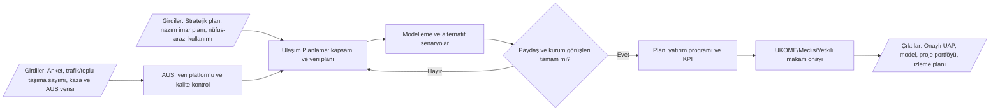

### F02 — Yol/Kavşak Projesi

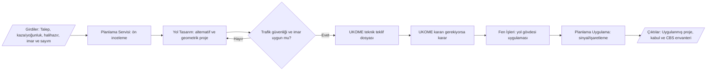

### F03 — Geçiş Yolu / Yol Kapatma

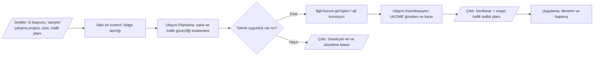

### F04 — UKOME Gündem ve Karar

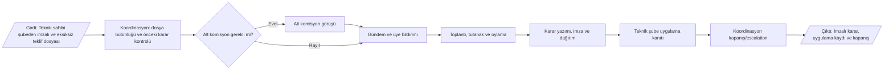

### F05 — Sinyalizasyon

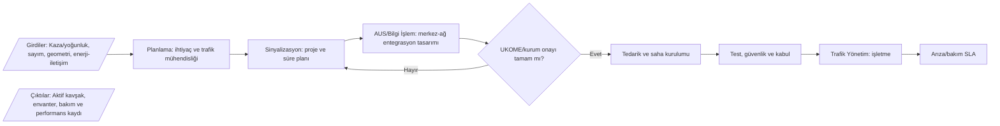

### F06 — EDS ve Akıllı Ulaşım

```mermaid
flowchart LR
  I[/"Girdiler: İhlal/kaza, trafik ihtiyacı, saha ve mevzuat kriteri"/]
  A[Planlama: fizibilite, saha ve iş gereksinimi]
  B[UKOME/kolluk görüşü ve karar]
  C[AUS: sistem mimarisi, veri, entegrasyon ve siber güvenlik]
  D[İhale/tedarik ve kurulum]
  E[Ortak kabul: Planlama işlev + AUS teknik + yetkili kurum]
  F[AUS teknik işletme ve veri]
  G[Planlama etki değerlendirmesi]
  O[/"Çıktılar: Kurulu sistem, veri akışı, ihlal/kaza etki raporu"/]
  I --> A --> B --> C --> D --> E --> F --> G --> O
```

### F07 — Toplu Taşıma Hat/Güzergâh/Tarife

```mermaid
flowchart LR
  I[/"Girdiler: Talep, doluluk, filo, maliyet, yol ağı, şikâyet"/]
  A[Toplu Taşıma Planlama: hizmet senaryoları]
  B[Ulaşım Planlama: yol/kapasite/geometri uygunluğu]
  C[AUS: veri ve simülasyon desteği]
  D[Tarife ve sosyal etki analizi]
  E[UKOME teklif ve karar]
  F[İşletmeci/ruhsat/sistem güncellemesi]
  G[30-90 gün performans izleme]
  O[/"Çıktılar: Kararlı hat-güzergâh-zaman-tarife ve etki raporu"/]
  I --> A --> B --> C --> D --> E --> F --> G --> O
```

### F08 — Ruhsat/Vize/İzin

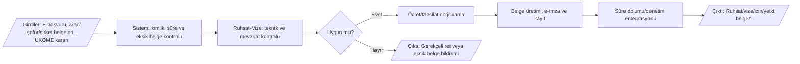

### F09 — Durak Yaşam Döngüsü

```mermaid
flowchart LR
  I[/"Girdiler: Hat planı, yolcu talebi, erişilebilirlik, geometri"/]
  A[Toplu Taşıma: hizmet ihtiyacı]
  B[Planlama: trafik güvenliği ve yer uygunluğu]
  C[UKOME kararı]
  D[Planlama Uygulama: fiziksel montaj]
  E[AUS: akıllı durak ekipmanı]
  F[Ortak kabul ve tek varlık kaydı]
  G[Arıza/bakım yönlendirme]
  O[/"Çıktılar: Erişilebilir durak, dijital bilgi, envanter ve SLA"/]
  I --> A --> B --> C --> D --> E --> F --> G --> O
```

### F10 — Otogar Gelir ve Peron

```mermaid
flowchart LR
  I1[/"Girdi: Araç/plaka, sefer, yetki ve tarife"/]
  A[Plaka tanıma / gişe giriş kaydı]
  B[Tahakkuk ve tahsilat]
  C[Peron kapasite ve tahsis kontrolü]
  D[İndirme-bindirme ve bekleme yönetimi]
  E[Gün sonu kasa ve sefer mutabakatı]
  F[Haftalık/aylık/yıllık faaliyet raporu]
  O[/"Çıktılar: Gelir kaydı, peron belgesi, işletme ve denetim raporu"/]
  I1 --> A --> B --> C --> D --> E --> F --> O
```

### F11 — Trafik Eğitimi

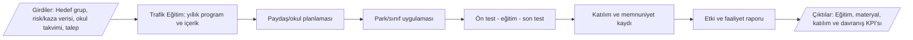

### F12 — İhale/Sözleşme/Hakediş

```mermaid
flowchart LR
  I[/"Girdiler: Onaylı ihtiyaç, bütçe, teknik gereksinim"/]
  A[Teknik şube: şartname, miktar, yaklaşık maliyet]
  B[İdari İşler: yöntem, dosya ve takvim kontrolü]
  C[Destek Hizmetleri veya Ulaşım: mevzuata uygun ihale]
  D[Sözleşme ve iş programı]
  E[Teknik şube: kontrol/metraj]
  F[İdari İşler: dosya, süre, teminat ve ödeme evrakı]
  G[Bağımsız muayene-kabul komisyonu]
  H[Mali kontrol ve ödeme]
  O[/"Çıktılar: İhale dosyası, hakediş, kabul, ödeme ve arşiv"/]
  I --> A --> B --> C --> D --> E --> F --> G --> H --> O
```

### F13 — Bütçe, Faaliyet ve Taşınır

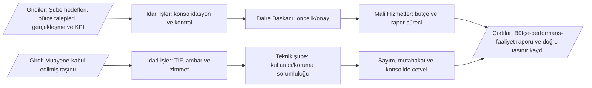

## 7. Mükerrer ve sınırı belirsiz iş süreçleri

| ID | Süreç alanı | Çakışan birimler | Bulgu | Önerilen atama | Gerekli işlem | Öncelik |
| --- | --- | --- | --- | --- | --- | --- |
| D01 | EDS kurulumu ve bakım | Ulaşım Planlama + Akıllı Ulaşım Sistemleri | Planlama yönetmeliği EDS kurulum/bakımını; AUS yönetmeliği EDS ve merkezlerin kurulması/geliştirilmesini tanımlıyor. | Planlama: ihtiyaç, fizibilite, saha/UKOME; AUS: mimari, tedarik, entegrasyon, teknik işletme; saha altyapısı ortak. | Görev yönergelerinde RACI ve kabul sınırı yazılmalı. | Kritik |
| D02 | Trafik Kontrol Merkezi | Trafik Yönetim Servisi + Akıllı Ulaşım Sistemleri | Planlama günlük trafik akışını izliyor/yönetiyor; AUS merkezin kurulması ve geliştirilmesini yürütüyor. | Planlama 24/7 operasyon sahibi; AUS platform/entegrasyon/teknik süreklilik sahibi. | Olay yönetimi ve teknik arıza için iki ayrı SLA. | Kritik |
| D03 | Ulaşım verisi ve analiz | Planlama + AUS + Toplu Taşıma | Her birim kendi verisini topluyor ve analiz ediyor; ortak veri modeli/sahiplik tanımı yok. | AUS kurumsal ulaşım veri platformu; şubeler veri sahibi ve iş kuralı sahibi. | Veri sözlüğü, katalog, API, kalite ve saklama politikası. | Kritik |
| D04 | Toplu taşıma planlaması | Toplu Taşıma Planlama + Ulaşım Planlama | Her iki şube plan/proje görevi taşıyor. | Toplu Taşıma: hat-güzergâh-zaman-tarife-filo; Ulaşım Planlama: çok modlu ana plan, yol/kavşak/kapasite ve geometrik uygunluk. | UKOME teklif şablonunda iki teknik imza alanı. | Yüksek |
| D05 | Durak süreçleri | Toplu Taşıma + Ulaşım Planlama + AUS | Yer/servis ihtiyacı, fiziksel montaj-bakım ve akıllı durak ayrı görevlerde. | Toplu Taşıma: ihtiyaç; Planlama: trafik uygunluğu ve fiziksel varlık; AUS: dijital ekipman. | Tek durak varlık kaydı ve üçlü hizmet seviyesi. | Yüksek |
| D06 | İhale, sözleşme, hakediş ve kabul | Tüm teknik şubeler + İdari İşler + Destek Hizmetleri | Teknik yönergeler ile İdari İşler yönergesi aynı sözleşme/hakediş takibini tekrar ediyor. | Teknik şube: ihtiyaç, şartname, yaklaşık maliyet, kontrol/kabul; İdari: dosya/takvim/ödeme; Destek: proje dışı mal-hizmet ihalesi. | Yetki matrisi ve görev ayrılığı kontrolü. | Kritik |
| D07 | Taşınır/ambar | İdari İşler + Ulaşım Planlama | Planlama yönergesinde taşınır teslim, ambar ve kayıt; ana yönetmelikte/İdari yönergede merkezi İdari İşler görevi. | Tüm kayıt/ambar İdari İşler; teknik şube kullanıcı/koruyucu sorumluluğu. | Planlama yönergesindeki maddeler kaldırılmalı. | Kritik |
| D08 | Evrak kaydı ve arşiv | İdari İşler + teknik şubeler | İdari İşler tüm gelen-giden evrakı yönlendirirken bazı şube yönergeleri ayrıca evrak kaydı tanımlıyor. | Tek EBYS/İdari kayıt; şube işlem ve dosya sahibi. | Paralel kayıt defterleri kaldırılmalı. | Yüksek |
| D09 | Yol kenarı tesis/geçiş yolu | Ulaşım Planlama + Ulaşım Koordinasyon | Planlama teknik proje/erişim; Koordinasyon görüş ve UKOME süreci yürütüyor. | Planlama teknik süreç sahibi; Koordinasyon kurul/karar sahibi. | Tek başvuru, iki aşamalı kontrol. | Yüksek |
| D10 | Otogar tesis işletme görevleri | Otogar + Destek Hizmetleri | 2026 değişikliğiyle ana yönetmelikte bazı Otogar bentleri mülga; eski yönergede bakım/temizlik/güvenlik görevleri kalmış olabilir. | Meclis kararının amacı doğrultusunda Otogar/Destek görevleri yeniden yazılmalı. | Yönerge ve görev tanımları acil revizyon. | Kritik |
| D11 | Kamera/veri teslimi | Trafik Yönetim + AUS + Hukuk/Bilgi İşlem | Kamera görüntüsü formu var; veri sorumluluğu, saklama ve erişim sınırı açık değil. | AUS teknik saklama; yetkilendirilmiş süreç birimi hukuki karar; tüm erişimler loglu. | KVKK ve bilgi güvenliği prosedürü. | Kritik |
| D12 | Belediye araçları vize/sigorta/tescil | Ulaşım Dairesi + merkezi filo birimleri | Daire yönetmeliğinde Ulaşıma verilmiş; kurumsal ölçekte merkezi araç yönetimiyle çakışma riski var. | Merkezi filo sahibi birimde yürütülmesi; Ulaşım mevzuat/teknik danışman. | Teşkilat genelinde yetki kontrolü. | Yüksek |

## 8. Departman bazında önerilen RACI

**R:** Yapan — **A:** Nihai hesap verebilir/onaylayan — **C:** Görüşü alınan — **I:** Bilgilendirilen. `*` işaretli birimler Ulaşım Dairesi dışı kurumsal paydaştır.

| Süreç grubu | Daire Başkanlığı | Ulaşım Planlama | Ulaşım Koordinasyon / UKOME | Toplu Taşıma | Akıllı Ulaşım Sistemleri | Otogar | Trafik Eğitim | İdari İşler | Destek Hizmetleri* | Bilgi İşlem* | Fen/İmar/Diğer* |
| --- | --- | --- | --- | --- | --- | --- | --- | --- | --- | --- | --- |
| Ulaşım ana planı ve çok modlu planlama | A | R | C | C | C | I | C | C | I | C | C |
| Yol/kavşak/geometrik proje | A | R | C | C | C | I | I | C | I | C | C |
| UKOME sekretaryası ve karar takibi | I | C | R/A | C | C | C | I | I | I | I | C |
| Sinyalizasyon ve klasik trafik saha varlıkları | A | R | C | I | C | I | I | C | C | C | C |
| Trafik Yönetim Merkezi operasyonu | A | R | C | C | C | I | I | I | I | C | C |
| EDS/AUS platform ve entegrasyon | A | C | C | C | R | I | I | C | C | C | C |
| Toplu taşıma hat/ruhsat/kontrol | A | C | C | R | C | I | I | C | I | C | I |
| Durak hizmeti ve varlığı | A | R | C | R | R | I | I | C | I | C | C |
| Otogar işletimi | A | I | I | C | C | R | I | C | C | C | I |
| Trafik eğitimi | A | C | I | C | C | I | R | C | C | I | C |
| İhale/sözleşme/hakediş | A | C | I | C | C | C | C | R | R | I | I |
| Bütçe/rapor/evrak/taşınır | A | C | I | C | C | C | C | R | C | I | I |

## 9. Diğer büyükşehirlerle karşılaştırma

| Karşılaştırma alanı | Belediye | Gözlenen model | Denizli için tavsiye | Resmî kaynak |
| --- | --- | --- | --- | --- |
| UKOME sekretaryası | İstanbul BB | Gündem, dosya bütünlüğü, alt kurul, tutanak, karar, imza, dağıtım ve uygulama takibi ayrı bir sekretarya görevi olarak tanımlanmış. | Denizli’de Ulaşım Koordinasyon teknik iş sahibi değil, süreç yöneticisi/kalite kapısı olarak konumlandırılmalı. | https://ulasim.ibb.istanbul/gorevlerimiz/ |
| Fonksiyonel ayrışma | Ankara BB | UKOME, Ulaşım Planlama ve Koordinasyon, Ticari Araç İşlemleri, Sinyalizasyon ve Altyapı, Trafik Kontrol, İdari ve Mali İşler ayrı şubelerdir. | Denizli’de mevcut yapı korunabilir; ancak Planlama içindeki operasyon ve saha servisleri için açık servis katalogları/SLA gerekir. | https://www.ankara.bel.tr/teskilat-semasi/ulasim-dairesi-baskanligi-187 |
| AUS ve sürdürülebilir ulaşım | Kocaeli BB | Akıllı ve Sürdürülebilir Ulaşım Sistemleri; Trafik Hizmetleri, UKOME, Ulaşım Planlama ve Ruhsat/İdareden ayrı yapılandırılmış. | Denizli’de AUS platform/veri/entegrasyon sahibi; Planlama trafik ve planlama iş sahibi olmalı. | https://www.kocaeli.bel.tr/teskilat/ |
| Veriye dayalı planlama | Kocaeli BB | Yaya stratejisinde veri toplama, uluslararası kıyas, anket/sayım, erişilebilirlik indeksi, model, kavram proje ve eylem planı birlikte kurgulanmış. | Denizli UAP ve sürdürülebilir ulaşım süreçlerine zorunlu veri-baseline, alternatif analizi ve etki KPI’sı eklenmeli. | https://www.kocaeli.bel.tr/haber/kocaeli-geneli-yaya-ulasim-stratejilerinin-gelistirilmesi-ve-eylem-plani-danismanlik-hizmeti-48329.html |
| AUS saha varlıkları | Kocaeli BB | AUS saha unsurlarının tedarik, montaj/demontaj ve bakım hizmeti AUS birimi altında yürütülüyor. | Denizli’de akıllı saha cihazlarının varlık/entegrasyon sahibi AUS; klasik sinyal/levha saha varlıkları Planlama olmalı. | https://www.kocaeli.bel.tr/haber/akilli-ulasim-sistemleri-saha-unsurlari-tedarik-montaj-ve-demontaj-hizmeti-51058.html |

### Karşılaştırma sonucu

Denizli için en verimli model başka bir belediyenin şemasını aynen kopyalamak değil; mevcut yapıyı süreç sınırlarıyla netleştirmektir:

1. İstanbul’daki gibi UKOME’yi sekretarya, dosya kalite kapısı ve karar takip birimi yapmak.
2. Ankara’daki gibi planlama, trafik operasyonu, sinyalizasyon, ruhsat, UKOME ve idari işleri süreç seviyesinde ayırmak.
3. Kocaeli’deki gibi AUS’u platform, veri, entegrasyon ve akıllı saha unsurlarının teknik sahibi yapmak.
4. Planlama işlerine veri tabanı, uluslararası kıyas, alternatif analizi, erişilebilirlik ve etki KPI’sını zorunlu eklemek.

## 10. Mevzuat uyum matrisi

| ID | Mevzuat | İlgili alan | Süreçler | İlk uyum değerlendirmesi | Önerilen kontrol |
| --- | --- | --- | --- | --- | --- |
| L01 | 5216 Büyükşehir Belediyesi Kanunu | Büyükşehir ulaşım yetkisi, ana plan, toplu taşıma, UKOME ve koordinasyon | P01-P44 | Genel olarak uyumlu; görev sahipliği ve UKOME ayrımı netleştirilmeli | Güncel konsolide metinle yıllık kontrol |
| L02 | 5393 Belediye Kanunu | Belediye görevleri, teşkilat, meclis/encümen ve yerel düzenleme | P01, P28-P37, P41 | Genel dayanak mevcut | Yönerge değişikliklerinde hukuk görüşü ve karar izi |
| L03 | 2918 Karayolları Trafik Kanunu | Trafik düzeni, işaretleme, sinyal, erişim, denetim ve yol güvenliği | P03-P16, P22-P24, P38-P43 | Teknik süreçler uyumlu; kolluk yetkisi sınırı dikkat gerektiriyor | Denetim ve EDS prosedüründe yetki matrisi |
| L04 | Büyükşehir Belediyeleri Koordinasyon Merkezleri Yönetmeliği | UKOME kuruluş, görev, sekretarya ve karar süreçleri | P05-P09, P20, P23, P39 | Koordinasyon birimi görevleri uyumlu; teknik sahiplik ayrılmalı | UKOME dosya kabul standardı ve karar takip sistemi |
| L05 | 4925 Karayolu Taşıma Kanunu ve Yönetmeliği | Taşıma yetki belgeleri, servis/yük/yolcu taşıma ve terminaller | P20-P27, P40 | Kapsam uygun; belgelerin güncelliği kontrol edilmeli | Ruhsat/otogar kontrol listelerini güncelle |
| L06 | 4734 Kamu İhale Kanunu ve ikincil mevzuat | Mal, hizmet, danışmanlık ve yapım alımı | P10-P13, P16-P19, P24, P27, P31-P33 | Görev tekrarı ve görev ayrılığı riski var | KİK/EKAP güncel kontrol listesi ve RACI |
| L07 | 4735 Kamu İhale Sözleşmeleri Kanunu | Sözleşme uygulama, hakediş, kabul, yaptırım | P10-P13, P16-P19, P24, P27, P32 | Teknik ve idari takip sınırı belirsiz | Sözleşme yöneticisi, kontrol ve kabul rollerini ayır |
| L08 | 5018 Kamu Mali Yönetimi ve Kontrol Kanunu | Bütçe, iç kontrol, harcama, ödeme, taşınır ve raporlama | P25, P30-P37 | Taşınır ve ihale rollerinde mükerrerlik var | İdari İşler merkezileştirmesi ve kontrol izi |
| L09 | 2464 Belediye Gelirleri Kanunu | Belediye ücret/harç ve gelir süreçleri | P21, P25, P37 | Tarife işlemleri için uygulanabilirliği kalem bazında teyit edilmeli | Hukuk ve Mali Hizmetler kontrolü |
| L10 | 2886 Devlet İhale Kanunu | Satış, kiralama ve gelir getirici taşınmaz işlemleri | P27, P37 | Satın alma süreçlerine uygulanmamalı; yalnız uygun satış/kira işlemleri | 4734/2886 karar ağacı |
| L11 | 3194 İmar Kanunu | İmar-plan, yapı/yol ilişkisi, erişim ve proje koordinasyonu | P01, P03-P06, P19, P42 | İmar-Ulaşım veri ve onay entegrasyonu gerekli | CBS tabanlı imar/ulaşım kontrolü |
| L12 | 4736 Kanunu | Kamu hizmetlerinde ücretsiz/indirimli tarifeler | P20-P21, P37 | Tarife tasarımında zorunlu hak sahipleri dikkate alınmalı | Tarife kontrol listesi |
| L13 | 5326 Kabahatler Kanunu | İdari yaptırım genel usulü | P22, P25-P27 | Yaptırım yetkisi ve tutanak düzenleyen makam açık olmalı | Yetki olmadan ceza süreci tasarlanmamalı |
| L14 | 5378 Engelliler Hakkında Kanun | Erişilebilir ulaşım, durak ve bilgi sistemleri | P03, P18-P24, P28-P29 | Erişilebilirlik kriterleri süreç giriş/kabul kontrolüne dönüştürülmeli | Erişilebilirlik kontrol listesi ve kullanıcı testi |
| L15 | 6331 İş Sağlığı ve Güvenliği Kanunu | Saha, bakım, yapım, otogar ve eğitim parkı güvenliği | P10-P13, P24, P27-P29 | Genel görevlerde var; iş akışına izin/LOTO/KKD kontrolleri eklenmeli | Saha iş emri güvenlik kapısı |
| L16 | 657 Devlet Memurları Kanunu | Personel görev, izin, sorumluluk ve disiplin | P28, P34-P35, P41 | İzin/rapor İdari İşlerde; görev tanımı sürümleri personele tebliğ edilmeli | Elektronik tebliğ ve görev tanımı kabul kaydı |
| L17 | Karayolu Trafik İşaretleme Standartları | Yatay/düşey işaretleme teknik standardı | P07, P10-P13, P23-P24 | Kaynak mevcut; kabul kriterleri ölçülebilir hale getirilmeli | Malzeme/uygulama kalite kontrol formları |
| L18 | KVKK ve bilgi güvenliği düzenlemeleri | Kamera, konum, plaka, personel ve başvuru verileri | P02, P14-P18, P21-P22, P25, P35, P38, P43-P44 | Repo ve süreçlerde kişisel/operasyonel veri riski yüksek | Veri envanteri, yetki, log, saklama-imha ve maskeleme |

### Kritik mevzuat ve doküman kontrol bulguları

1. 16 Haziran 2026 tarihli ve 419 sayılı Meclis kararıyla Toplu Taşıma denetimi ve Otogar görevleri değişmiştir. Otogar yönergesi, görev tanımları, formlar ve hizmet sözleşmeleri etki analizinden geçirilmelidir.
2. Ulaşım Planlama yönergesindeki taşınır teslim/ambar/kayıt görevleri ana yönetmelik ve İdari İşler göreviyle çakışmaktadır; İdari İşlerde merkezileştirilmelidir.
3. Teknik şubelerdeki ihale–sözleşme–hakediş maddeleri İdari İşler görevleriyle örtüşür. Teknik içerik/kontrol ile idari dosya/takvim ayrılmalıdır.
4. Yönergelerde başka şube adı veya yanlış yürürlükten kaldırma referansı gibi doküman kontrol hataları bulunmaktadır; bütün çapraz referanslar doğrulanmalıdır.
5. Personel isimli raporlar, kamera görüntüsü, EDS ve ağ dokümanları için erişim sınıflandırması, KVKK ve bilgi güvenliği uygulanmalıdır.
6. Repodaki mevzuat PDF’lerine güncel konsolide bağlantı, kontrol tarihi ve değişiklik takip alanı eklenmelidir.

## 11. Tavsiye edilen süreç kimlik kartı

Her süreçte şu alanlar zorunlu olmalıdır: süreç ID/adı, amaç/kapsam, RACI, tetikleyici, zorunlu girdiler, adımlar/karar noktaları, çıktılar/kayıtlar, mevzuat, SLA, KPI, risk/kontrol, sistem/API, kişisel veri-saklama süresi ve revizyon/onay.

Ortak dijital omurga:

`E-başvuru → tamlık kontrolü → teknik inceleme → kurum görüşü → kurul/onay → e-imza → ödeme/tahsilat → uygulama → kapanış → arşiv/KPI`

## 12. Öncelikli yol haritası

| Dönem | İş paketi | Çıktı | Öncelik |
| --- | --- | --- | --- |
| 0–30 gün | Yönetmelik-yönerge etki analizi | 2026/419 değişikliğini Otogar, Toplu Taşıma, görev tanımları ve formlara yansıt; hatalı çapraz referansları düzelt. | Kritik |
| 0–30 gün | RACI kararları | EDS/TKM, ihale-sözleşme, taşınır, durak ve toplu taşıma planlama sınırlarını Daire Başkanı onayıyla geçici RACI olarak yayımla. | Kritik |
| 0–30 gün | Bilgi güvenliği | Repo ve dokümanları Kamuya Açık/Kurum İçi/Kişisel Veri/Operasyonel Hassas olarak sınıflandır. | Kritik |
| 30–90 gün | Süreç kayıt sistemi | 44 süreci kodla; sahip, girdi, çıktı, süre, mevzuat ve KPI alanlarıyla süreç envanterini yürürlüğe al. | Yüksek |
| 30–90 gün | UKOME dijital dosyası | Teknik teklif şablonu, belge tamlık kapısı, alt komisyon, e-imza, dağıtım ve kapanış modülü kur. | Kritik |
| 30–90 gün | İhale ve sözleşme takvimi | Teknik/İdari/Destek/Mali görev ayrılığıyla merkezi sözleşme ve teminat takibi kur. | Kritik |
| 30–90 gün | Tek varlık ve veri kataloğu | Durak, levha, sinyal, kamera, EDS ve yol sorumluluk katmanlarını CBS’de tekil ID ile yönet. | Yüksek |
| 90–180 gün | E-başvuru paketleri | Ruhsat-vize, geçiş yolu, yol kapatma, kamera talebi ve peron işlemlerini standart e-form/SLA ile dijitalleştir. | Yüksek |
| 90–180 gün | KPI ve yönetici paneli | Süre, bekleme, tekrar işlem, arıza SLA, gelir mutabakatı, karar kapanış ve vatandaş memnuniyeti göstergelerini yayımla. | Yüksek |
| 180+ gün | Süreç madenciliği ve sürekli iyileştirme | EBYS, UKOME, ruhsat, bakım ve mali sistem olay kayıtlarından darboğaz/mükerrerlik analizi yap. | Orta |

## 13. Kaynak dizini

| Kurum | Kaynak | Bağlantı |
| --- | --- | --- |
| Repo | GitHub kaynak deposu | https://github.com/emre1006/Ula-m_Dairesi_-_Analizi |
| Denizli | Ulaşım Dairesi Başkanlığı görev sayfası | https://denizli.bel.tr/Default.aspx?k=ulasim-hizmetleri |
| Denizli | Ulaşım Dairesi Başkanlığı teşkilat yönetmeliği | https://www2.denizli.bel.tr/userfiles/file/TeskilatYonetmeligi/Ula%C5%9F%C4%B1m%20Dairesi%20Ba%C5%9Fkanl%C4%B1%C4%9F%C4%B1.pdf?v13= |
| Denizli | 16.06.2026 tarih ve 419 sayılı değişiklik duyurusu | https://www.denizli.bel.tr/Default.aspx?id=25263&k=haber-detay |
| İstanbul | Ulaşım Koordinasyon Müdürlüğü görevleri | https://ulasim.ibb.istanbul/gorevlerimiz/ |
| Ankara | Ulaşım Dairesi Başkanlığı teşkilat yapısı | https://www.ankara.bel.tr/teskilat-semasi/ulasim-dairesi-baskanligi-187 |
| Kocaeli | Ulaşım organizasyon yapısı | https://www.kocaeli.bel.tr/teskilat/ |
| Kocaeli | Yaya ulaşım stratejisi ve eylem planı kapsamı | https://www.kocaeli.bel.tr/haber/kocaeli-geneli-yaya-ulasim-stratejilerinin-gelistirilmesi-ve-eylem-plani-danismanlik-hizmeti-48329.html |
| KİK | Güncel kamu ihale mevzuatı | https://www.kik.gov.tr/Mevzuat.aspx?AnaSayfa=true&keyword=4734 |