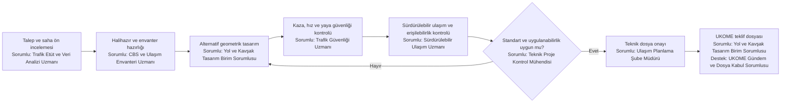
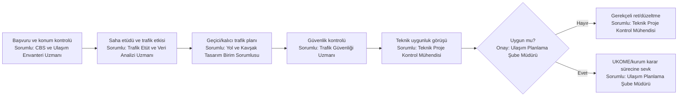

# Ulaşım Planlama — Sorumlu Pozisyonlu Süreç Haritaları

## Ulaşım Ana Planı ve modelleme

```mermaid
flowchart LR
 A["Kapsam ve veri planı<br/>Sorumlu: Ulaşım Ana Planı ve Modelleme Birim Sorumlusu<br/>Onay: Ulaşım Planlama Şube Müdürü"] --> B["Sayım ve veri toplama<br/>Sorumlu: Trafik Etüt ve Veri Analizi Uzmanı<br/>Destek: CBS ve Ulaşım Envanteri Uzmanı"]
 B --> C["Veri kalite ve CBS kontrolü<br/>Sorumlu: CBS ve Ulaşım Envanteri Uzmanı<br/>Destek: Veri Yönetişimi Sorumlusu"]
 C --> D["Model kurma ve kalibrasyon<br/>Sorumlu: Ulaşım Ana Planı ve Modelleme Birim Sorumlusu"]
 D --> E["Senaryo ve kapasite analizi<br/>Sorumlu: Ulaşım Ana Planı ve Modelleme Birim Sorumlusu<br/>Destek: Trafik Etüt ve Veri Analizi Uzmanı"]
 E --> F["Yaya-bisiklet-erişilebilirlik paketi<br/>Sorumlu: Sürdürülebilir Ulaşım Uzmanı<br/>Kontrol: Trafik Güvenliği Uzmanı"]
 F --> G["Teknik uygulanabilirlik kontrolü<br/>Sorumlu: Teknik Proje Kontrol Mühendisi"]
 G --> H["Plan portföyünün onayı ve kurum görüşleri<br/>Sorumlu: Ulaşım Planlama Şube Müdürü"]
 H --> I["Onaylı plan ve izleme göstergeleri<br/>Sorumlu: Ulaşım Ana Planı ve Modelleme Birim Sorumlusu"]
```

## Yol ve kavşak projesi

```mermaid
flowchart LR
 A["Talep ve saha ön incelemesi<br/>Sorumlu: Trafik Etüt ve Veri Analizi Uzmanı"] --> B["Halihazır ve envanter hazırlığı<br/>Sorumlu: CBS ve Ulaşım Envanteri Uzmanı"]
 B --> C["Alternatif geometrik tasarım<br/>Sorumlu: Yol ve Kavşak Tasarım Birim Sorumlusu"]
 C --> D["Kaza, hız ve yaya güvenliği kontrolü<br/>Sorumlu: Trafik Güvenliği Uzmanı"]
 D --> E["Sürdürülebilir ulaşım ve erişilebilirlik kontrolü<br/>Sorumlu: Sürdürülebilir Ulaşım Uzmanı"]
 E --> F{"Standart ve uygulanabilirlik uygun mu?<br/>Sorumlu: Teknik Proje Kontrol Mühendisi"}
 F -- Hayır --> C
 F -- Evet --> G["Teknik dosya onayı<br/>Sorumlu: Ulaşım Planlama Şube Müdürü"]
 G --> H["UKOME teklif dosyası<br/>Sorumlu: Yol ve Kavşak Tasarım Birim Sorumlusu<br/>Destek: UKOME Gündem ve Dosya Kabul Sorumlusu"]
```

## Geçiş yolu, yol kapatma ve trafik düzenleme

```mermaid
flowchart LR
 A["Başvuru ve konum kontrolü<br/>Sorumlu: CBS ve Ulaşım Envanteri Uzmanı"] --> B["Saha etüdü ve trafik etkisi<br/>Sorumlu: Trafik Etüt ve Veri Analizi Uzmanı"]
 B --> C["Geçici/kalıcı trafik planı<br/>Sorumlu: Yol ve Kavşak Tasarım Birim Sorumlusu"]
 C --> D["Güvenlik kontrolü<br/>Sorumlu: Trafik Güvenliği Uzmanı"]
 D --> E["Teknik uygunluk görüşü<br/>Sorumlu: Teknik Proje Kontrol Mühendisi"]
 E --> F{"Uygun mu?<br/>Onay: Ulaşım Planlama Şube Müdürü"}
 F -- Hayır --> G["Gerekçeli ret/düzeltme<br/>Sorumlu: Teknik Proje Kontrol Mühendisi"]
 F -- Evet --> H["UKOME/kurum karar sürecine sevk<br/>Sorumlu: Ulaşım Planlama Şube Müdürü"]
```
