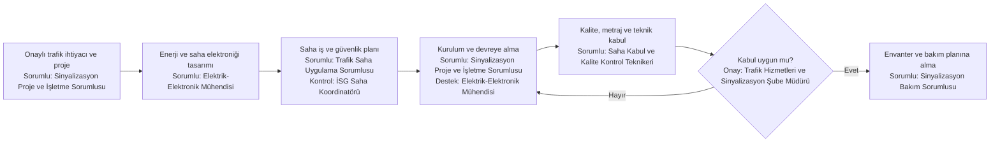
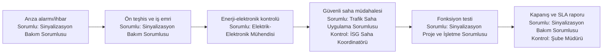
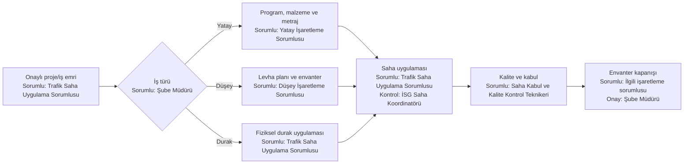

# Trafik Hizmetleri ve Sinyalizasyon — Sorumlu Pozisyonlu Süreç Haritaları

## Yeni sinyalize kavşak kurulumu

```mermaid
flowchart LR
 A["Onaylı trafik ihtiyacı ve proje<br/>Sorumlu: Sinyalizasyon Proje ve İşletme Sorumlusu"] --> B["Enerji ve saha elektroniği tasarımı<br/>Sorumlu: Elektrik-Elektronik Mühendisi"]
 B --> C["Saha iş ve güvenlik planı<br/>Sorumlu: Trafik Saha Uygulama Sorumlusu<br/>Kontrol: İSG Saha Koordinatörü"]
 C --> D["Kurulum ve devreye alma<br/>Sorumlu: Sinyalizasyon Proje ve İşletme Sorumlusu<br/>Destek: Elektrik-Elektronik Mühendisi"]
 D --> E["Kalite, metraj ve teknik kabul<br/>Sorumlu: Saha Kabul ve Kalite Kontrol Teknikeri"]
 E --> F{"Kabul uygun mu?<br/>Onay: Trafik Hizmetleri ve Sinyalizasyon Şube Müdürü"}
 F -- Hayır --> D
 F -- Evet --> G["Envanter ve bakım planına alma<br/>Sorumlu: Sinyalizasyon Bakım Sorumlusu"]
```

## Sinyalizasyon arıza ve bakım

```mermaid
flowchart LR
 A["Arıza alarmı/ihbar<br/>Sorumlu: Sinyalizasyon Bakım Sorumlusu"] --> B["Ön teşhis ve iş emri<br/>Sorumlu: Sinyalizasyon Bakım Sorumlusu"]
 B --> C["Enerji-elektronik kontrolü<br/>Sorumlu: Elektrik-Elektronik Mühendisi"]
 C --> D["Güvenli saha müdahalesi<br/>Sorumlu: Trafik Saha Uygulama Sorumlusu<br/>Kontrol: İSG Saha Koordinatörü"]
 D --> E["Fonksiyon testi<br/>Sorumlu: Sinyalizasyon Proje ve İşletme Sorumlusu"]
 E --> F["Kapanış ve SLA raporu<br/>Sorumlu: Sinyalizasyon Bakım Sorumlusu<br/>Kontrol: Şube Müdürü"]
```

## Yatay-düşey işaretleme ve durak varlığı

```mermaid
flowchart LR
 A["Onaylı proje/iş emri<br/>Sorumlu: Trafik Saha Uygulama Sorumlusu"] --> B{"İş türü<br/>Sorumlu: Şube Müdürü"}
 B -- Yatay --> C["Program, malzeme ve metraj<br/>Sorumlu: Yatay İşaretleme Sorumlusu"]
 B -- Düşey --> D["Levha planı ve envanter<br/>Sorumlu: Düşey İşaretleme Sorumlusu"]
 B -- Durak --> E["Fiziksel durak uygulaması<br/>Sorumlu: Trafik Saha Uygulama Sorumlusu"]
 C --> F["Saha uygulaması<br/>Sorumlu: Trafik Saha Uygulama Sorumlusu<br/>Kontrol: İSG Saha Koordinatörü"]
 D --> F
 E --> F
 F --> G["Kalite ve kabul<br/>Sorumlu: Saha Kabul ve Kalite Kontrol Teknikeri"]
 G --> H["Envanter kapanışı<br/>Sorumlu: İlgili işaretleme sorumlusu<br/>Onay: Şube Müdürü"]
```
