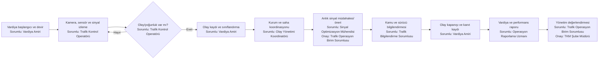

# Trafik Yönetim Merkezi — Sorumlu Pozisyonlu Süreç Haritaları

## Günlük trafik operasyonu ve olay yönetimi

```mermaid
flowchart LR
 A["Vardiya başlangıcı ve devir<br/>Sorumlu: Vardiya Amiri"] --> B["Kamera, sensör ve sinyal izleme<br/>Sorumlu: Trafik Kontrol Operatörü"]
 B --> C{"Olay/yoğunluk var mı?<br/>Sorumlu: Trafik Kontrol Operatörü"}
 C -- Hayır --> B
 C -- Evet --> D["Olay kaydı ve sınıflandırma<br/>Sorumlu: Vardiya Amiri"]
 D --> E["Kurum ve saha koordinasyonu<br/>Sorumlu: Olay Yönetimi Koordinatörü"]
 E --> F["Anlık sinyal müdahalesi/öneri<br/>Sorumlu: Sinyal Optimizasyon Mühendisi<br/>Onay: Trafik Operasyon Birim Sorumlusu"]
 F --> G["Kamu ve sürücü bilgilendirmesi<br/>Sorumlu: Trafik Bilgilendirme Sorumlusu"]
 G --> H["Olay kapanışı ve kanıt kaydı<br/>Sorumlu: Vardiya Amiri"]
 H --> I["Vardiya ve performans raporu<br/>Sorumlu: Operasyon Raporlama Uzmanı"]
 I --> J["Yönetim değerlendirmesi<br/>Sorumlu: Trafik Operasyon Birim Sorumlusu<br/>Onay: TKM Şube Müdürü"]
```

## Planlı çalışma ve acil durum koordinasyonu

```mermaid
flowchart LR
 A["Planlı kapanış/acil durum bildirimi<br/>Sorumlu: Olay Yönetimi Koordinatörü"] --> B["Operasyon senaryosu ve vardiya planı<br/>Sorumlu: Trafik Operasyon Birim Sorumlusu"]
 B --> C["Sinyal ve yönlendirme senaryosu<br/>Sorumlu: Sinyal Optimizasyon Mühendisi"]
 C --> D["Operatör görev dağılımı<br/>Sorumlu: Vardiya Amiri"]
 D --> E["Canlı izleme ve müdahale<br/>Sorumlu: Trafik Kontrol Operatörü"]
 E --> F["Kurumlar arası olay yönetimi<br/>Sorumlu: Olay Yönetimi Koordinatörü"]
 F --> G["Duyuru ve trafik bilgisi<br/>Sorumlu: Trafik Bilgilendirme Sorumlusu"]
 G --> H["Sonuç ve etki analizi<br/>Sorumlu: Operasyon Raporlama Uzmanı"]
 H --> I["Operasyon kapanış onayı<br/>Sorumlu: TKM Şube Müdürü"]
```
