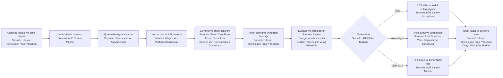

# Akıllı ve Sürdürülebilir Ulaşım Sistemleri — Sorumlu Pozisyonlu Süreç Haritaları

## AUS/EDS sistem tasarımı ve devreye alma

```mermaid
flowchart LR
 A["Onaylı iş ihtiyacı ve saha listesi<br/>Sorumlu: Ulaşım Teknolojileri Proje Yöneticisi"] --> B["Hedef sistem mimarisi<br/>Sorumlu: AUS Sistem Mimarı"]
 B --> C["Ağ ve haberleşme tasarımı<br/>Sorumlu: Haberleşme ve Ağ Mühendisi"]
 C --> D["Veri modeli ve API tasarımı<br/>Sorumlu: Ulaşım Veri Platformu Sorumlusu"]
 D --> E["Güvenlik ve erişim tasarımı<br/>Sorumlu: Siber Güvenlik ve Erişim Sorumlusu<br/>Kontrol: Veri Koruma Süreç Sorumlusu"]
 E --> F["Teknik şartname ve tedarik hazırlığı<br/>Sorumlu: Ulaşım Teknolojileri Proje Yöneticisi"]
 F --> G["Kurulum ve entegrasyon<br/>Sorumlu: Sistem Entegrasyon Mühendisi<br/>Destek: Haberleşme ve Ağ Mühendisi"]
 G --> H{"Sistem türü<br/>Sorumlu: AUS Şube Müdürü"}
 H -- EDS --> I["EDS saha ve kolluk entegrasyonu<br/>Sorumlu: EDS Sistem Sorumlusu"]
 H -- Yolcu bilgisi --> J["Akıllı durak ve yolcu bilgisi<br/>Sorumlu: Akıllı Durak ve Yolcu Bilgilendirme Sorumlusu"]
 H -- Diğer AUS --> K["Fonksiyon ve performans testi<br/>Sorumlu: AUS Sistem Mimarı"]
 I --> L["Ortak kabul ve devreye alma<br/>Sorumlu: Ulaşım Teknolojileri Proje Yöneticisi<br/>Onay: AUS Şube Müdürü"]
 J --> L
 K --> L
```

## Ulaşım veri platformu ve analitik

```mermaid
flowchart LR
 A["Veri kaynağı envanteri<br/>Sorumlu: Ulaşım Veri Platformu Sorumlusu"] --> B["Entegrasyon ve veri akışı<br/>Sorumlu: Sistem Entegrasyon Mühendisi"]
 B --> C["Ağ, erişim ve süreklilik<br/>Sorumlu: Haberleşme ve Ağ Mühendisi"]
 C --> D["Yetki, log ve güvenlik kontrolü<br/>Sorumlu: Siber Güvenlik ve Erişim Sorumlusu"]
 D --> E["Kişisel veri ve saklama kontrolü<br/>Sorumlu: Veri Koruma Süreç Sorumlusu"]
 E --> F["Veri kalite ve katalog işlemleri<br/>Sorumlu: Ulaşım Veri Platformu Sorumlusu"]
 F --> G["Analiz, tahmin ve gösterge üretimi<br/>Sorumlu: Veri Analisti / Veri Bilimci"]
 G --> H["Yayın ve karar destek hizmeti<br/>Sorumlu: AUS Şube Müdürü"]
```
