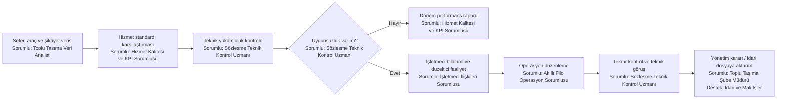

# Toplu Taşıma Planlama ve İşletme — Sorumlu Pozisyonlu Süreç Haritaları

## Hat, güzergâh, sefer ve tarife planlama

```mermaid
flowchart LR
 A["Talep ve hizmet verisi toplama<br/>Sorumlu: Toplu Taşıma Veri Analisti"] --> B["Hat ve güzergâh alternatifleri<br/>Sorumlu: Hat ve Güzergâh Planlama Sorumlusu"]
 B --> C["Filo ve kapasite analizi<br/>Sorumlu: Filo ve Kapasite Planlama Uzmanı"]
 C --> D["Tarife ve maliyet analizi<br/>Sorumlu: Tarife ve Maliyet Analizi Uzmanı"]
 D --> E["Durak hizmet ihtiyacı<br/>Sorumlu: Durak Hizmetleri Planlama Uzmanı"]
 E --> F["Hizmet kalitesi ve KPI hedefleri<br/>Sorumlu: Hizmet Kalitesi ve KPI Sorumlusu"]
 F --> G["İşletmeci uygulanabilirlik görüşü<br/>Sorumlu: İşletmeci İlişkileri Sorumlusu"]
 G --> H["Teknik dosya onayı<br/>Sorumlu: Toplu Taşıma Şube Müdürü"]
 H --> I["UKOME teklif ve karar süreci<br/>Sorumlu: Hat ve Güzergâh Planlama Sorumlusu<br/>Destek: UKOME Şube Müdürlüğü"]
 I --> J["Canlı filo kural ve sistem güncellemesi<br/>Sorumlu: Akıllı Filo Operasyon Sorumlusu<br/>Destek: AUS"]
 J --> K["Uygulama sonrası performans izleme<br/>Sorumlu: Toplu Taşıma Veri Analisti"]
```

## İşletmeci performansı ve sözleşme teknik kontrolü

```mermaid
flowchart LR
 A["Sefer, araç ve şikâyet verisi<br/>Sorumlu: Toplu Taşıma Veri Analisti"] --> B["Hizmet standardı karşılaştırması<br/>Sorumlu: Hizmet Kalitesi ve KPI Sorumlusu"]
 B --> C["Teknik yükümlülük kontrolü<br/>Sorumlu: Sözleşme Teknik Kontrol Uzmanı"]
 C --> D{"Uygunsuzluk var mı?<br/>Sorumlu: Sözleşme Teknik Kontrol Uzmanı"}
 D -- Hayır --> E["Dönem performans raporu<br/>Sorumlu: Hizmet Kalitesi ve KPI Sorumlusu"]
 D -- Evet --> F["İşletmeci bildirimi ve düzeltici faaliyet<br/>Sorumlu: İşletmeci İlişkileri Sorumlusu"]
 F --> G["Operasyon düzenleme<br/>Sorumlu: Akıllı Filo Operasyon Sorumlusu"]
 G --> H["Tekrar kontrol ve teknik görüş<br/>Sorumlu: Sözleşme Teknik Kontrol Uzmanı"]
 H --> I["Yönetim kararı / idari dosyaya aktarım<br/>Sorumlu: Toplu Taşıma Şube Müdürü<br/>Destek: İdari ve Mali İşler"]
```
