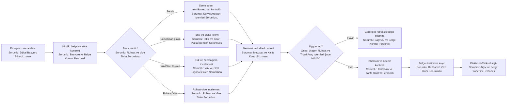
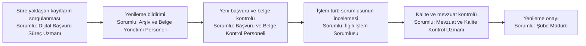

# Ulaşım Ruhsat ve Ticari Araç İşlemleri — Sorumlu Pozisyonlu Süreç Haritaları

## Ruhsat, vize ve izin süreci

```mermaid
flowchart LR
 A["E-başvuru ve randevu<br/>Sorumlu: Dijital Başvuru Süreç Uzmanı"] --> B["Kimlik, belge ve süre kontrolü<br/>Sorumlu: Başvuru ve Belge Kontrol Personeli"]
 B --> C{"Başvuru türü<br/>Sorumlu: Ruhsat ve Vize Birim Sorumlusu"}
 C -- Servis --> D["Servis aracı teknik/mevzuat kontrolü<br/>Sorumlu: Servis Araçları İşlemleri Sorumlusu"]
 C -- Taksi/Ticari plaka --> E["Taksi ve plaka işlemi<br/>Sorumlu: Taksi ve Ticari Plaka İşlemleri Sorumlusu"]
 C -- Yük/Özel taşıma --> F["Yük ve özel taşıma incelemesi<br/>Sorumlu: Yük ve Özel Taşıma İzinleri Sorumlusu"]
 C -- Ruhsat/Vize --> G["Ruhsat-vize incelemesi<br/>Sorumlu: Ruhsat ve Vize Birim Sorumlusu"]
 D --> H["Mevzuat ve kalite kontrolü<br/>Sorumlu: Mevzuat ve Kalite Kontrol Uzmanı"]
 E --> H
 F --> H
 G --> H
 H --> I{"Uygun mu?<br/>Onay: Ulaşım Ruhsat ve Ticari Araç İşlemleri Şube Müdürü"}
 I -- Hayır --> J["Gerekçeli ret/eksik belge bildirimi<br/>Sorumlu: Başvuru ve Belge Kontrol Personeli"]
 I -- Evet --> K["Tahakkuk ve ödeme kontrolü<br/>Sorumlu: Tahakkuk ve Tarife Kontrol Personeli"]
 K --> L["Belge üretimi ve kayıt<br/>Sorumlu: Ruhsat ve Vize Birim Sorumlusu"]
 L --> M["Elektronik/fiziksel arşiv<br/>Sorumlu: Arşiv ve Belge Yönetimi Personeli"]
```

## Süre dolumu ve yenileme takibi

```mermaid
flowchart LR
 A["Süre yaklaşan kayıtların sorgulanması<br/>Sorumlu: Dijital Başvuru Süreç Uzmanı"] --> B["Yenileme bildirimi<br/>Sorumlu: Arşiv ve Belge Yönetimi Personeli"]
 B --> C["Yeni başvuru ve belge kontrolü<br/>Sorumlu: Başvuru ve Belge Kontrol Personeli"]
 C --> D["İşlem türü sorumlusunun incelemesi<br/>Sorumlu: İlgili İşlem Sorumlusu"]
 D --> E["Kalite ve mevzuat kontrolü<br/>Sorumlu: Mevzuat ve Kalite Kontrol Uzmanı"]
 E --> F["Yenileme onayı<br/>Sorumlu: Şube Müdürü"]
```
