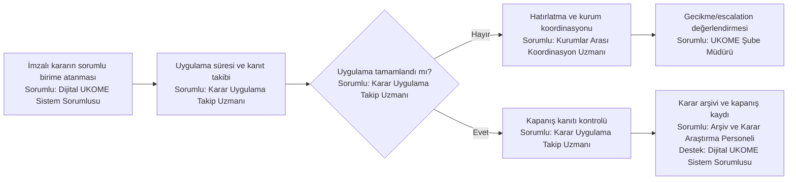

# UKOME — Sorumlu Pozisyonlu Süreç Haritaları

## Gündem, alt komisyon ve karar süreci

```mermaid
flowchart LR
 A["Teknik teklif dosyasının teslimi<br/>Sorumlu: Teknik sahibi şube"] --> B["Dosya tamlık ve yetki kontrolü<br/>Sorumlu: Gündem ve Dosya Kabul Sorumlusu"]
 B --> C["Önceki karar ve dosya araştırması<br/>Sorumlu: Arşiv ve Karar Araştırma Personeli"]
 C --> D{"Alt komisyon gerekli mi?<br/>Sorumlu: UKOME Şube Müdürü"}
 D -- Evet --> E["Alt komisyon takvimi ve görüşler<br/>Sorumlu: Alt Komisyon Koordinatörü"]
 D -- Hayır --> F["Gündem taslağı<br/>Sorumlu: Gündem ve Dosya Kabul Sorumlusu"]
 E --> F
 F --> G["Kurum görüşleri ve üye koordinasyonu<br/>Sorumlu: Kurumlar Arası Koordinasyon Uzmanı"]
 G --> H["Toplantı ve tutanak<br/>Sorumlu: UKOME Karar Yazım Uzmanı<br/>Onay: UKOME Şube Müdürü"]
 H --> I["Karar metni ve imza süreci<br/>Sorumlu: UKOME Karar Yazım Uzmanı"]
 I --> J["Dağıtım ve tebligat<br/>Sorumlu: Karar Dağıtım ve Tebligat Personeli"]
 J --> K["Dijital kayıt ve arşiv<br/>Sorumlu: Dijital UKOME Sistem Sorumlusu"]
```

## Karar uygulama ve kapanış takibi

```mermaid
flowchart LR
 A["İmzalı kararın sorumlu birime atanması<br/>Sorumlu: Dijital UKOME Sistem Sorumlusu"] --> B["Uygulama süresi ve kanıt takibi<br/>Sorumlu: Karar Uygulama Takip Uzmanı"]
 B --> C{"Uygulama tamamlandı mı?<br/>Sorumlu: Karar Uygulama Takip Uzmanı"}
 C -- Hayır --> D["Hatırlatma ve kurum koordinasyonu<br/>Sorumlu: Kurumlar Arası Koordinasyon Uzmanı"]
 D --> E["Gecikme/escalation değerlendirmesi<br/>Sorumlu: UKOME Şube Müdürü"]
 C -- Evet --> F["Kapanış kanıtı kontrolü<br/>Sorumlu: Karar Uygulama Takip Uzmanı"]
 F --> G["Karar arşivi ve kapanış kaydı<br/>Sorumlu: Arşiv ve Karar Araştırma Personeli<br/>Destek: Dijital UKOME Sistem Sorumlusu"]
```
