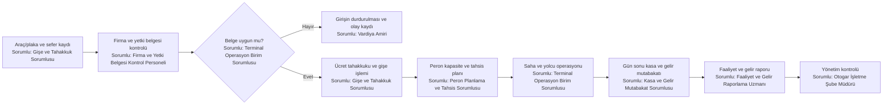
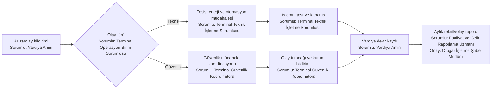

# Otogar İşletme — Sorumlu Pozisyonlu Süreç Haritaları

## Araç giriş-çıkış, tahakkuk ve peron tahsisi

```mermaid
flowchart LR
 A["Araç/plaka ve sefer kaydı<br/>Sorumlu: Gişe ve Tahakkuk Sorumlusu"] --> B["Firma ve yetki belgesi kontrolü<br/>Sorumlu: Firma ve Yetki Belgesi Kontrol Personeli"]
 B --> C{"Belge uygun mu?<br/>Sorumlu: Terminal Operasyon Birim Sorumlusu"}
 C -- Hayır --> D["Girişin durdurulması ve olay kaydı<br/>Sorumlu: Vardiya Amiri"]
 C -- Evet --> E["Ücret tahakkuku ve gişe işlemi<br/>Sorumlu: Gişe ve Tahakkuk Sorumlusu"]
 E --> F["Peron kapasite ve tahsis planı<br/>Sorumlu: Peron Planlama ve Tahsis Sorumlusu"]
 F --> G["Saha ve yolcu operasyonu<br/>Sorumlu: Terminal Operasyon Birim Sorumlusu"]
 G --> H["Gün sonu kasa ve gelir mutabakatı<br/>Sorumlu: Kasa ve Gelir Mutabakat Sorumlusu"]
 H --> I["Faaliyet ve gelir raporu<br/>Sorumlu: Faaliyet ve Gelir Raporlama Uzmanı"]
 I --> J["Yönetim kontrolü<br/>Sorumlu: Otogar İşletme Şube Müdürü"]
```

## Teknik işletme, güvenlik ve vardiya yönetimi

```mermaid
flowchart LR
 A["Arıza/olay bildirimi<br/>Sorumlu: Vardiya Amiri"] --> B{"Olay türü<br/>Sorumlu: Terminal Operasyon Birim Sorumlusu"}
 B -- Teknik --> C["Tesis, enerji ve otomasyon müdahalesi<br/>Sorumlu: Terminal Teknik İşletme Sorumlusu"]
 B -- Güvenlik --> D["Güvenlik müdahale koordinasyonu<br/>Sorumlu: Terminal Güvenlik Koordinatörü"]
 C --> E["İş emri, test ve kapanış<br/>Sorumlu: Terminal Teknik İşletme Sorumlusu"]
 D --> F["Olay tutanağı ve kurum bildirimi<br/>Sorumlu: Terminal Güvenlik Koordinatörü"]
 E --> G["Vardiya devir kaydı<br/>Sorumlu: Vardiya Amiri"]
 F --> G
 G --> H["Aylık teknik/olay raporu<br/>Sorumlu: Faaliyet ve Gelir Raporlama Uzmanı<br/>Onay: Otogar İşletme Şube Müdürü"]
```
