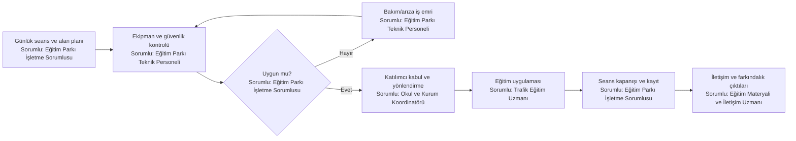

# Trafik Eğitim — Sorumlu Pozisyonlu Süreç Haritaları

## Eğitim programı ve uygulama

```mermaid
flowchart LR
 A["Yıllık ihtiyaç ve hedef grup analizi<br/>Sorumlu: Eğitim Programları Sorumlusu"] --> B["Okul ve kurum takvimi<br/>Sorumlu: Okul ve Kurum Koordinatörü"]
 B --> C["Müfredat ve materyal hazırlığı<br/>Sorumlu: Eğitim Materyali ve İletişim Uzmanı<br/>Destek: Trafik Eğitim Uzmanı"]
 C --> D["Park, alan ve ekipman hazırlığı<br/>Sorumlu: Eğitim Parkı İşletme Sorumlusu<br/>Destek: Eğitim Parkı Teknik Personeli"]
 D --> E["Ön test ve katılımcı kaydı<br/>Sorumlu: Ölçme ve Değerlendirme Uzmanı"]
 E --> F["Teorik ve uygulamalı eğitim<br/>Sorumlu: Trafik Eğitim Uzmanı"]
 F --> G["Son test ve memnuniyet ölçümü<br/>Sorumlu: Ölçme ve Değerlendirme Uzmanı"]
 G --> H["Faaliyet ve etki raporu<br/>Sorumlu: Eğitim Programları Sorumlusu"]
 H --> I["Yıllık değerlendirme ve iyileştirme<br/>Sorumlu: Trafik Eğitim Şube Müdürü"]
```

## Eğitim parkı işletme ve bakım

```mermaid
flowchart LR
 A["Günlük seans ve alan planı<br/>Sorumlu: Eğitim Parkı İşletme Sorumlusu"] --> B["Ekipman ve güvenlik kontrolü<br/>Sorumlu: Eğitim Parkı Teknik Personeli"]
 B --> C{"Uygun mu?<br/>Sorumlu: Eğitim Parkı İşletme Sorumlusu"}
 C -- Hayır --> D["Bakım/arıza iş emri<br/>Sorumlu: Eğitim Parkı Teknik Personeli"]
 D --> B
 C -- Evet --> E["Katılımcı kabul ve yönlendirme<br/>Sorumlu: Okul ve Kurum Koordinatörü"]
 E --> F["Eğitim uygulaması<br/>Sorumlu: Trafik Eğitim Uzmanı"]
 F --> G["Seans kapanışı ve kayıt<br/>Sorumlu: Eğitim Parkı İşletme Sorumlusu"]
 G --> H["İletişim ve farkındalık çıktıları<br/>Sorumlu: Eğitim Materyali ve İletişim Uzmanı"]
```
