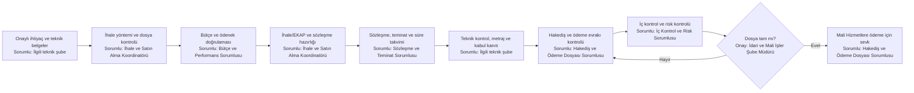
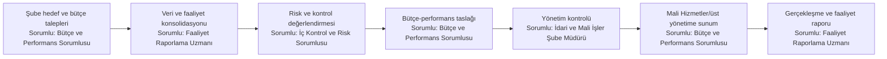
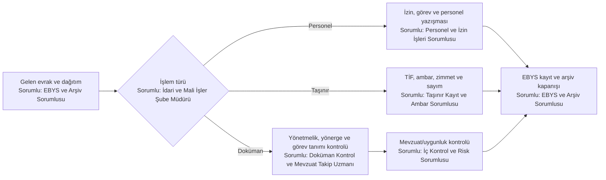

# İdari ve Mali İşler — Sorumlu Pozisyonlu Süreç Haritaları

## İhale, sözleşme, hakediş ve ödeme dosyası

## Bütçe, performans ve faaliyet raporu

## EBYS, personel, taşınır ve doküman kontrolü

