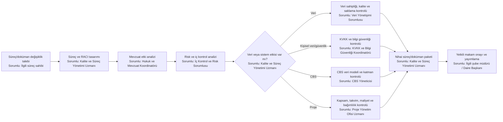

# Daire Geneli Ortak Uzmanlıklar — Sorumlu Pozisyonlu Kontrol Haritaları

## Yeni veya değişen süreç/doküman kontrolü

## Proje ve yatırım portföyü yönetişimi

```mermaid
flowchart LR
 A["Şubelerden proje teklifleri<br/>Sorumlu: İlgili şube müdürleri"] --> B["Portföy kaydı ve bağımlılık analizi<br/>Sorumlu: Proje Yönetim Ofisi Uzmanı"]
 B --> C["CBS ve konumsal çakışma kontrolü<br/>Sorumlu: CBS Yöneticisi"]
 C --> D["Veri, entegrasyon ve sistem etkisi<br/>Sorumlu: Veri Yönetişimi Sorumlusu"]
 D --> E["Mevzuat ve yetki kontrolü<br/>Sorumlu: Hukuk ve Mevzuat Koordinatörü"]
 E --> F["KVKK ve bilgi güvenliği kontrolü<br/>Sorumlu: KVKK ve Bilgi Güvenliği Koordinatörü"]
 F --> G["Risk ve kontrol planı<br/>Sorumlu: İç Kontrol ve Risk Sorumlusu"]
 G --> H["Süreç/KPI tasarımı<br/>Sorumlu: Kalite ve Süreç Yönetimi Uzmanı"]
 H --> I["Portföy önceliklendirme kararı<br/>Onay: Ulaşım Dairesi Başkanı"]
```

## İlke

Ortak uzmanlık pozisyonları teknik sürecin sahibi değildir. Bu roller; mevzuat, veri, CBS, proje, kalite, iç kontrol, KVKK ve bilgi güvenliği açısından bağımsız kontrol ve standart desteği sağlar.