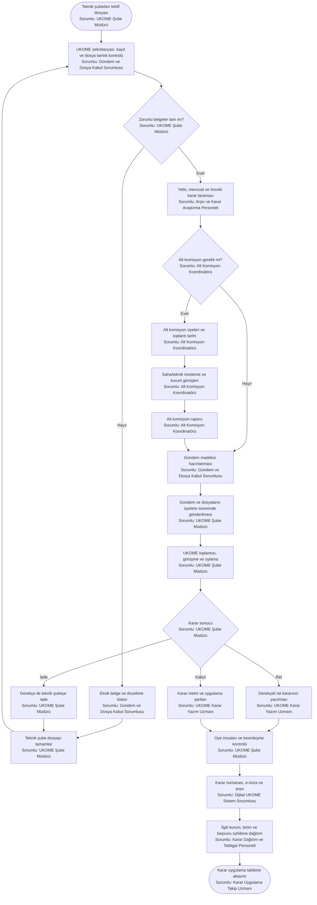
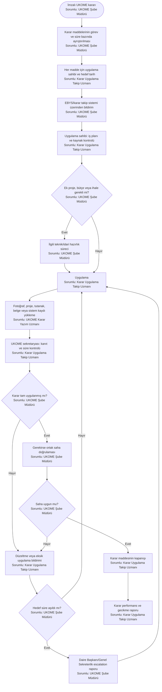
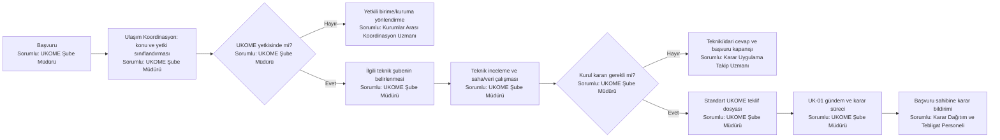

# UKOME Süreç Haritaları

Bu bölüm Ulaşım Koordinasyon Şube Müdürlüğünün UKOME sekretaryası, kurul yönetimi ve karar takip sorumluluklarını gösterir. Teknik teklifin sahibi ilgili teknik şubedir; Ulaşım Koordinasyon teknik projeyi üretmez veya uygulamaz.

---

## UK-01 — UKOME gündem, alt komisyon ve karar süreci

**Süreç sahibi:** Ulaşım Koordinasyon Şube Müdürlüğü  
**Teknik dosya sahibi:** Teklifi hazırlayan şube  
**Girdiler:** İmzalı teknik rapor, proje/harita, mevzuat dayanağı, kurum görüşleri, önceki UKOME kararları, başvuru ve ekleri.  
**Çıktılar:** Gündem, alt komisyon raporu, toplantı tutanağı, imzalı UKOME kararı, dağıtım ve dijital karar kaydı.

**Zorunlu kalite kapısı**

- Teknik raporda ihtiyaç, mevcut durum, alternatifler, öneri, etki, mevzuat ve uygulama sorumlusu bulunmalıdır.
- Önceki kararlarla çelişki kontrolü yapılmalıdır.
- Gündem, karar metni ve eklerde cadde, koordinat, plaka, güzergâh ve süre bilgileri tutarlı olmalıdır.
- Karar sahibine, uygulayıcıya ve kapanış tarihine yer verilmelidir.

**Önerilen KPI:** Eksik dosya oranı, gündeme alınma süresi, alt komisyon çevrim süresi, karar yazım süresi, imza tamamlama süresi.

---

## UK-02 — UKOME kararının uygulama ve kapanış takibi

**Takip sahibi:** Ulaşım Koordinasyon Şube Müdürlüğü  
**Uygulama sahibi:** Kararda belirtilen teknik şube veya kurum  
**Girdiler:** İmzalı karar, uygulama şartları, sorumlu birimler, süre ve varsa bütçe/ihale ihtiyacı.  
**Çıktılar:** İş emri, uygulama kanıtı, saha kontrolü, gecikme/escalation raporu ve kapanış kaydı.

**Temel kontrol:** Ulaşım Koordinasyon uygulamayı kendi yapmamalı; takip, kanıt doğrulama ve gecikme yönetimini yürütmelidir.

**Önerilen KPI:** Zamanında uygulanan karar oranı, açık karar maddesi sayısı, ortalama kapanış süresi, kanıt eksikliği oranı.

---

## UK-03 — Kurum veya vatandaş başvurusunun UKOME sürecine alınması

**Girdiler:** Başvuru dilekçesi/e-başvuru, ek belgeler, talep konusu ve konum bilgisi.  
**Çıktılar:** Teknik şubeye yönlendirme, kurul kararı gerekmiyorsa idari cevap, UKOME kararı gerekiyorsa tamamlanmış teklif dosyası.

**Kontrol:** Başvurunun doğrudan gündeme alınması yerine önce yetkili teknik şube tarafından teknik rapor hazırlanmalıdır.
