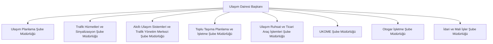

# Ulaşım Dairesi Başkanlığı — Ana Yalın Organizasyon Şeması

## Yönetim modeli

- **Ulaşım Planlama:** plan, modelleme, yol-kavşak, trafik güvenliği, CBS ve trafik eğitim işlevleri.
- **Trafik Hizmetleri ve Sinyalizasyon:** sinyalizasyon, işaretleme, durak fiziksel varlıkları ve saha uygulamaları.
- **AUS ve TKM:** ulaşım teknolojileri, veri platformu, EDS, ağ-siber güvenlik ve 7/24 trafik operasyonu.
- **Toplu Taşıma:** hat, güzergâh, sefer, kapasite, işletmeci ve hizmet kalitesi.
- **Ulaşım Ruhsat:** ticari araç, servis, taksi, yük ve özel izin süreçleri.
- **UKOME:** gündem, alt komisyon, karar, dağıtım ve uygulama kapanış takibi.
- **Otogar:** terminal operasyonu, peron, gişe, tahakkuk, gelir ve teknik işletme.
- **İdari ve Mali İşler:** bütçe, ihale, sözleşme, ödeme evrakı, taşınır, EBYS, personel ve iç kontrol.

## Yalın geçiş notları

- Trafik Eğitim işlevleri ilk aşamada Ulaşım Planlama Şube Müdürlüğü altında birim olarak çalışır.
- Trafik Yönetim Merkezi, AUS ve TKM Şube Müdürlüğü altında ayrı operasyon birimi olarak yapılandırılır.
- İş yükü, vardiya ve operasyon hacmi arttığında Trafik Eğitim ile TKM'nin bağımsız şubeye dönüşmesi ayrıca değerlendirilir.
