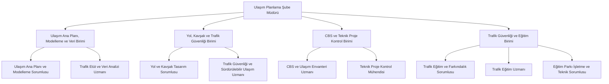
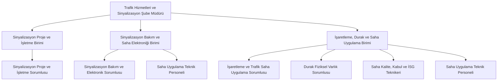
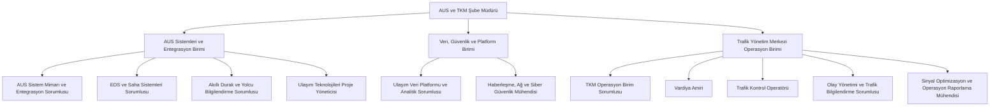
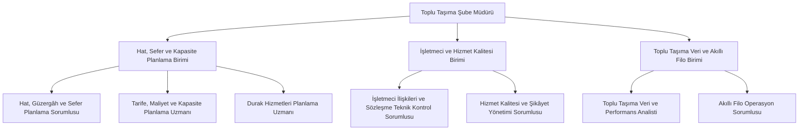
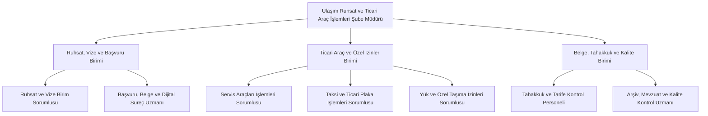
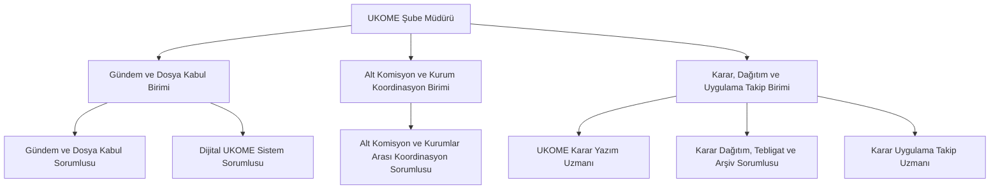
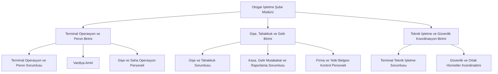
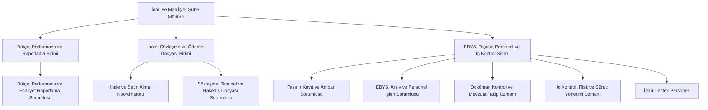

# Şube, Birim ve Pozisyon Şemaları

## 1. Ulaşım Planlama Şube Müdürlüğü

## 2. Trafik Hizmetleri ve Sinyalizasyon Şube Müdürlüğü

## 3. Akıllı Ulaşım Sistemleri ve Trafik Yönetim Merkezi Şube Müdürlüğü

## 4. Toplu Taşıma Planlama ve İşletme Şube Müdürlüğü

## 5. Ulaşım Ruhsat ve Ticari Araç İşlemleri Şube Müdürlüğü

## 6. UKOME Şube Müdürlüğü

## 7. Otogar İşletme Şube Müdürlüğü

## 8. İdari ve Mali İşler Şube Müdürlüğü

## Daire geneli ortak uzmanlık desteği

Aşağıdaki uzmanlıkların her şubede ayrı ayrı kurulması yerine ortak hizmet modeliyle çalışması önerilir:

- Hukuk ve Mevzuat Koordinatörü
- CBS Yöneticisi
- Veri Yönetişimi Sorumlusu
- Proje Yönetim Ofisi Uzmanı
- Kalite ve Süreç Yönetimi Uzmanı
- KVKK ve Bilgi Güvenliği Koordinatörü
- İş Sağlığı ve Güvenliği Koordinatörü
