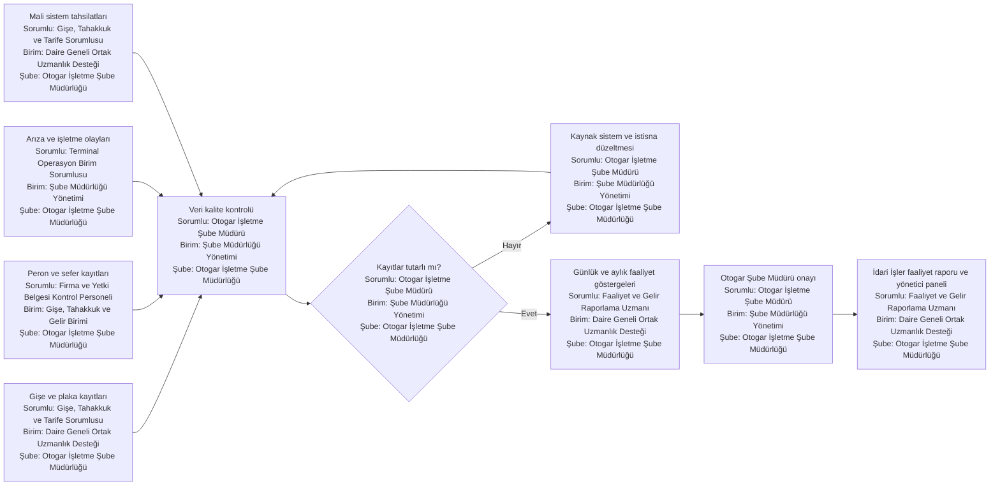

# Otogar Süreç Haritaları

Bu bölüm otogar araç giriş-çıkış, tahakkuk/tahsilat, peron ve teknik tesis işletme süreçlerini gösterir. 16 Haziran 2026 tarihli yönetmelik değişikliğinin eski Otogar yönergesi ve görev tanımlarına etkisi ayrıca doğrulanmalıdır.

---

## OT-01 — Araç giriş-çıkış, tahakkuk ve tahsilat

**Atanan şube:** Otogar İşletme Şube Müdürlüğü  
**Atanan ana birim:** Gişe, Tahakkuk ve Gelir Birimi  
**Organizasyon kaynağı:** `14_yalin_organizasyon_semasi/02_sube_birim_pozisyon_semalari.md`

**Süreç sahibi:** Gişe ve Tahsilat İşlemleri Birimi  
**Hesap verebilir:** Otogar Şube Müdürü  
**Girdiler:** Plaka, firma/sefer, araç sınıfı, giriş-çıkış zamanı, yetki belgesi, güncel ücret tarifesi ve muafiyet bilgisi.  
**Çıktılar:** Geçiş kaydı, tahakkuk, makbuz, kasa mutabakatı, gelir ve araç sayısı raporu.

```mermaid
flowchart TD
    A([Araç otogar girişine gelir<br/>Sorumlu: Otogar İşletme Şube Müdürü<br/>Birim: Şube Müdürlüğü Yönetimi<br/>Şube: Otogar İşletme Şube Müdürlüğü]) --> B[Plaka tanıma veya gişe kaydı<br/>Sorumlu: Gişe, Tahakkuk ve Tarife Sorumlusu<br/>Birim: Daire Geneli Ortak Uzmanlık Desteği<br/>Şube: Otogar İşletme Şube Müdürlüğü]
    B --> C[Firma, sefer ve yetki belgesi doğrulama<br/>Sorumlu: Firma ve Yetki Belgesi Kontrol Personeli<br/>Birim: Gişe, Tahakkuk ve Gelir Birimi<br/>Şube: Otogar İşletme Şube Müdürlüğü]
    C --> D{Girişe uygun mu?<br/>Sorumlu: Otogar İşletme Şube Müdürü<br/>Birim: Şube Müdürlüğü Yönetimi<br/>Şube: Otogar İşletme Şube Müdürlüğü}
    D -- Hayır --> E[Ret/istisna kaydı ve işletme sorumlusuna bildirim<br/>Sorumlu: Terminal Operasyon Birim Sorumlusu<br/>Birim: Şube Müdürlüğü Yönetimi<br/>Şube: Otogar İşletme Şube Müdürlüğü]
    D -- Evet --> F[Araç sınıfı ve tarife sürümünün belirlenmesi<br/>Sorumlu: Otogar İşletme Şube Müdürü<br/>Birim: Şube Müdürlüğü Yönetimi<br/>Şube: Otogar İşletme Şube Müdürlüğü]
    F --> G[Otomatik tahakkuk<br/>Sorumlu: Gişe, Tahakkuk ve Tarife Sorumlusu<br/>Birim: Daire Geneli Ortak Uzmanlık Desteği<br/>Şube: Otogar İşletme Şube Müdürlüğü]
    G --> H{Muafiyet veya özel karar var mı?<br/>Sorumlu: Otogar İşletme Şube Müdürü<br/>Birim: Şube Müdürlüğü Yönetimi<br/>Şube: Otogar İşletme Şube Müdürlüğü}
    H -- Evet --> I[Yetki ve dayanak doğrulaması<br/>Sorumlu: Otogar İşletme Şube Müdürü<br/>Birim: Şube Müdürlüğü Yönetimi<br/>Şube: Otogar İşletme Şube Müdürlüğü]
    H -- Hayır --> J[Tahsilat<br/>Sorumlu: Gişe, Tahakkuk ve Tarife Sorumlusu<br/>Birim: Daire Geneli Ortak Uzmanlık Desteği<br/>Şube: Otogar İşletme Şube Müdürlüğü]
    I --> J
    J --> K[Makbuz ve mali sistem kaydı<br/>Sorumlu: Gişe, Tahakkuk ve Tarife Sorumlusu<br/>Birim: Daire Geneli Ortak Uzmanlık Desteği<br/>Şube: Otogar İşletme Şube Müdürlüğü]
    K --> L[Peron/işletme sürecine aktarım<br/>Sorumlu: Peron Planlama ve Tahsis Sorumlusu<br/>Birim: Daire Geneli Ortak Uzmanlık Desteği<br/>Şube: Otogar İşletme Şube Müdürlüğü]
    L --> M[Araç çıkış kaydı<br/>Sorumlu: Otogar İşletme Şube Müdürü<br/>Birim: Şube Müdürlüğü Yönetimi<br/>Şube: Otogar İşletme Şube Müdürlüğü]
    M --> N{Giriş, tahakkuk, tahsilat ve çıkış eşleşiyor mu?<br/>Sorumlu: Gişe, Tahakkuk ve Tarife Sorumlusu<br/>Birim: Daire Geneli Ortak Uzmanlık Desteği<br/>Şube: Otogar İşletme Şube Müdürlüğü}
    N -- Hayır --> O[İstisna incelemesi ve yetkili düzeltme<br/>Sorumlu: Otogar İşletme Şube Müdürü<br/>Birim: Şube Müdürlüğü Yönetimi<br/>Şube: Otogar İşletme Şube Müdürlüğü]
    O --> P[Çift onay ve log<br/>Sorumlu: Otogar İşletme Şube Müdürü<br/>Birim: Şube Müdürlüğü Yönetimi<br/>Şube: Otogar İşletme Şube Müdürlüğü]
    P --> Q[Gün sonu mutabakat<br/>Sorumlu: Kasa ve Gelir Mutabakat Sorumlusu<br/>Birim: Daire Geneli Ortak Uzmanlık Desteği<br/>Şube: Otogar İşletme Şube Müdürlüğü]
    N -- Evet --> Q
    Q --> R[Kasa, banka/POS ve mali sistem karşılaştırması<br/>Sorumlu: Kasa ve Gelir Mutabakat Sorumlusu<br/>Birim: Daire Geneli Ortak Uzmanlık Desteği<br/>Şube: Otogar İşletme Şube Müdürlüğü]
    R --> S{Fark var mı?<br/>Sorumlu: Otogar İşletme Şube Müdürü<br/>Birim: Şube Müdürlüğü Yönetimi<br/>Şube: Otogar İşletme Şube Müdürlüğü}
    S -- Evet --> T[Fark tutanağı ve inceleme<br/>Sorumlu: Kasa ve Gelir Mutabakat Sorumlusu<br/>Birim: Daire Geneli Ortak Uzmanlık Desteği<br/>Şube: Otogar İşletme Şube Müdürlüğü]
    S -- Hayır --> U[Gün sonu kapama<br/>Sorumlu: Otogar İşletme Şube Müdürü<br/>Birim: Şube Müdürlüğü Yönetimi<br/>Şube: Otogar İşletme Şube Müdürlüğü]
    T --> U
    U --> V[Aylık araç ve gelir raporu<br/>Sorumlu: Faaliyet ve Gelir Raporlama Uzmanı<br/>Birim: Daire Geneli Ortak Uzmanlık Desteği<br/>Şube: Otogar İşletme Şube Müdürlüğü]
```

**Temel kontroller:** Tarife sürüm numarası, manuel plaka/tutar değişikliğinde çift onay, muafiyet dayanağı, günlük kasa mutabakatı, mali sistem entegrasyonu.

**Önerilen KPI:** Otomatik plaka tanıma oranı, manuel düzeltme oranı, kasa farkı, tahsilat başarı oranı, işlem süresi.

---

## OT-02 — Peron tahsisi ve günlük saha işletimi

**Atanan şube:** Otogar İşletme Şube Müdürlüğü  
**Atanan ana birim:** Terminal Operasyon ve Peron Birimi  
**Organizasyon kaynağı:** `14_yalin_organizasyon_semasi/02_sube_birim_pozisyon_semalari.md`

**Süreç sahibi:** Otogar İşletme Birimi  
**Girdiler:** Firma ve yetki bilgileri, sefer planı, peron kapasitesi, geliş/gidiş zamanı, özel durum ve işletme kuralları.  
**Çıktılar:** Peron tahsisi, günlük peron planı, gecikme/çakışma kaydı, olay ve vardiya raporu.

```mermaid
flowchart TD
    A([Onaylı sefer veya araç giriş kaydı<br/>Sorumlu: Firma ve Yetki Belgesi Kontrol Personeli<br/>Birim: Gişe, Tahakkuk ve Gelir Birimi<br/>Şube: Otogar İşletme Şube Müdürlüğü]) --> B[Günlük sefer ve peron kapasite planı<br/>Sorumlu: Firma ve Yetki Belgesi Kontrol Personeli<br/>Birim: Gişe, Tahakkuk ve Gelir Birimi<br/>Şube: Otogar İşletme Şube Müdürlüğü]
    B --> C[Uygun peronun kurallara göre atanması<br/>Sorumlu: Peron Planlama ve Tahsis Sorumlusu<br/>Birim: Daire Geneli Ortak Uzmanlık Desteği<br/>Şube: Otogar İşletme Şube Müdürlüğü]
    C --> D{Peron çakışması var mı?<br/>Sorumlu: Peron Planlama ve Tahsis Sorumlusu<br/>Birim: Daire Geneli Ortak Uzmanlık Desteği<br/>Şube: Otogar İşletme Şube Müdürlüğü}
    D -- Evet --> E[Öncelik, süre ve alternatif peron analizi<br/>Sorumlu: Peron Planlama ve Tahsis Sorumlusu<br/>Birim: Daire Geneli Ortak Uzmanlık Desteği<br/>Şube: Otogar İşletme Şube Müdürlüğü]
    E --> C
    D -- Hayır --> F[Firma/şoföre dijital peron bildirimi<br/>Sorumlu: Firma ve Yetki Belgesi Kontrol Personeli<br/>Birim: Gişe, Tahakkuk ve Gelir Birimi<br/>Şube: Otogar İşletme Şube Müdürlüğü]
    F --> G[Araç perona yönlendirilir<br/>Sorumlu: Peron Planlama ve Tahsis Sorumlusu<br/>Birim: Daire Geneli Ortak Uzmanlık Desteği<br/>Şube: Otogar İşletme Şube Müdürlüğü]
    G --> H[İndirme-bindirme, bekleme ve hareket kontrolü<br/>Sorumlu: Terminal Operasyon Birim Sorumlusu<br/>Birim: Şube Müdürlüğü Yönetimi<br/>Şube: Otogar İşletme Şube Müdürlüğü]
    H --> I{Gecikme, ihlal veya olay var mı?<br/>Sorumlu: Otogar İşletme Şube Müdürü<br/>Birim: Şube Müdürlüğü Yönetimi<br/>Şube: Otogar İşletme Şube Müdürlüğü}
    I -- Evet --> J[Olay kaydı ve ilgili birim/kolluk koordinasyonu<br/>Sorumlu: Terminal Güvenlik Koordinatörü<br/>Birim: Şube Müdürlüğü Yönetimi<br/>Şube: Otogar İşletme Şube Müdürlüğü]
    J --> K[Gerekirse peron yeniden planlama<br/>Sorumlu: Peron Planlama ve Tahsis Sorumlusu<br/>Birim: Daire Geneli Ortak Uzmanlık Desteği<br/>Şube: Otogar İşletme Şube Müdürlüğü]
    K --> H
    I -- Hayır --> L[Seferin tamamlanması ve peronun boşaltılması<br/>Sorumlu: Firma ve Yetki Belgesi Kontrol Personeli<br/>Birim: Gişe, Tahakkuk ve Gelir Birimi<br/>Şube: Otogar İşletme Şube Müdürlüğü]
    L --> M[Sistem ve saha kaydının kapatılması<br/>Sorumlu: Terminal Operasyon Birim Sorumlusu<br/>Birim: Şube Müdürlüğü Yönetimi<br/>Şube: Otogar İşletme Şube Müdürlüğü]
    M --> N[Vardiya devir ve günlük işletme raporu<br/>Sorumlu: Terminal Operasyon Birim Sorumlusu<br/>Birim: Şube Müdürlüğü Yönetimi<br/>Şube: Otogar İşletme Şube Müdürlüğü]
```

**Kontroller:** Kapasiteye dayalı otomatik çakışma kontrolü, yetkisiz peron değişikliği engeli, olay kayıtlarının plaka/sefer/peronla ilişkilendirilmesi.

---

## OT-03 — Teknik bakım, arıza ve tesis hizmeti

**Atanan şube:** Otogar İşletme Şube Müdürlüğü  
**Atanan ana birim:** Teknik İşletme ve Güvenlik Koordinasyon Birimi  
**Organizasyon kaynağı:** `14_yalin_organizasyon_semasi/02_sube_birim_pozisyon_semalari.md`

**Süreç sahibi:** Otogar teknik işletme sahibi olarak belirlenecek birim  
**Ortak hizmet paydaşları:** Destek Hizmetleri, Bilgi İşlem, İtfaiye/İSG ve yükleniciler  
**Girdiler:** Arıza ihbarı/alarm, bakım planı, tesis envanteri, sözleşme/SLA, yedek parça ve iş güvenliği koşulları.  
**Çıktılar:** İş emri, giderilmiş arıza, bakım/kabul kaydı, hizmet KPI ve maliyet raporu.

```mermaid
flowchart TD
    A([Arıza, alarm veya periyodik bakım<br/>Sorumlu: Terminal Teknik İşletme Sorumlusu<br/>Birim: Teknik İşletme ve Güvenlik Koordinasyon Birimi<br/>Şube: Otogar İşletme Şube Müdürlüğü]) --> B[Teknik çağrı kaydı ve varlık ID<br/>Sorumlu: Terminal Teknik İşletme Sorumlusu<br/>Birim: Teknik İşletme ve Güvenlik Koordinasyon Birimi<br/>Şube: Otogar İşletme Şube Müdürlüğü]
    B --> C[Öncelik ve hizmet kesintisi etkisi<br/>Sorumlu: Otogar İşletme Şube Müdürü<br/>Birim: Şube Müdürlüğü Yönetimi<br/>Şube: Otogar İşletme Şube Müdürlüğü]
    C --> D{Acil güvenlik riski var mı?<br/>Sorumlu: Terminal Güvenlik Koordinatörü<br/>Birim: Şube Müdürlüğü Yönetimi<br/>Şube: Otogar İşletme Şube Müdürlüğü}
    D -- Evet --> E[Alanı güvene alma ve acil kurum koordinasyonu<br/>Sorumlu: Otogar İşletme Şube Müdürü<br/>Birim: Şube Müdürlüğü Yönetimi<br/>Şube: Otogar İşletme Şube Müdürlüğü]
    D -- Hayır --> F[İş emri ve sorumlu ekip<br/>Sorumlu: Otogar İşletme Şube Müdürü<br/>Birim: Şube Müdürlüğü Yönetimi<br/>Şube: Otogar İşletme Şube Müdürlüğü]
    E --> F
    F --> G{Arıza türü<br/>Sorumlu: Terminal Teknik İşletme Sorumlusu<br/>Birim: Teknik İşletme ve Güvenlik Koordinasyon Birimi<br/>Şube: Otogar İşletme Şube Müdürlüğü}
    G -- Elektrik/Mekanik --> H[Otogar teknik ekip veya yüklenici<br/>Sorumlu: Otogar İşletme Şube Müdürü<br/>Birim: Şube Müdürlüğü Yönetimi<br/>Şube: Otogar İşletme Şube Müdürlüğü]
    G -- Bilişim/Otomasyon --> I[Bilgi İşlem/AUS veya yüklenici<br/>Sorumlu: Otogar İşletme Şube Müdürü<br/>Birim: Şube Müdürlüğü Yönetimi<br/>Şube: Otogar İşletme Şube Müdürlüğü]
    G -- Ortak hizmet --> J[Destek Hizmetleri/yüklenici<br/>Sorumlu: Otogar İşletme Şube Müdürü<br/>Birim: Şube Müdürlüğü Yönetimi<br/>Şube: Otogar İşletme Şube Müdürlüğü]
    H --> K[İSG ve enerji izolasyonu kontrolü<br/>Sorumlu: Otogar İşletme Şube Müdürü<br/>Birim: Şube Müdürlüğü Yönetimi<br/>Şube: Otogar İşletme Şube Müdürlüğü]
    I --> K
    J --> K
    K --> L[Müdahale ve parça/işçilik kaydı<br/>Sorumlu: Otogar İşletme Şube Müdürü<br/>Birim: Şube Müdürlüğü Yönetimi<br/>Şube: Otogar İşletme Şube Müdürlüğü]
    L --> M[Fonksiyon ve güvenlik testi<br/>Sorumlu: Terminal Güvenlik Koordinatörü<br/>Birim: Şube Müdürlüğü Yönetimi<br/>Şube: Otogar İşletme Şube Müdürlüğü]
    M --> N{Hizmet geri geldi mi?<br/>Sorumlu: Otogar İşletme Şube Müdürü<br/>Birim: Şube Müdürlüğü Yönetimi<br/>Şube: Otogar İşletme Şube Müdürlüğü}
    N -- Hayır --> O[Üst seviye teknik destek ve escalation<br/>Sorumlu: Otogar İşletme Şube Müdürü<br/>Birim: Şube Müdürlüğü Yönetimi<br/>Şube: Otogar İşletme Şube Müdürlüğü]
    O --> L
    N -- Evet --> P[Kullanıcı/işletme kabulü<br/>Sorumlu: Terminal Operasyon Birim Sorumlusu<br/>Birim: Şube Müdürlüğü Yönetimi<br/>Şube: Otogar İşletme Şube Müdürlüğü]
    P --> Q[İş emri kapanışı ve envanter güncelleme<br/>Sorumlu: Otogar İşletme Şube Müdürü<br/>Birim: Şube Müdürlüğü Yönetimi<br/>Şube: Otogar İşletme Şube Müdürlüğü]
    Q --> R[Aylık arıza, SLA ve kök neden analizi<br/>Sorumlu: Terminal Teknik İşletme Sorumlusu<br/>Birim: Teknik İşletme ve Güvenlik Koordinasyon Birimi<br/>Şube: Otogar İşletme Şube Müdürlüğü]
```

**Kritik yönetişim notu:** Temizlik, güvenlik, bakım ve ortak tesis hizmetlerinin Otogar ile Destek Hizmetleri arasındaki sahipliği güncel yönetmelik değişikliğine göre yazılı olarak yeniden belirlenmelidir.

---

## OT-04 — Otogar gelir ve faaliyet raporlaması

**Atanan şube:** Otogar İşletme Şube Müdürlüğü  
**Atanan ana birim:** Gişe, Tahakkuk ve Gelir Birimi  
**Organizasyon kaynağı:** `14_yalin_organizasyon_semasi/02_sube_birim_pozisyon_semalari.md`

