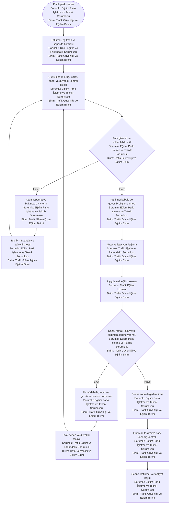

# Trafik Eğitim Süreç Haritaları

Bu bölüm Trafik Eğitim Şube Müdürlüğünün eğitim programı, katılımcı organizasyonu, ölçme-değerlendirme ve trafik eğitim parkı işletme süreçlerini gösterir.

---

## TE-01 — Trafik eğitimi ve farkındalık programı

**Süreç sahibi:** Trafik Eğitim Şube Müdürlüğü  
**Girdiler:** Hedef grup talebi, kaza/risk verisi, okul/kurum takvimi, eğitim ihtiyacı, müfredat ve kapasite.  
**Çıktılar:** Yıllık eğitim programı, materyal, katılım kaydı, ön/son test, memnuniyet ve faaliyet raporu.

```mermaid
flowchart TD
    A([Yıllık plan veya eğitim talebi<br/>Sorumlu: Trafik Eğitim ve Farkındalık Sorumlusu<br/>Birim: Trafik Güvenliği ve Eğitim Birimi]) --> B[Hedef grup, yaş, risk ve öğrenme ihtiyacı<br/>Sorumlu: Trafik Eğitim ve Farkındalık Sorumlusu<br/>Birim: Trafik Güvenliği ve Eğitim Birimi]
    B --> C[Kaza/ihlal verisi ve öncelikli davranışların analizi<br/>Sorumlu: Trafik Eğitim ve Farkındalık Sorumlusu<br/>Birim: Trafik Güvenliği ve Eğitim Birimi]
    C --> D[Eğitim amacı, içerik ve ölçme yöntemi<br/>Sorumlu: Trafik Eğitim ve Farkındalık Sorumlusu<br/>Birim: Trafik Güvenliği ve Eğitim Birimi]
    D --> E[Okul/kurum, eğitmen, salon/park ve tarih planı<br/>Sorumlu: Trafik Eğitim ve Farkındalık Sorumlusu<br/>Birim: Trafik Güvenliği ve Eğitim Birimi]
    E --> F{Kaynak ve kapasite uygun mu?<br/>Sorumlu: Trafik Eğitim ve Farkındalık Sorumlusu<br/>Birim: Trafik Güvenliği ve Eğitim Birimi}
    F -- Hayır --> G[Tarih, grup veya yöntem revizyonu<br/>Sorumlu: Trafik Eğitim ve Farkındalık Sorumlusu<br/>Birim: Trafik Güvenliği ve Eğitim Birimi]
    G --> E
    F -- Evet --> H[Katılımcı ve veli/kurum bilgilendirmesi<br/>Sorumlu: Trafik Eğitim ve Farkındalık Sorumlusu<br/>Birim: Trafik Güvenliği ve Eğitim Birimi]
    H --> I[Ön test veya başlangıç ölçümü<br/>Sorumlu: Trafik Eğitim Uzmanı<br/>Birim: Trafik Güvenliği ve Eğitim Birimi]
    I --> J[Teorik ve uygulamalı eğitim<br/>Sorumlu: Trafik Eğitim Uzmanı<br/>Birim: Trafik Güvenliği ve Eğitim Birimi]
    J --> K[Son test ve uygulama gözlemi<br/>Sorumlu: Trafik Eğitim Uzmanı<br/>Birim: Trafik Güvenliği ve Eğitim Birimi]
    K --> L{Asgari kazanım sağlandı mı?<br/>Sorumlu: Trafik Eğitim Uzmanı<br/>Birim: Trafik Güvenliği ve Eğitim Birimi}
    L -- Hayır --> M[Ek eğitim/tekrar uygulama<br/>Sorumlu: Trafik Eğitim ve Farkındalık Sorumlusu<br/>Birim: Trafik Güvenliği ve Eğitim Birimi]
    M --> K
    L -- Evet --> N[Katılım kaydı ve belge<br/>Sorumlu: Trafik Eğitim ve Farkındalık Sorumlusu<br/>Birim: Trafik Güvenliği ve Eğitim Birimi]
    N --> O[Memnuniyet ve eğitmen değerlendirmesi<br/>Sorumlu: Trafik Eğitim ve Farkındalık Sorumlusu<br/>Birim: Trafik Güvenliği ve Eğitim Birimi]
    O --> P[Aylık/yıllık faaliyet ve etki raporu<br/>Sorumlu: Trafik Eğitim ve Farkındalık Sorumlusu<br/>Birim: Trafik Güvenliği ve Eğitim Birimi]
```

**Önerilen KPI:** Katılımcı sayısı, planlanan eğitimin gerçekleşme oranı, ön/son test gelişimi, tekrar eğitim ihtiyacı, memnuniyet ve hedef gruba erişim oranı.

---

## TE-02 — Trafik eğitim parkı seans ve güvenlik işletimi

**İşletme sahibi:** Trafik Eğitim Şube Müdürlüğü  
**Fiziksel proje/bakım paydaşları:** Ulaşım Planlama, Fen İşleri, Destek Hizmetleri ve İSG  
**Girdiler:** Onaylı eğitim programı, seans listesi, park kapasitesi, ekipman ve güvenlik kontrolü.  
**Çıktılar:** Güvenli eğitim seansı, katılımcı/ekipman kaydı, olay/ramak kala kaydı ve bakım iş emri.

**Temel kontroller:** Katılımcı yaşına uygun ekipman, kapasite sınırı, günlük saha kontrolü, acil durum prosedürü, kaza/ramak kala kaydı, çocuk ve kişisel veri güvenliği.

---

## TE-03 — Eğitim materyali hazırlama ve yayımlama

```mermaid
flowchart LR
    A[Eğitim ihtiyacı<br/>Sorumlu: Trafik Eğitim ve Farkındalık Sorumlusu<br/>Birim: Trafik Güvenliği ve Eğitim Birimi] --> B[İçerik hedefi ve hedef grup<br/>Sorumlu: Trafik Eğitim ve Farkındalık Sorumlusu<br/>Birim: Trafik Güvenliği ve Eğitim Birimi]
    B --> C[Mevzuat/teknik doğrulama<br/>Sorumlu: Trafik Eğitim ve Farkındalık Sorumlusu<br/>Birim: Trafik Güvenliği ve Eğitim Birimi]
    C --> D[Taslak materyal<br/>Sorumlu: Trafik Eğitim Uzmanı<br/>Birim: Trafik Güvenliği ve Eğitim Birimi]
    D --> E[Eğitim uzmanı ve ilgili teknik şube incelemesi<br/>Sorumlu: Trafik Eğitim ve Farkındalık Sorumlusu<br/>Birim: Trafik Güvenliği ve Eğitim Birimi]
    E --> F{Doğru ve anlaşılır mı?<br/>Sorumlu: Trafik Eğitim ve Farkındalık Sorumlusu<br/>Birim: Trafik Güvenliği ve Eğitim Birimi}
    F -- Hayır --> D
    F -- Evet --> G[Erişilebilirlik, görsel ve dil kontrolü<br/>Sorumlu: Trafik Eğitim ve Farkındalık Sorumlusu<br/>Birim: Trafik Güvenliği ve Eğitim Birimi]
    G --> H[Yetkili onay ve sürüm numarası<br/>Sorumlu: Ulaşım Planlama Şube Müdürü<br/>Birim: Şube Müdürlüğü Yönetimi]
    H --> I[Yayımlama/dağıtım<br/>Sorumlu: Trafik Eğitim ve Farkındalık Sorumlusu<br/>Birim: Trafik Güvenliği ve Eğitim Birimi]
    I --> J[Geri bildirim ve periyodik güncelleme<br/>Sorumlu: Trafik Eğitim ve Farkındalık Sorumlusu<br/>Birim: Trafik Güvenliği ve Eğitim Birimi]
```

