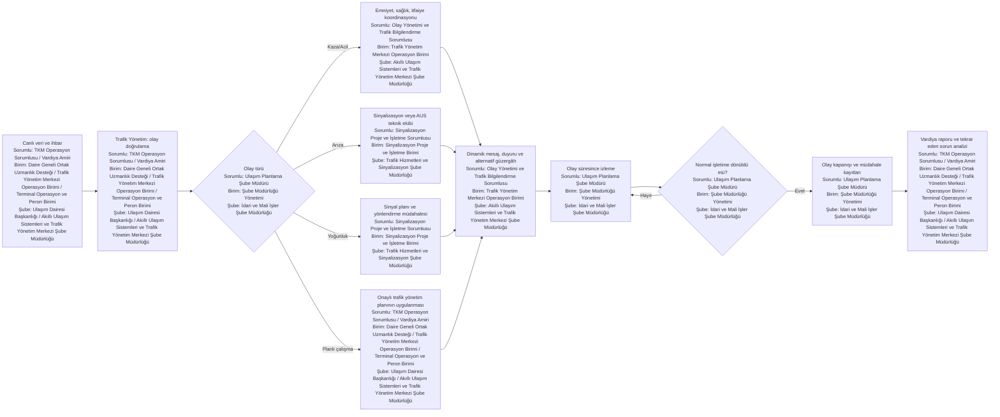

# Trafik Planlama Süreç Haritaları

Bu bölüm Ulaşım Planlama Şube Müdürlüğünün teknik sahipliğinde yürütülmesi önerilen ulaşım planlama, yol/kavşak, erişim, sinyalizasyon, işaretleme ve Trafik Yönetim Merkezi süreçlerini gösterir.

---

## TP-01 — Ulaşım Ana Planı hazırlama ve revizyonu

**Atanan şube:** Ulaşım Planlama Şube Müdürlüğü  
**Atanan ana birim:** Ulaşım Ana Planı, Modelleme ve Veri Birimi  
**Organizasyon kaynağı:** `14_yalin_organizasyon_semasi/02_sube_birim_pozisyon_semalari.md`

**Süreç sahibi:** Ulaşım Planlama Şube Müdürlüğü  
**Hesap verebilir:** Ulaşım Dairesi Başkanı  
**Girdiler:** Stratejik plan, nazım imar planı, nüfus ve arazi kullanımı, yolculuk anketleri, trafik/toplu taşıma sayımları, kaza verisi, AUS verisi, yatırım ve bütçe sınırları.  
**Çıktılar:** Onaylı Ulaşım Ana Planı, ulaşım modeli, alternatif analizi, yatırım programı, uygulama takvimi ve KPI seti.

```mermaid
flowchart TD
    A([Plan/revizyon ihtiyacı<br/>Sorumlu: Ulaşım Planlama Şube Müdürü<br/>Birim: Şube Müdürlüğü Yönetimi<br/>Şube: İdari ve Mali İşler Şube Müdürlüğü]) --> B[Ulaşım Planlama: kapsam ve çalışma programı<br/>Sorumlu: Ulaşım Planlama Şube Müdürü<br/>Birim: Şube Müdürlüğü Yönetimi<br/>Şube: İdari ve Mali İşler Şube Müdürlüğü]
    B --> C[Veri ihtiyaç planı ve veri sorumluları<br/>Sorumlu: Ulaşım Planlama Şube Müdürü<br/>Birim: Şube Müdürlüğü Yönetimi<br/>Şube: İdari ve Mali İşler Şube Müdürlüğü]
    C --> D[AUS: sensör, kamera ve veri platformu çıktıları<br/>Sorumlu: Ulaşım Veri Platformu ve Veri Yönetişimi Sorumlusu<br/>Birim: Daire Geneli Ortak Uzmanlık Desteği<br/>Şube: Ulaşım Dairesi Başkanlığı]
    C --> E[Toplu Taşıma: hat, yolcu, filo ve hizmet verileri<br/>Sorumlu: Toplu Taşıma Veri ve Performans Analisti<br/>Birim: Toplu Taşıma Veri ve Akıllı Filo Birimi<br/>Şube: Toplu Taşıma Planlama ve İşletme Şube Müdürlüğü]
    C --> F[İmar/Fen: arazi kullanımı ve yatırım projeleri<br/>Sorumlu: Yol ve Kavşak Tasarım Sorumlusu<br/>Birim: Yol, Kavşak ve Trafik Güvenliği Birimi<br/>Şube: Ulaşım Planlama Şube Müdürlüğü]
    D --> G[Veri kalite ve eksiklik kontrolü<br/>Sorumlu: Trafik Etüt ve Veri Analizi Uzmanı<br/>Birim: Ulaşım Ana Planı, Modelleme ve Veri Birimi<br/>Şube: Ulaşım Planlama Şube Müdürlüğü]
    E --> G
    F --> G
    G --> H{Veri yeterli mi?<br/>Sorumlu: Ulaşım Planlama Şube Müdürü<br/>Birim: Şube Müdürlüğü Yönetimi<br/>Şube: İdari ve Mali İşler Şube Müdürlüğü}
    H -- Hayır --> I[Ek sayım, anket veya saha etüdü<br/>Sorumlu: Trafik Etüt ve Veri Analizi Uzmanı<br/>Birim: Ulaşım Ana Planı, Modelleme ve Veri Birimi<br/>Şube: Ulaşım Planlama Şube Müdürlüğü]
    I --> G
    H -- Evet --> J[Mevcut durum modeli ve kalibrasyon<br/>Sorumlu: Ulaşım Ana Planı ve Modelleme Sorumlusu<br/>Birim: Ulaşım Ana Planı, Modelleme ve Veri Birimi<br/>Şube: Ulaşım Planlama Şube Müdürlüğü]
    J --> K[Alternatif senaryolar ve etki analizi<br/>Sorumlu: Ulaşım Ana Planı ve Modelleme Sorumlusu<br/>Birim: Ulaşım Ana Planı, Modelleme ve Veri Birimi<br/>Şube: Ulaşım Planlama Şube Müdürlüğü]
    K --> L[Paydaş ve kurum görüşleri<br/>Sorumlu: Ulaşım Planlama Şube Müdürü<br/>Birim: Şube Müdürlüğü Yönetimi<br/>Şube: İdari ve Mali İşler Şube Müdürlüğü]
    L --> M{Teknik ve mali olarak uygulanabilir mi?<br/>Sorumlu: Ulaşım Planlama Şube Müdürü<br/>Birim: Şube Müdürlüğü Yönetimi<br/>Şube: İdari ve Mali İşler Şube Müdürlüğü}
    M -- Hayır --> K
    M -- Evet --> N[Tercih edilen plan, yatırım programı ve KPI<br/>Sorumlu: Ulaşım Planlama Şube Müdürü<br/>Birim: Şube Müdürlüğü Yönetimi<br/>Şube: İdari ve Mali İşler Şube Müdürlüğü]
    N --> O[Yetkili kurul/UKOME/Meclis süreci<br/>Sorumlu: Ulaşım Planlama Şube Müdürü<br/>Birim: Şube Müdürlüğü Yönetimi<br/>Şube: İdari ve Mali İşler Şube Müdürlüğü]
    O --> P{Onaylandı mı?<br/>Sorumlu: Ulaşım Planlama Şube Müdürü<br/>Birim: Şube Müdürlüğü Yönetimi<br/>Şube: İdari ve Mali İşler Şube Müdürlüğü}
    P -- Hayır --> Q[Gerekçe ve revizyon<br/>Sorumlu: Ulaşım Planlama Şube Müdürü<br/>Birim: Şube Müdürlüğü Yönetimi<br/>Şube: İdari ve Mali İşler Şube Müdürlüğü]
    Q --> N
    P -- Evet --> R[Uygulama portföyü ve sorumlu birimler<br/>Sorumlu: Ulaşım Ana Planı ve Modelleme Sorumlusu<br/>Birim: Ulaşım Ana Planı, Modelleme ve Veri Birimi<br/>Şube: Ulaşım Planlama Şube Müdürlüğü]
    R --> S[Periyodik izleme ve plan revizyonu<br/>Sorumlu: Ulaşım Ana Planı ve Modelleme Sorumlusu<br/>Birim: Ulaşım Ana Planı, Modelleme ve Veri Birimi<br/>Şube: Ulaşım Planlama Şube Müdürlüğü]
    S --> T([Onaylı plan ve izleme raporu<br/>Sorumlu: Ulaşım Ana Planı ve Modelleme Sorumlusu<br/>Birim: Ulaşım Ana Planı, Modelleme ve Veri Birimi<br/>Şube: Ulaşım Planlama Şube Müdürlüğü])
```

**Temel kontroller**

- Plan verileri tek veri kataloğunda sürümlenmelidir.
- Senaryolar erişilebilirlik, güvenlik, çevresel etki, toplu taşıma ve mali uygulanabilirlik açısından karşılaştırılmalıdır.
- UKOME teknik planı hazırlamaz; karar gerektiren maddeleri kurul sürecine alır.

**Önerilen KPI:** Veri tamlık oranı, model kalibrasyon başarısı, proje gerçekleşme oranı, planlanan/gerçekleşen yatırım farkı, erişilebilirlik ve yolculuk süresi değişimi.

---

## TP-02 — Yol, kavşak ve geometrik düzenleme projesi

**Atanan şube:** Ulaşım Planlama Şube Müdürlüğü  
**Atanan ana birim:** Yol, Kavşak ve Trafik Güvenliği Birimi  
**Organizasyon kaynağı:** `14_yalin_organizasyon_semasi/02_sube_birim_pozisyon_semalari.md`

**Süreç sahibi:** Ulaşım Planlama / Yol Tasarım Servisi  
**Girdiler:** Talep veya sorun kaydı, kaza/yoğunluk verisi, halihazır harita, imar planı, trafik sayımı, mülkiyet ve altyapı verileri.  
**Çıktılar:** Onaylı avan/uygulama projesi, UKOME teklif dosyası, yaklaşık maliyet girdileri, uygulama ve kabul kaydı.

```mermaid
flowchart TD
    A([Talep, kaza veya kapasite sorunu<br/>Sorumlu: Ulaşım Planlama Şube Müdürü<br/>Birim: Şube Müdürlüğü Yönetimi<br/>Şube: İdari ve Mali İşler Şube Müdürlüğü]) --> B[Planlama Servisi: ön inceleme<br/>Sorumlu: Ulaşım Planlama Şube Müdürü<br/>Birim: Şube Müdürlüğü Yönetimi<br/>Şube: İdari ve Mali İşler Şube Müdürlüğü]
    B --> C{Ulaşım Dairesi yetki alanında mı?<br/>Sorumlu: Ulaşım Planlama Şube Müdürü<br/>Birim: Şube Müdürlüğü Yönetimi<br/>Şube: İdari ve Mali İşler Şube Müdürlüğü}
    C -- Hayır --> D[Yetkili kuruma yönlendirme ve kayıt kapatma<br/>Sorumlu: Ulaşım Planlama Şube Müdürü<br/>Birim: Şube Müdürlüğü Yönetimi<br/>Şube: İdari ve Mali İşler Şube Müdürlüğü]
    C -- Evet --> E[Saha etüdü, sayım ve halihazır kontrolü<br/>Sorumlu: Trafik Etüt ve Veri Analizi Uzmanı<br/>Birim: Ulaşım Ana Planı, Modelleme ve Veri Birimi<br/>Şube: Ulaşım Planlama Şube Müdürlüğü]
    E --> F[Yol Tasarım: alternatif geometrik çözümler<br/>Sorumlu: Yol ve Kavşak Tasarım Sorumlusu<br/>Birim: Yol, Kavşak ve Trafik Güvenliği Birimi<br/>Şube: Ulaşım Planlama Şube Müdürlüğü]
    F --> G[İmar, mülkiyet, altyapı ve erişilebilirlik görüşleri<br/>Sorumlu: Yol ve Kavşak Tasarım Sorumlusu<br/>Birim: Yol, Kavşak ve Trafik Güvenliği Birimi<br/>Şube: Ulaşım Planlama Şube Müdürlüğü]
    G --> H[Trafik güvenliği ve kapasite analizi<br/>Sorumlu: Trafik Güvenliği ve Sürdürülebilir Ulaşım Uzmanı<br/>Birim: Yol, Kavşak ve Trafik Güvenliği Birimi<br/>Şube: Ulaşım Planlama Şube Müdürlüğü]
    H --> I{Teknik çözüm uygun mu?<br/>Sorumlu: Ulaşım Planlama Şube Müdürü<br/>Birim: Şube Müdürlüğü Yönetimi<br/>Şube: İdari ve Mali İşler Şube Müdürlüğü}
    I -- Hayır --> F
    I -- Evet --> J{UKOME kararı gerekli mi?<br/>Sorumlu: Ulaşım Planlama Şube Müdürü<br/>Birim: Şube Müdürlüğü Yönetimi<br/>Şube: İdari ve Mali İşler Şube Müdürlüğü}
    J -- Evet --> K[UKOME teknik teklif dosyası<br/>Sorumlu: Ulaşım Planlama Şube Müdürü<br/>Birim: Şube Müdürlüğü Yönetimi<br/>Şube: İdari ve Mali İşler Şube Müdürlüğü]
    K --> L[UKOME kararı<br/>Sorumlu: Ulaşım Planlama Şube Müdürü<br/>Birim: Şube Müdürlüğü Yönetimi<br/>Şube: İdari ve Mali İşler Şube Müdürlüğü]
    J -- Hayır --> M[Yetkili teknik onay<br/>Sorumlu: Ulaşım Planlama Şube Müdürü<br/>Birim: Şube Müdürlüğü Yönetimi<br/>Şube: İdari ve Mali İşler Şube Müdürlüğü]
    L --> N[Uygulama paketi ve iş programı<br/>Sorumlu: Ulaşım Planlama Şube Müdürü<br/>Birim: Şube Müdürlüğü Yönetimi<br/>Şube: İdari ve Mali İşler Şube Müdürlüğü]
    M --> N
    N --> O[Fen İşleri: yol gövdesi/yapım<br/>Sorumlu: Ulaşım Planlama Şube Müdürü<br/>Birim: Şube Müdürlüğü Yönetimi<br/>Şube: İdari ve Mali İşler Şube Müdürlüğü]
    N --> P[Ulaşım Planlama: sinyal ve işaretleme<br/>Sorumlu: Sinyalizasyon Proje ve İşletme Sorumlusu<br/>Birim: Sinyalizasyon Proje ve İşletme Birimi<br/>Şube: Trafik Hizmetleri ve Sinyalizasyon Şube Müdürlüğü]
    O --> Q[Ortak saha kontrolü<br/>Sorumlu: Ulaşım Planlama Şube Müdürü<br/>Birim: Şube Müdürlüğü Yönetimi<br/>Şube: İdari ve Mali İşler Şube Müdürlüğü]
    P --> Q
    Q --> R{Proje ve kalite kriterlerine uygun mu?<br/>Sorumlu: Teknik Proje Kontrol Mühendisi<br/>Birim: CBS ve Teknik Proje Kontrol Birimi<br/>Şube: Ulaşım Planlama Şube Müdürlüğü}
    R -- Hayır --> S[Düzeltici iş emri<br/>Sorumlu: Ulaşım Planlama Şube Müdürü<br/>Birim: Şube Müdürlüğü Yönetimi<br/>Şube: İdari ve Mali İşler Şube Müdürlüğü]
    S --> Q
    R -- Evet --> T[CBS envanteri, as-built ve kabul<br/>Sorumlu: CBS ve Ulaşım Envanteri Uzmanı<br/>Birim: CBS ve Teknik Proje Kontrol Birimi<br/>Şube: Ulaşım Planlama Şube Müdürlüğü]
    T --> U([Proje kapanışı<br/>Sorumlu: Ulaşım Planlama Şube Müdürü<br/>Birim: Şube Müdürlüğü Yönetimi<br/>Şube: İdari ve Mali İşler Şube Müdürlüğü])
```

**Görev paylaşımı:** Trafik geometrisi ve trafik projesi Ulaşım Planlamada; yol gövdesi yapımı Fen İşlerinde; sinyalizasyon ve işaretleme Ulaşım Planlama Uygulama/Yapım biriminde olmalıdır.

**Önerilen KPI:** Ön inceleme süresi, proje revizyon sayısı, uygulama sonrası kaza/yoğunluk değişimi, as-built kayıt tamlığı.

---

## TP-03 — Geçiş yolu, yol kapatma ve yol daraltma izni

**Atanan şube:** Ulaşım Planlama Şube Müdürlüğü  
**Atanan ana birim:** Yol, Kavşak ve Trafik Güvenliği Birimi  
**Organizasyon kaynağı:** `14_yalin_organizasyon_semasi/02_sube_birim_pozisyon_semalari.md`

**Süreç sahibi:** Ulaşım Planlama Şube Müdürlüğü  
**Karar/sekretarya:** Ulaşım Koordinasyon / UKOME  
**Girdiler:** E-başvuru, vaziyet veya çalışma projesi, süre, iş programı, trafik yönetim planı, tapu/imar ve kurum izinleri.  
**Çıktılar:** Teknik uygunluk raporu, onaylı geçici trafik planı, izin/UKOME kararı veya gerekçeli ret, saha kapanış kaydı.

```mermaid
flowchart TD
    A([Başvuru<br/>Sorumlu: Ulaşım Planlama Şube Müdürü<br/>Birim: Şube Müdürlüğü Yönetimi<br/>Şube: İdari ve Mali İşler Şube Müdürlüğü]) --> B[E-başvuru ve belge tamlık kontrolü<br/>Sorumlu: Ulaşım Planlama Şube Müdürü<br/>Birim: Şube Müdürlüğü Yönetimi<br/>Şube: İdari ve Mali İşler Şube Müdürlüğü]
    B --> C{Belgeler tam mı?<br/>Sorumlu: Ulaşım Planlama Şube Müdürü<br/>Birim: Şube Müdürlüğü Yönetimi<br/>Şube: İdari ve Mali İşler Şube Müdürlüğü}
    C -- Hayır --> D[Eksik belge bildirimi<br/>Sorumlu: Ulaşım Planlama Şube Müdürü<br/>Birim: Şube Müdürlüğü Yönetimi<br/>Şube: İdari ve Mali İşler Şube Müdürlüğü]
    D --> B
    C -- Evet --> E[Planlama: yetki alanı ve mevzuat kontrolü<br/>Sorumlu: Ulaşım Planlama Şube Müdürü<br/>Birim: Şube Müdürlüğü Yönetimi<br/>Şube: İdari ve Mali İşler Şube Müdürlüğü]
    E --> F[Saha incelemesi ve trafik güvenliği analizi<br/>Sorumlu: Trafik Güvenliği ve Sürdürülebilir Ulaşım Uzmanı<br/>Birim: Yol, Kavşak ve Trafik Güvenliği Birimi<br/>Şube: Ulaşım Planlama Şube Müdürlüğü]
    F --> G[İmar, altyapı, AYKOME, kolluk ve ilgili kurum görüşleri<br/>Sorumlu: Ulaşım Planlama Şube Müdürü<br/>Birim: Şube Müdürlüğü Yönetimi<br/>Şube: İdari ve Mali İşler Şube Müdürlüğü]
    G --> H{Teknik olarak uygun mu?<br/>Sorumlu: Ulaşım Planlama Şube Müdürü<br/>Birim: Şube Müdürlüğü Yönetimi<br/>Şube: İdari ve Mali İşler Şube Müdürlüğü}
    H -- Hayır --> I[Gerekçeli ret veya proje revizyon talebi<br/>Sorumlu: Ulaşım Planlama Şube Müdürü<br/>Birim: Şube Müdürlüğü Yönetimi<br/>Şube: İdari ve Mali İşler Şube Müdürlüğü]
    I --> J([Süreç kapatılır veya yeniden başvuru<br/>Sorumlu: Ulaşım Planlama Şube Müdürü<br/>Birim: Şube Müdürlüğü Yönetimi<br/>Şube: İdari ve Mali İşler Şube Müdürlüğü])
    H -- Evet --> K{UKOME kararı gerekli mi?<br/>Sorumlu: Ulaşım Planlama Şube Müdürü<br/>Birim: Şube Müdürlüğü Yönetimi<br/>Şube: İdari ve Mali İşler Şube Müdürlüğü}
    K -- Evet --> L[UKOME gündem ve karar süreci<br/>Sorumlu: Ulaşım Planlama Şube Müdürü<br/>Birim: Şube Müdürlüğü Yönetimi<br/>Şube: İdari ve Mali İşler Şube Müdürlüğü]
    K -- Hayır --> M[Yetkili idari/teknik onay<br/>Sorumlu: Ulaşım Planlama Şube Müdürü<br/>Birim: Şube Müdürlüğü Yönetimi<br/>Şube: İdari ve Mali İşler Şube Müdürlüğü]
    L --> N[İzin ve trafik tedbir şartlarının yayımlanması<br/>Sorumlu: Ulaşım Planlama Şube Müdürü<br/>Birim: Şube Müdürlüğü Yönetimi<br/>Şube: İdari ve Mali İşler Şube Müdürlüğü]
    M --> N
    N --> O[Başlangıç öncesi saha güvenlik kontrolü<br/>Sorumlu: Saha Kalite, Kabul ve İSG Teknikeri<br/>Birim: Şube Müdürlüğü Yönetimi<br/>Şube: İdari ve Mali İşler Şube Müdürlüğü]
    O --> P[Çalışma süresince denetim<br/>Sorumlu: Ulaşım Planlama Şube Müdürü<br/>Birim: Şube Müdürlüğü Yönetimi<br/>Şube: İdari ve Mali İşler Şube Müdürlüğü]
    P --> Q{Süre/şart ihlali var mı?<br/>Sorumlu: Ulaşım Planlama Şube Müdürü<br/>Birim: Şube Müdürlüğü Yönetimi<br/>Şube: İdari ve Mali İşler Şube Müdürlüğü}
    Q -- Evet --> R[Düzeltme, durdurma veya ilgili makama bildirim<br/>Sorumlu: Ulaşım Planlama Şube Müdürü<br/>Birim: Şube Müdürlüğü Yönetimi<br/>Şube: İdari ve Mali İşler Şube Müdürlüğü]
    R --> P
    Q -- Hayır --> S[Çalışma bitişi ve yolun eski hale getirilmesi<br/>Sorumlu: Ulaşım Planlama Şube Müdürü<br/>Birim: Şube Müdürlüğü Yönetimi<br/>Şube: İdari ve Mali İşler Şube Müdürlüğü]
    S --> T[Saha kabulü, fotoğraf ve kapanış kaydı<br/>Sorumlu: Ulaşım Planlama Şube Müdürü<br/>Birim: Şube Müdürlüğü Yönetimi<br/>Şube: İdari ve Mali İşler Şube Müdürlüğü]
    T --> U([Süreç tamamlandı<br/>Sorumlu: Ulaşım Planlama Şube Müdürü<br/>Birim: Şube Müdürlüğü Yönetimi<br/>Şube: İdari ve Mali İşler Şube Müdürlüğü])
```

**Temel kontroller:** Standart kontrol listesi, yetki alanı doğrulaması, erişilebilir yaya güzergâhı, acil servis erişimi, başlangıç/bitiş fotoğrafı, süre aşımı uyarısı.

---

## TP-04 — Sinyalize kavşak kurulumu, bakım ve optimizasyon

**Atanan şube:** Trafik Hizmetleri ve Sinyalizasyon Şube Müdürlüğü  
**Atanan ana birim:** Sinyalizasyon Proje ve İşletme Birimi  
**Organizasyon kaynağı:** `14_yalin_organizasyon_semasi/02_sube_birim_pozisyon_semalari.md`

**Süreç sahibi:** Ulaşım Planlama / Sinyalizasyon Servisi  
**Teknoloji ve merkez entegrasyonu:** Akıllı Ulaşım Sistemleri / Bilgi İşlem  
**Girdiler:** Kaza ve yoğunluk verisi, sayım, kavşak geometrisi, enerji/iletişim imkânı, UKOME kararı, arıza alarmı veya bakım planı.  
**Çıktılar:** Onaylı sinyal projesi, kurulu ve test edilmiş kavşak, güncel sinyal planı, bakım/arıza kaydı ve performans raporu.

```mermaid
flowchart TD
    A([Yeni ihtiyaç veya mevcut kavşak problemi<br/>Sorumlu: Ulaşım Planlama Şube Müdürü<br/>Birim: Şube Müdürlüğü Yönetimi<br/>Şube: İdari ve Mali İşler Şube Müdürlüğü]) --> B[Trafik mühendisliği ve sayım<br/>Sorumlu: Trafik Etüt ve Veri Analizi Uzmanı<br/>Birim: Ulaşım Ana Planı, Modelleme ve Veri Birimi<br/>Şube: Ulaşım Planlama Şube Müdürlüğü]
    B --> C{Sinyalizasyon uygun çözüm mü?<br/>Sorumlu: Sinyalizasyon Proje ve İşletme Sorumlusu<br/>Birim: Sinyalizasyon Proje ve İşletme Birimi<br/>Şube: Trafik Hizmetleri ve Sinyalizasyon Şube Müdürlüğü}
    C -- Hayır --> D[Alternatif geometrik/işaretleme çözümü<br/>Sorumlu: Yol ve Kavşak Tasarım Sorumlusu<br/>Birim: Yol, Kavşak ve Trafik Güvenliği Birimi<br/>Şube: Ulaşım Planlama Şube Müdürlüğü]
    C -- Evet --> E[Faz planı, süre hesabı ve ekipman projesi<br/>Sorumlu: Sinyalizasyon Proje ve İşletme Sorumlusu<br/>Birim: Sinyalizasyon Proje ve İşletme Birimi<br/>Şube: Trafik Hizmetleri ve Sinyalizasyon Şube Müdürlüğü]
    E --> F[AUS/Bilgi İşlem: ağ ve merkez entegrasyon tasarımı<br/>Sorumlu: Ulaşım Planlama Şube Müdürü<br/>Birim: Şube Müdürlüğü Yönetimi<br/>Şube: İdari ve Mali İşler Şube Müdürlüğü]
    F --> G[UKOME/kurum onayları<br/>Sorumlu: Ulaşım Planlama Şube Müdürü<br/>Birim: Şube Müdürlüğü Yönetimi<br/>Şube: İdari ve Mali İşler Şube Müdürlüğü]
    G --> H[Tedarik ve saha kurulum planı<br/>Sorumlu: Ulaşım Planlama Şube Müdürü<br/>Birim: Şube Müdürlüğü Yönetimi<br/>Şube: İdari ve Mali İşler Şube Müdürlüğü]
    H --> I[İSG, enerji ve altyapı hazırlığı<br/>Sorumlu: Saha Kalite, Kabul ve İSG Teknikeri<br/>Birim: Şube Müdürlüğü Yönetimi<br/>Şube: İdari ve Mali İşler Şube Müdürlüğü]
    I --> J[Montaj, kablolama ve programlama<br/>Sorumlu: Sinyalizasyon Proje ve İşletme Sorumlusu<br/>Birim: Sinyalizasyon Proje ve İşletme Birimi<br/>Şube: Trafik Hizmetleri ve Sinyalizasyon Şube Müdürlüğü]
    J --> K[Elektriksel, fonksiyonel ve trafik güvenliği testleri<br/>Sorumlu: Trafik Güvenliği ve Sürdürülebilir Ulaşım Uzmanı<br/>Birim: Yol, Kavşak ve Trafik Güvenliği Birimi<br/>Şube: Ulaşım Planlama Şube Müdürlüğü]
    K --> L{Kabul kriterleri sağlandı mı?<br/>Sorumlu: Teknik Proje Kontrol Mühendisi<br/>Birim: CBS ve Teknik Proje Kontrol Birimi<br/>Şube: Ulaşım Planlama Şube Müdürlüğü}
    L -- Hayır --> M[Hata giderme<br/>Sorumlu: Ulaşım Planlama Şube Müdürü<br/>Birim: Şube Müdürlüğü Yönetimi<br/>Şube: İdari ve Mali İşler Şube Müdürlüğü]
    M --> K
    L -- Evet --> N[Envanter, as-built ve yedek konfigürasyon<br/>Sorumlu: CBS ve Ulaşım Envanteri Uzmanı<br/>Birim: CBS ve Teknik Proje Kontrol Birimi<br/>Şube: Ulaşım Planlama Şube Müdürlüğü]
    N --> O[Trafik Yönetim Merkezi işletimi<br/>Sorumlu: TKM Operasyon Sorumlusu / Vardiya Amiri<br/>Birim: Daire Geneli Ortak Uzmanlık Desteği / Trafik Yönetim Merkezi Operasyon Birimi / Terminal Operasyon ve Peron Birimi<br/>Şube: Ulaşım Dairesi Başkanlığı / Akıllı Ulaşım Sistemleri ve Trafik Yönetim Merkezi Şube Müdürlüğü]
    O --> P[Alarm, ihbar veya periyodik bakım<br/>Sorumlu: Sinyalizasyon Bakım ve Elektronik Sorumlusu<br/>Birim: Sinyalizasyon Bakım ve Saha Elektroniği Birimi<br/>Şube: Trafik Hizmetleri ve Sinyalizasyon Şube Müdürlüğü]
    P --> Q[Arıza sınıflandırma ve SLA<br/>Sorumlu: Sinyalizasyon Bakım ve Elektronik Sorumlusu<br/>Birim: Sinyalizasyon Bakım ve Saha Elektroniği Birimi<br/>Şube: Trafik Hizmetleri ve Sinyalizasyon Şube Müdürlüğü]
    Q --> R{Saha ekipmanı mı, merkez/ağ mı?<br/>Sorumlu: Ulaşım Planlama Şube Müdürü<br/>Birim: Şube Müdürlüğü Yönetimi<br/>Şube: İdari ve Mali İşler Şube Müdürlüğü}
    R -- Saha --> S[Sinyalizasyon Servisi müdahalesi<br/>Sorumlu: Sinyalizasyon Proje ve İşletme Sorumlusu<br/>Birim: Sinyalizasyon Proje ve İşletme Birimi<br/>Şube: Trafik Hizmetleri ve Sinyalizasyon Şube Müdürlüğü]
    R -- Merkez/Ağ --> T[AUS/Bilgi İşlem müdahalesi<br/>Sorumlu: Ulaşım Planlama Şube Müdürü<br/>Birim: Şube Müdürlüğü Yönetimi<br/>Şube: İdari ve Mali İşler Şube Müdürlüğü]
    S --> U[Test ve servis kapanışı<br/>Sorumlu: Ulaşım Planlama Şube Müdürü<br/>Birim: Şube Müdürlüğü Yönetimi<br/>Şube: İdari ve Mali İşler Şube Müdürlüğü]
    T --> U
    U --> V[Veriyle süre optimizasyonu<br/>Sorumlu: Ulaşım Planlama Şube Müdürü<br/>Birim: Şube Müdürlüğü Yönetimi<br/>Şube: İdari ve Mali İşler Şube Müdürlüğü]
```

**Önerilen KPI:** Arıza ilk yanıt süresi, ortalama onarım süresi, kavşak kullanılabilirliği, gecikme/kuyruk değişimi, tekrar arıza oranı.

---

## TP-05 — Yatay ve düşey işaretleme yaşam döngüsü

**Atanan şube:** Trafik Hizmetleri ve Sinyalizasyon Şube Müdürlüğü  
**Atanan ana birim:** İşaretleme, Durak ve Saha Uygulama Birimi  
**Organizasyon kaynağı:** `14_yalin_organizasyon_semasi/02_sube_birim_pozisyon_semalari.md`

**Süreç sahibi:** Ulaşım Planlama / Uygulama ve Yapım Birimi  
**Girdiler:** Onaylı trafik projesi veya UKOME kararı, yol ve levha envanteri, saha kontrolü, aşınma/hasar bildirimi, yıllık program.  
**Çıktılar:** Uygulanmış çizgi/levha, kalite ölçümü, metraj, fotoğraf ve güncel CBS envanteri.

```mermaid
flowchart TD
    A([Proje, karar veya bakım ihtiyacı<br/>Sorumlu: Sinyalizasyon Bakım ve Elektronik Sorumlusu<br/>Birim: Sinyalizasyon Bakım ve Saha Elektroniği Birimi<br/>Şube: Trafik Hizmetleri ve Sinyalizasyon Şube Müdürlüğü]) --> B[Envanter ve saha doğrulaması<br/>Sorumlu: CBS ve Ulaşım Envanteri Uzmanı<br/>Birim: CBS ve Teknik Proje Kontrol Birimi<br/>Şube: Ulaşım Planlama Şube Müdürlüğü]
    B --> C{Onaylı proje/karar var mı?<br/>Sorumlu: Ulaşım Planlama Şube Müdürü<br/>Birim: Şube Müdürlüğü Yönetimi<br/>Şube: İdari ve Mali İşler Şube Müdürlüğü}
    C -- Hayır --> D[Planlama ve onay sürecine yönlendirme<br/>Sorumlu: Ulaşım Planlama Şube Müdürü<br/>Birim: Şube Müdürlüğü Yönetimi<br/>Şube: İdari ve Mali İşler Şube Müdürlüğü]
    C -- Evet --> E[Risk, yol sınıfı ve aşınmaya göre öncelik<br/>Sorumlu: Ulaşım Planlama Şube Müdürü<br/>Birim: Şube Müdürlüğü Yönetimi<br/>Şube: İdari ve Mali İşler Şube Müdürlüğü]
    E --> F[Yıllık/aylık iş programı<br/>Sorumlu: Ulaşım Planlama Şube Müdürü<br/>Birim: Şube Müdürlüğü Yönetimi<br/>Şube: İdari ve Mali İşler Şube Müdürlüğü]
    F --> G[Malzeme, ekip, trafik tedbiri ve İSG hazırlığı<br/>Sorumlu: Saha Kalite, Kabul ve İSG Teknikeri<br/>Birim: Şube Müdürlüğü Yönetimi<br/>Şube: İdari ve Mali İşler Şube Müdürlüğü]
    G --> H[Yatay çizgi veya levha uygulaması<br/>Sorumlu: İşaretleme ve Trafik Saha Uygulama Sorumlusu<br/>Birim: Şube Müdürlüğü Yönetimi<br/>Şube: İdari ve Mali İşler Şube Müdürlüğü]
    H --> I[Konum, ölçü, görünürlük ve malzeme kalite kontrolü<br/>Sorumlu: Teknik Proje Kontrol Mühendisi<br/>Birim: CBS ve Teknik Proje Kontrol Birimi<br/>Şube: Ulaşım Planlama Şube Müdürlüğü]
    I --> J{Uygun mu?<br/>Sorumlu: Ulaşım Planlama Şube Müdürü<br/>Birim: Şube Müdürlüğü Yönetimi<br/>Şube: İdari ve Mali İşler Şube Müdürlüğü}
    J -- Hayır --> K[Düzeltme/yenileme<br/>Sorumlu: Ulaşım Planlama Şube Müdürü<br/>Birim: Şube Müdürlüğü Yönetimi<br/>Şube: İdari ve Mali İşler Şube Müdürlüğü]
    K --> I
    J -- Evet --> L[Fotoğraf, metraj ve CBS güncellemesi<br/>Sorumlu: CBS ve Ulaşım Envanteri Uzmanı<br/>Birim: CBS ve Teknik Proje Kontrol Birimi<br/>Şube: Ulaşım Planlama Şube Müdürlüğü]
    L --> M[Periyodik performans ve aşınma izlemesi<br/>Sorumlu: Ulaşım Planlama Şube Müdürü<br/>Birim: Şube Müdürlüğü Yönetimi<br/>Şube: İdari ve Mali İşler Şube Müdürlüğü]
```

**Temel kontrol:** Proje veya karar olmadan saha uygulaması yapılmamalı; levha ve işaretler tekil varlık numarasıyla izlenmelidir.

---

## TP-06 — Trafik Yönetim Merkezi günlük operasyonu

**Atanan şube:** Akıllı Ulaşım Sistemleri ve Trafik Yönetim Merkezi Şube Müdürlüğü  
**Atanan ana birim:** Trafik Yönetim Merkezi Operasyon Birimi  
**Organizasyon kaynağı:** `14_yalin_organizasyon_semasi/02_sube_birim_pozisyon_semalari.md`

**Operasyon sahibi:** Ulaşım Planlama / Trafik Yönetim Servisi  
**Platform sahibi:** Akıllı Ulaşım Sistemleri  
**Girdiler:** Canlı kamera/sensör/sinyal verisi, olay ihbarı, planlı yol çalışması, hava ve etkinlik bilgisi.  
**Çıktılar:** Olay kaydı, trafik müdahalesi, kurum koordinasyonu, yol kullanıcı bilgilendirmesi ve vardiya raporu.

**Kontroller:** Yetkili personel matrisi, tüm manuel müdahalelerin loglanması, kamera erişim yetkisi, vardiya devir kontrol listesi, kritik sistem yedekliliği.

**Önerilen KPI:** Olay doğrulama süresi, müdahale başlatma süresi, olay kapanış süresi, sistem kullanılabilirliği, yanlış alarm oranı.
