# Trafik Planlama — Kaynak İncelemesi Sonucu Ek Süreçler

Bu dosya, kaynak belgelerde yer aldığı halde mevcut `TP-01–TP-06` haritalarında bağımsız bir süreç olarak gösterilmeyen işleri içerir.

---

## TP-07 — Otopark erişim uygunluk belgesi

**Süreç sahibi:** Ulaşım Planlama Şube Müdürlüğü  
**Karar/kurum paydaşları:** İmar ve Şehircilik, Fen İşleri, UKOME ve ilgili ilçe belediyesi  
**Kaynak dayanağı:** Otopark erişim uygunluk belgesi ve Ulaşım Planlama görev/yönerge belgeleri.  
**Girdiler:** Başvuru dilekçesi, vaziyet planı, mimari proje, tapu/imar bilgisi, araç giriş-çıkış noktaları, yol ve kaldırım geometrisi, mevcut trafik düzeni.  
**Çıktılar:** Teknik uygunluk raporu, uygunluk belgesi, proje revizyon talebi veya gerekçeli ret; CBS ve başvuru kapanış kaydı.

```mermaid
flowchart TD
    A([Otopark erişim uygunluğu başvurusu<br/>Sorumlu: Yol ve Kavşak Tasarım Sorumlusu<br/>Birim: Yol, Kavşak ve Trafik Güvenliği Birimi]) --> B[Başvuru ve proje eklerinin kayıt altına alınması<br/>Sorumlu: Ulaşım Planlama Şube Müdürü<br/>Birim: Şube Müdürlüğü Yönetimi]
    B --> C{Zorunlu belgeler tam mı?<br/>Sorumlu: Ulaşım Planlama Şube Müdürü<br/>Birim: Şube Müdürlüğü Yönetimi}
    C -- Hayır --> D[Eksik belge ve proje bildirim listesi<br/>Sorumlu: Ulaşım Planlama Şube Müdürü<br/>Birim: Şube Müdürlüğü Yönetimi]
    D --> B
    C -- Evet --> E[İmar durumu, yetki alanı ve yol sorumluluğu kontrolü<br/>Sorumlu: Ulaşım Planlama Şube Müdürü<br/>Birim: Şube Müdürlüğü Yönetimi]
    E --> F[Saha incelemesi ve mevcut trafik düzeninin tespiti<br/>Sorumlu: Ulaşım Planlama Şube Müdürü<br/>Birim: Şube Müdürlüğü Yönetimi]
    F --> G[Araç giriş-çıkış görüş mesafesi ve manevra analizi<br/>Sorumlu: Yol ve Kavşak Tasarım Sorumlusu<br/>Birim: Yol, Kavşak ve Trafik Güvenliği Birimi]
    G --> H[Yaya, bisiklet, engelli erişimi ve kaldırım sürekliliği kontrolü<br/>Sorumlu: Trafik Güvenliği ve Sürdürülebilir Ulaşım Uzmanı<br/>Birim: Yol, Kavşak ve Trafik Güvenliği Birimi]
    H --> I[Yakın kavşak, durak, sinyal, geçit ve yol güvenliği etkisi<br/>Sorumlu: Sinyalizasyon Proje ve İşletme Sorumlusu<br/>Birim: Sinyalizasyon Proje ve İşletme Birimi]
    I --> J{Erişim teknik olarak uygun mu?<br/>Sorumlu: Ulaşım Planlama Şube Müdürü<br/>Birim: Şube Müdürlüğü Yönetimi}
    J -- Hayır --> K[Alternatif giriş-çıkış veya proje revizyon talebi<br/>Sorumlu: Ulaşım Planlama Şube Müdürü<br/>Birim: Şube Müdürlüğü Yönetimi]
    K --> L{Revize proje sunuldu mu?<br/>Sorumlu: Ulaşım Planlama Şube Müdürü<br/>Birim: Şube Müdürlüğü Yönetimi}
    L -- Hayır --> M[Gerekçeli ret ve dosya kapanışı<br/>Sorumlu: Ulaşım Planlama Şube Müdürü<br/>Birim: Şube Müdürlüğü Yönetimi]
    L -- Evet --> F
    J -- Evet --> N{UKOME veya başka kurul kararı gerekli mi?<br/>Sorumlu: Ulaşım Planlama Şube Müdürü<br/>Birim: Şube Müdürlüğü Yönetimi}
    N -- Evet --> O[Standart teknik teklif dosyasının hazırlanması<br/>Sorumlu: Teknik Proje Kontrol Mühendisi<br/>Birim: CBS ve Teknik Proje Kontrol Birimi]
    O --> P[UKOME/ilgili kurul karar süreci<br/>Sorumlu: Ulaşım Planlama Şube Müdürü<br/>Birim: Şube Müdürlüğü Yönetimi]
    P --> Q{Karar olumlu mu?<br/>Sorumlu: Ulaşım Planlama Şube Müdürü<br/>Birim: Şube Müdürlüğü Yönetimi}
    Q -- Hayır --> M
    Q -- Evet --> R[Uygunluk şartları ve uygulama koşulları<br/>Sorumlu: Ulaşım Planlama Şube Müdürü<br/>Birim: Şube Müdürlüğü Yönetimi]
    N -- Hayır --> R
    R --> S[Yetkili teknik onay ve uygunluk belgesinin düzenlenmesi<br/>Sorumlu: Ulaşım Planlama Şube Müdürü<br/>Birim: Şube Müdürlüğü Yönetimi]
    S --> T[Başvuru sahibine bildirim ve ilgili kurumlara dağıtım<br/>Sorumlu: Ulaşım Planlama Şube Müdürü<br/>Birim: Şube Müdürlüğü Yönetimi]
    T --> U[Gerekirse uygulama sonrası saha doğrulaması<br/>Sorumlu: Ulaşım Planlama Şube Müdürü<br/>Birim: Şube Müdürlüğü Yönetimi]
    U --> V[CBS, belge ve kapanış kaydı<br/>Sorumlu: CBS ve Ulaşım Envanteri Uzmanı<br/>Birim: CBS ve Teknik Proje Kontrol Birimi]
```

**Temel kontroller**

- Yol güvenliği, görüş mesafesi ve manevra alanı ölçülebilir kriterlerle değerlendirilmelidir.
- Otopark erişimi yaya yolu, bisiklet güzergâhı, durak, sinyal, yaya geçidi veya kavşak işlevini bozacak şekilde onaylanmamalıdır.
- İmar ve yapı ruhsatı uygunluğu ilgili yetkili birimce; trafik erişim uygunluğu Ulaşım Planlama tarafından değerlendirilmelidir.
- Uygunluk belgesinde giriş-çıkış konumu, proje sürümü ve varsa uygulama şartları açıkça yazılmalıdır.

**Önerilen KPI:** Ortalama sonuçlandırma süresi, ilk başvuruda belge tamlık oranı, revizyon sayısı, uygulama sonrası uygunsuzluk oranı, saha doğrulama süresi.
